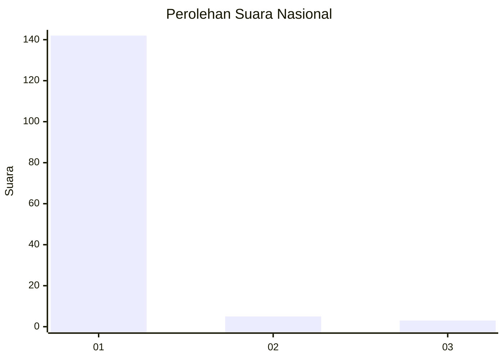
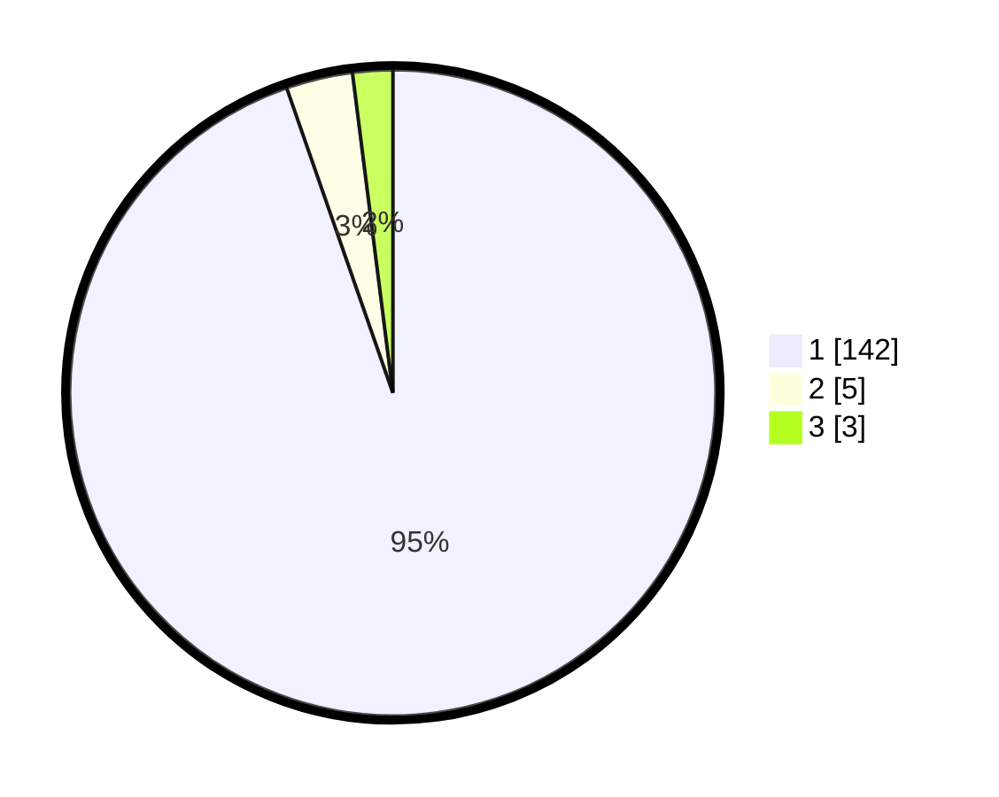

# Hasil

## Grafik

## Tabel

| No. | Nama Paslon    | Suara | Suara (raw) | Persentase |
|:--- |:-------------- | -----:| -----------:| ----------:|
| 1   | ANIES MUHAIMIN | 142   | [142][p-1]  | 94,67      |
| 2   | PRABOWO GIBRAN | 5     | [5][p-2]    | 3,33       |
| 3   | GANJAR MAHFUD  | 3     | [3][p-3]    | 2,00       |

[p-1]: https://github.com/gigit-pemilu/pemilu-2024/blob/main/pilpres/hitung-suara/sub/11-aceh/sub/06-aceh-besar/sub/06-sukamakmur/sub/2029-lambarih-bak-mee/sub/002-tps/sub/paslon-1.txt
[p-2]: https://github.com/gigit-pemilu/pemilu-2024/blob/main/pilpres/hitung-suara/sub/11-aceh/sub/06-aceh-besar/sub/06-sukamakmur/sub/2029-lambarih-bak-mee/sub/002-tps/sub/paslon-2.txt
[p-3]: https://github.com/gigit-pemilu/pemilu-2024/blob/main/pilpres/hitung-suara/sub/11-aceh/sub/06-aceh-besar/sub/06-sukamakmur/sub/2029-lambarih-bak-mee/sub/002-tps/sub/paslon-3.txt

## Foto C Plano

https://sirekap-obj-formc.kpu.go.id/adda/pemilu/ppwp/11/06/06/20/29/1106062029002-20240214-205147--5d968af6-3c42-4894-a800-54e70db6af91.jpg

https://sirekap-obj-formc.kpu.go.id/adda/pemilu/ppwp/11/06/06/20/29/1106062029002-20240214-205737--8566a5e7-79a0-4180-86ee-ee1ed1b99b0a.jpg

https://sirekap-obj-formc.kpu.go.id/adda/pemilu/ppwp/11/06/06/20/29/1106062029002-20240214-205936--9d4451e4-4f61-4aa6-9cc9-5d49017ad983.jpg

## Metadata

| Key        | Value               |
| ---------- | ------------------- |
| Time Stamp | 2024-02-16 01:00:27 |

