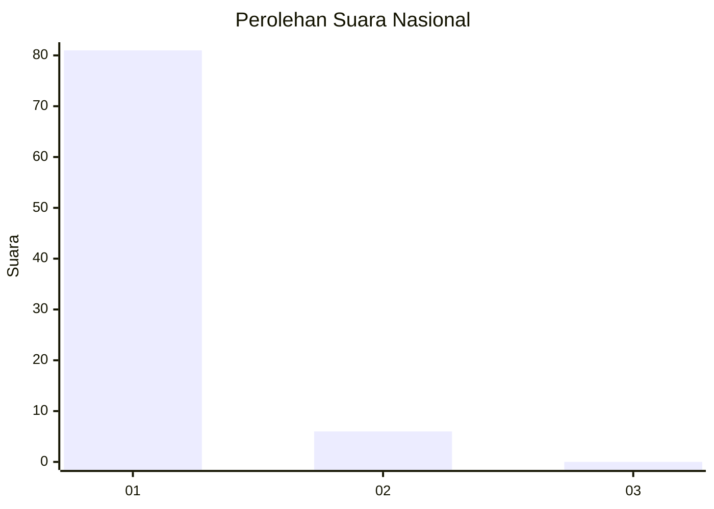
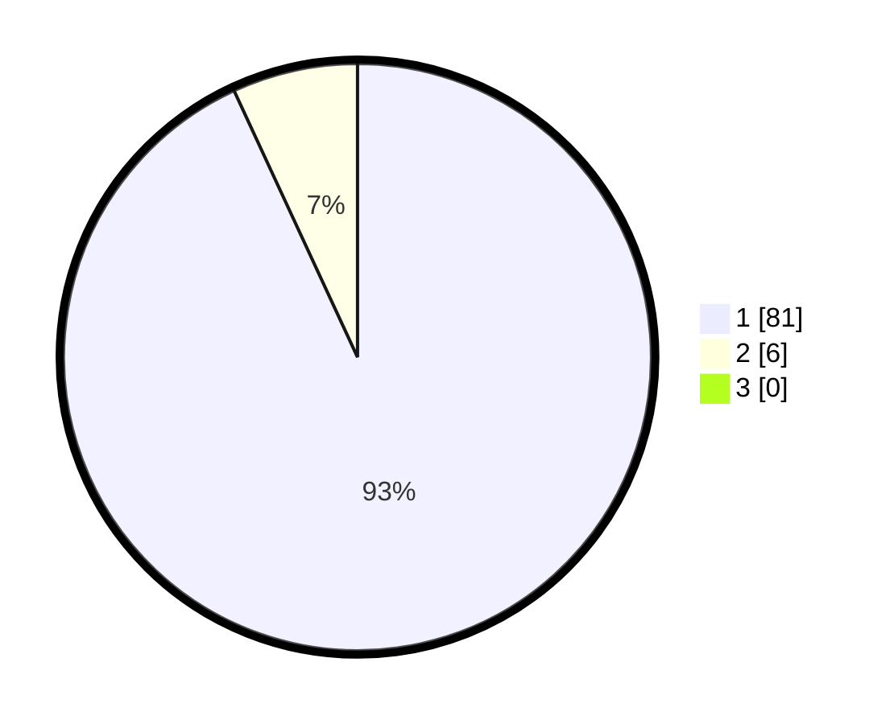

# Hasil

## Grafik

## Tabel

| No. | Nama Paslon    | Suara | Suara (raw) | Persentase |
|:--- |:-------------- | -----:| -----------:| ----------:|
| 1   | ANIES MUHAIMIN | 81    | [81][p-1]   | 93,10      |
| 2   | PRABOWO GIBRAN | 6     | [6][p-2]    | 6,90       |
| 3   | GANJAR MAHFUD  | 0     | [0][p-3]    | 0,00       |

[p-1]: https://github.com/gigit-pemilu/pemilu-2024/blob/main/pilpres/hitung-suara/sub/11-aceh/sub/06-aceh-besar/sub/06-sukamakmur/sub/2032-panterawa/sub/001-tps/sub/paslon-1.txt
[p-2]: https://github.com/gigit-pemilu/pemilu-2024/blob/main/pilpres/hitung-suara/sub/11-aceh/sub/06-aceh-besar/sub/06-sukamakmur/sub/2032-panterawa/sub/001-tps/sub/paslon-2.txt
[p-3]: https://github.com/gigit-pemilu/pemilu-2024/blob/main/pilpres/hitung-suara/sub/11-aceh/sub/06-aceh-besar/sub/06-sukamakmur/sub/2032-panterawa/sub/001-tps/sub/paslon-3.txt

## Foto C Plano

https://sirekap-obj-formc.kpu.go.id/8738/pemilu/ppwp/11/06/06/20/32/1106062032001-20240216-145458--35999e08-f128-4bca-b97e-86190f4dfc70.jpg

https://sirekap-obj-formc.kpu.go.id/8738/pemilu/ppwp/11/06/06/20/32/1106062032001-20240216-145500--1358148d-91c2-41e1-90e1-e74ad65b4ae3.jpg

https://sirekap-obj-formc.kpu.go.id/8738/pemilu/ppwp/11/06/06/20/32/1106062032001-20240216-145459--9be62faf-43c2-4eb6-a924-4886c4de65b2.jpg

## Metadata

| Key        | Value               |
| ---------- | ------------------- |
| Time Stamp | 2024-02-16 21:01:00 |

## DATA PEMILIH TETAP

Jumlah pemilih dalam DPT: **92**.
 * L: **45**.
 * P: **47**.

## DATA PENGGUNA HAK PILIH

Jumlah pengguna hak pilih dalam DPT: **88**.
 * L: **41**.
 * P: **47**.

Jumlah pengguna hak pilih dalam DPTb: **0**.
 * L: **0**.
 * P: **0**.

Jumlah pengguna hak pilih dalam DPK: **0**.
 * L: **0**.
 * P: **0**.

Jumlah pengguna hak pilih: **88**.
 * L: **41**.
 * P: **47**.

## JUMLAH SUARA SAH DAN TIDAK SAH

JUMLAH SELURUH SUARA SAH: **87**.

JUMLAH SUARA TIDAK SAH: **1**.

JUMLAH SELURUH SUARA SAH DAN SUARA TIDAK SAH: **88**.

