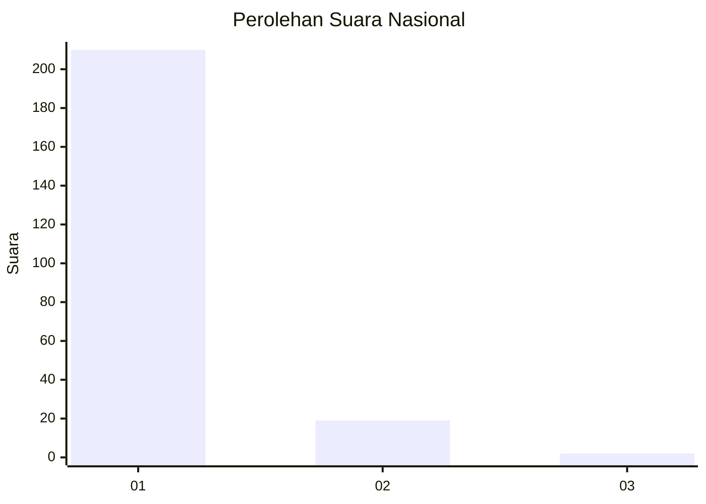
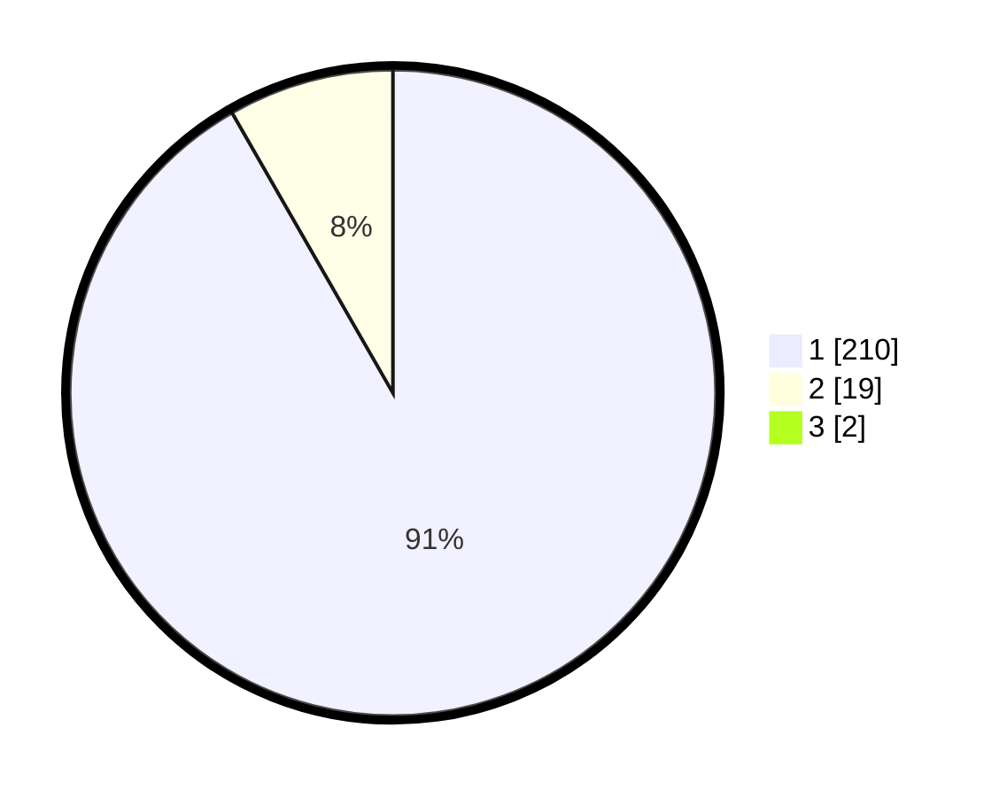

# Hasil

## Grafik

## Tabel

| No. | Nama Paslon    | Suara | Suara (raw) | Persentase |
|:--- |:-------------- | -----:| -----------:| ----------:|
| 1   | ANIES MUHAIMIN | 210   | [210][p-1]  | 90,91      |
| 2   | PRABOWO GIBRAN | 19    | [19][p-2]   | 8,23       |
| 3   | GANJAR MAHFUD  | 2     | [2][p-3]    | 0,87       |

[p-1]: https://github.com/gigit-pemilu/pemilu-2024/blob/main/pilpres/hitung-suara/sub/11-aceh/sub/06-aceh-besar/sub/07-darul-imarah/sub/2001-lampeuneurut-ujong-blang/sub/002-tps/sub/paslon-1.txt
[p-2]: https://github.com/gigit-pemilu/pemilu-2024/blob/main/pilpres/hitung-suara/sub/11-aceh/sub/06-aceh-besar/sub/07-darul-imarah/sub/2001-lampeuneurut-ujong-blang/sub/002-tps/sub/paslon-2.txt
[p-3]: https://github.com/gigit-pemilu/pemilu-2024/blob/main/pilpres/hitung-suara/sub/11-aceh/sub/06-aceh-besar/sub/07-darul-imarah/sub/2001-lampeuneurut-ujong-blang/sub/002-tps/sub/paslon-3.txt

## Foto C Plano

https://sirekap-obj-formc.kpu.go.id/7f02/pemilu/ppwp/11/06/07/20/01/1106072001002-20240214-205724--a60b2bcc-550d-416d-a705-17f3e815c74e.jpg

https://sirekap-obj-formc.kpu.go.id/7f02/pemilu/ppwp/11/06/07/20/01/1106072001002-20240214-210001--6d5940ad-05fc-4455-b924-b0cd5ce13b1c.jpg

https://sirekap-obj-formc.kpu.go.id/7f02/pemilu/ppwp/11/06/07/20/01/1106072001002-20240214-210707--f3f92072-75c4-4f85-affb-369cd476f344.jpg

## Metadata

| Key        | Value               |
| ---------- | ------------------- |
| Time Stamp | 2024-02-20 17:00:00 |

