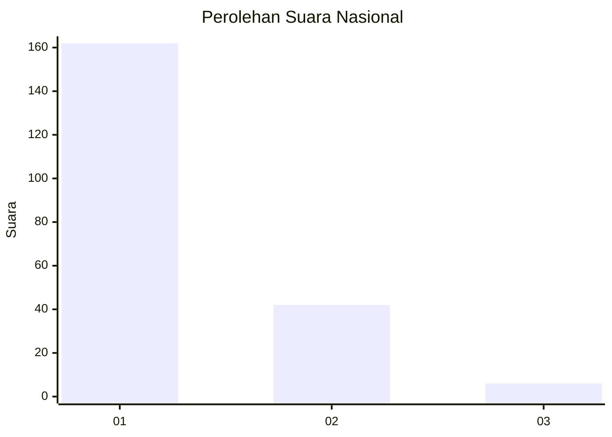
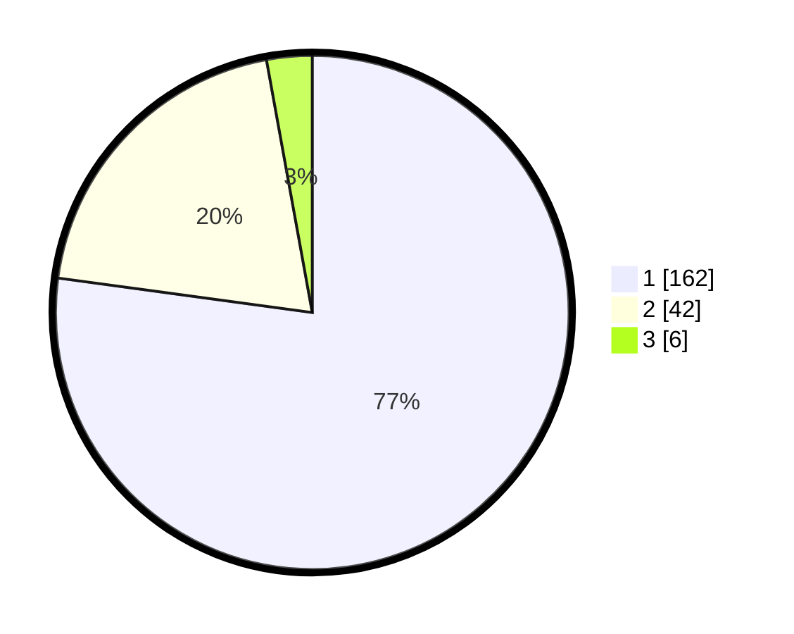

# Hasil

## Grafik

## Tabel

| No. | Nama Paslon    | Suara | Suara (raw) | Persentase |
|:--- |:-------------- | -----:| -----------:| ----------:|
| 1   | ANIES MUHAIMIN | 162   | [162][p-1]  | 77,14      |
| 2   | PRABOWO GIBRAN | 42    | [42][p-2]   | 20,00      |
| 3   | GANJAR MAHFUD  | 6     | [6][p-3]    | 2,86       |

[p-1]: https://github.com/gigit-pemilu/pemilu-2024/blob/main/pilpres/hitung-suara/sub/11-aceh/sub/06-aceh-besar/sub/07-darul-imarah/sub/2001-lampeuneurut-ujong-blang/sub/005-tps/sub/paslon-1.txt
[p-2]: https://github.com/gigit-pemilu/pemilu-2024/blob/main/pilpres/hitung-suara/sub/11-aceh/sub/06-aceh-besar/sub/07-darul-imarah/sub/2001-lampeuneurut-ujong-blang/sub/005-tps/sub/paslon-2.txt
[p-3]: https://github.com/gigit-pemilu/pemilu-2024/blob/main/pilpres/hitung-suara/sub/11-aceh/sub/06-aceh-besar/sub/07-darul-imarah/sub/2001-lampeuneurut-ujong-blang/sub/005-tps/sub/paslon-3.txt

## Foto C Plano

https://sirekap-obj-formc.kpu.go.id/3a01/pemilu/ppwp/11/06/07/20/01/1106072001005-20240215-022700--e51d69f2-5c2a-478e-9091-d7590983c5ef.jpg

https://sirekap-obj-formc.kpu.go.id/3a01/pemilu/ppwp/11/06/07/20/01/1106072001005-20240215-021210--7771276a-6fee-408c-99fa-a2f2fb021e97.jpg

https://sirekap-obj-formc.kpu.go.id/3a01/pemilu/ppwp/11/06/07/20/01/1106072001005-20240215-022941--a9cf79be-25d9-4dcb-880b-87ef59b08fc4.jpg

## Metadata

| Key        | Value               |
| ---------- | ------------------- |
| Time Stamp | 2024-02-15 19:00:26 |

## DATA PEMILIH TETAP

Jumlah pemilih dalam DPT: **247**.
 * L: **127**.
 * P: **120**.

## DATA PENGGUNA HAK PILIH

Jumlah pengguna hak pilih dalam DPT: **211**.
 * L: **108**.
 * P: **103**.

Jumlah pengguna hak pilih dalam DPTb: **0**.
 * L: **0**.
 * P: **0**.

Jumlah pengguna hak pilih dalam DPK: **0**.
 * L: **0**.
 * P: **0**.

Jumlah pengguna hak pilih: **211**.
 * L: **108**.
 * P: **103**.

## JUMLAH SUARA SAH DAN TIDAK SAH

JUMLAH SELURUH SUARA SAH: **210**.

JUMLAH SUARA TIDAK SAH: **1**.

JUMLAH SELURUH SUARA SAH DAN SUARA TIDAK SAH: **211**.

