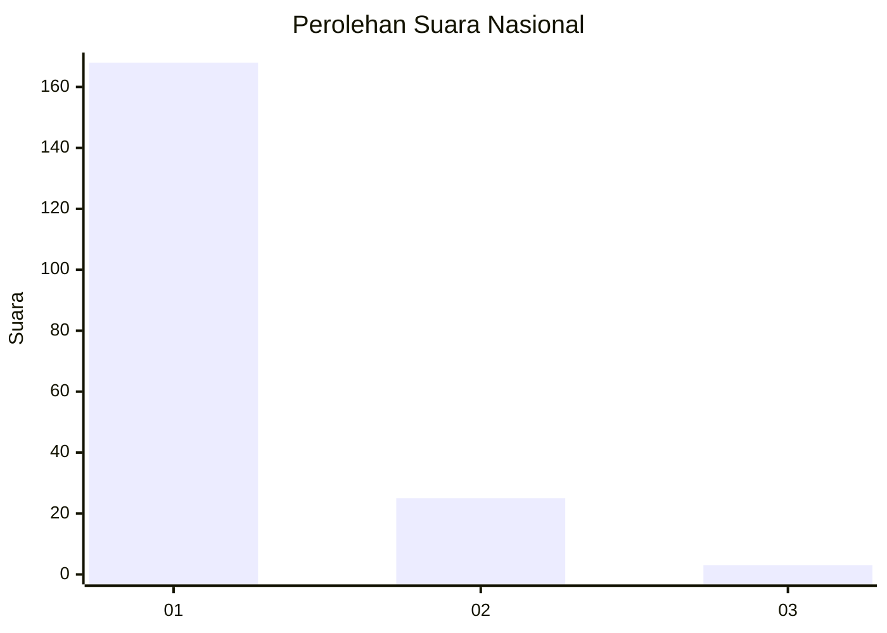
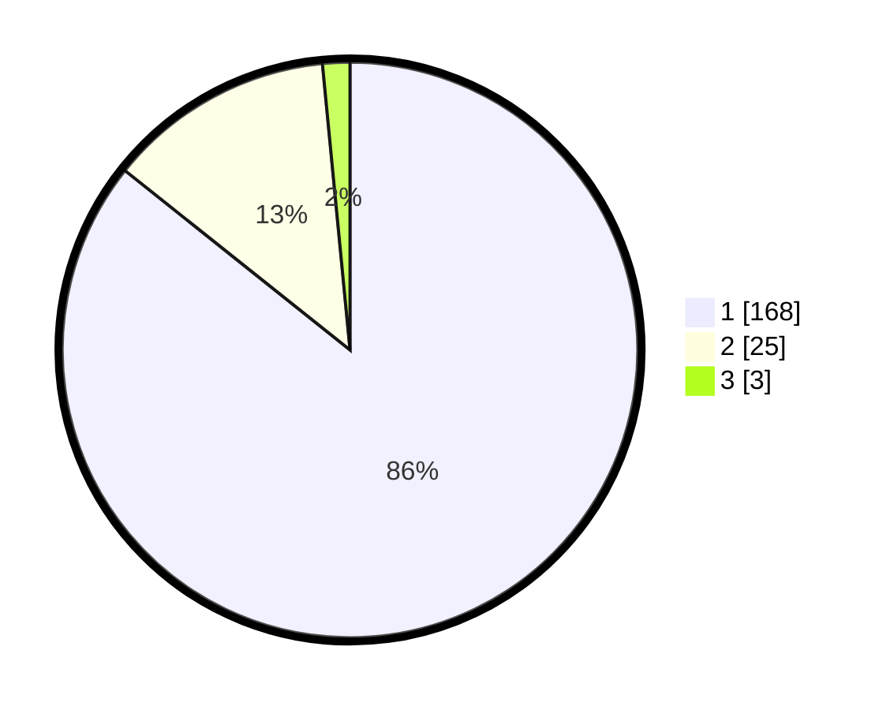

# Hasil

## Grafik

## Tabel

| No. | Nama Paslon    | Suara | Suara (raw) | Persentase |
|:--- |:-------------- | -----:| -----------:| ----------:|
| 1   | ANIES MUHAIMIN | 168   | [168][p-1]  | 85,71      |
| 2   | PRABOWO GIBRAN | 25    | [25][p-2]   | 12,76      |
| 3   | GANJAR MAHFUD  | 3     | [3][p-3]    | 1,53       |

[p-1]: https://github.com/gigit-pemilu/pemilu-2024/blob/main/pilpres/hitung-suara/sub/11-aceh/sub/06-aceh-besar/sub/07-darul-imarah/sub/2001-lampeuneurut-ujong-blang/sub/006-tps/sub/paslon-1.txt
[p-2]: https://github.com/gigit-pemilu/pemilu-2024/blob/main/pilpres/hitung-suara/sub/11-aceh/sub/06-aceh-besar/sub/07-darul-imarah/sub/2001-lampeuneurut-ujong-blang/sub/006-tps/sub/paslon-2.txt
[p-3]: https://github.com/gigit-pemilu/pemilu-2024/blob/main/pilpres/hitung-suara/sub/11-aceh/sub/06-aceh-besar/sub/07-darul-imarah/sub/2001-lampeuneurut-ujong-blang/sub/006-tps/sub/paslon-3.txt

## Foto C Plano

https://sirekap-obj-formc.kpu.go.id/6257/pemilu/ppwp/11/06/07/20/01/1106072001006-20240216-190444--822d5a29-e1bf-46d5-9544-5d487a499d97.jpg

https://sirekap-obj-formc.kpu.go.id/6257/pemilu/ppwp/11/06/07/20/01/1106072001006-20240216-190445--7a6f7ffe-1c75-4ecf-b431-4b28e93193b7.jpg

https://sirekap-obj-formc.kpu.go.id/6257/pemilu/ppwp/11/06/07/20/01/1106072001006-20240216-190445--5ccdb60e-4c6c-4970-93ac-6c5c9a56c788.jpg

## Metadata

| Key        | Value               |
| ---------- | ------------------- |
| Time Stamp | 2024-02-16 21:01:00 |

## DATA PEMILIH TETAP

Jumlah pemilih dalam DPT: **245**.
 * L: **125**.
 * P: **120**.

## DATA PENGGUNA HAK PILIH

Jumlah pengguna hak pilih dalam DPT: **198**.
 * L: **96**.
 * P: **102**.

Jumlah pengguna hak pilih dalam DPTb: **0**.
 * L: **0**.
 * P: **0**.

Jumlah pengguna hak pilih dalam DPK: **0**.
 * L: **0**.
 * P: **0**.

Jumlah pengguna hak pilih: **198**.
 * L: **96**.
 * P: **102**.

## JUMLAH SUARA SAH DAN TIDAK SAH

JUMLAH SELURUH SUARA SAH: **196**.

JUMLAH SUARA TIDAK SAH: **2**.

JUMLAH SELURUH SUARA SAH DAN SUARA TIDAK SAH: **198**.

