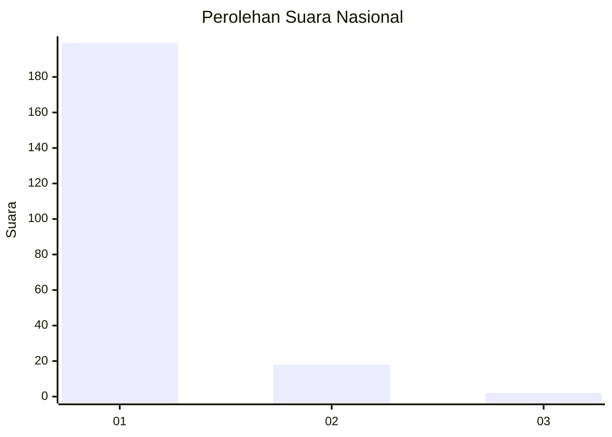
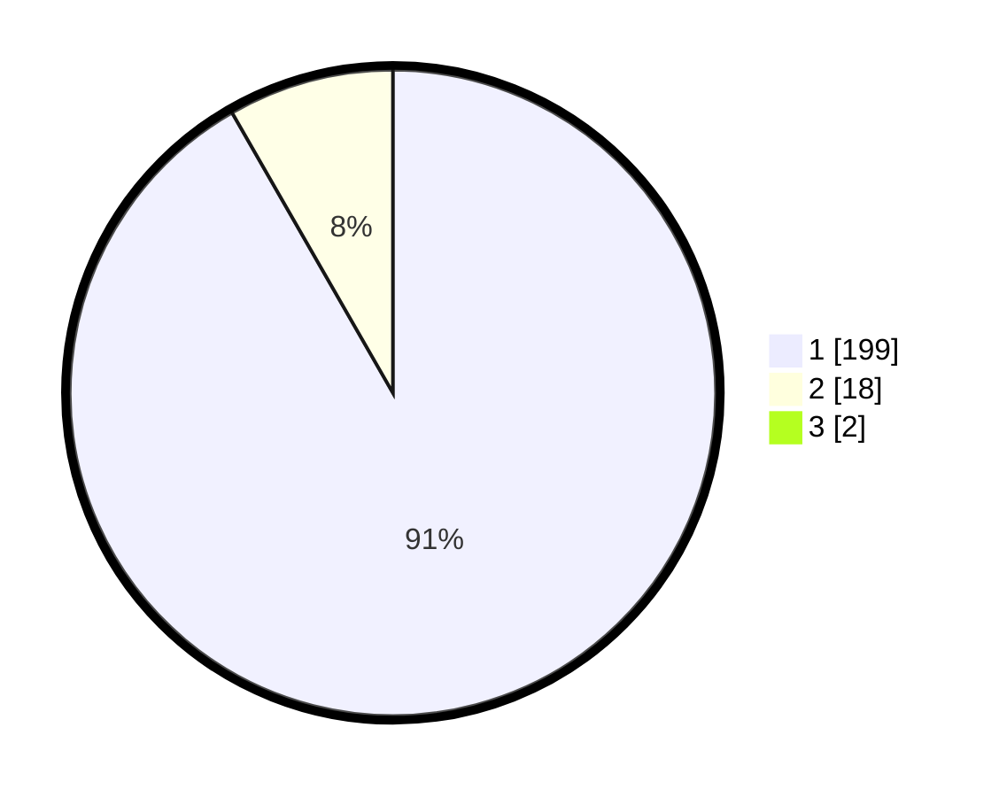

# Hasil

## Grafik

## Tabel

| No. | Nama Paslon    | Suara | Suara (raw) | Persentase |
|:--- |:-------------- | -----:| -----------:| ----------:|
| 1   | ANIES MUHAIMIN | 199   | [199][p-1]  | 90,87      |
| 2   | PRABOWO GIBRAN | 18    | [18][p-2]   | 8,22       |
| 3   | GANJAR MAHFUD  | 2     | [2][p-3]    | 0,91       |

[p-1]: https://github.com/gigit-pemilu/pemilu-2024/blob/main/pilpres/hitung-suara/sub/11-aceh/sub/06-aceh-besar/sub/07-darul-imarah/sub/2003-lamreung/sub/004-tps/sub/paslon-1.txt
[p-2]: https://github.com/gigit-pemilu/pemilu-2024/blob/main/pilpres/hitung-suara/sub/11-aceh/sub/06-aceh-besar/sub/07-darul-imarah/sub/2003-lamreung/sub/004-tps/sub/paslon-2.txt
[p-3]: https://github.com/gigit-pemilu/pemilu-2024/blob/main/pilpres/hitung-suara/sub/11-aceh/sub/06-aceh-besar/sub/07-darul-imarah/sub/2003-lamreung/sub/004-tps/sub/paslon-3.txt

## Foto C Plano

https://sirekap-obj-formc.kpu.go.id/ae8e/pemilu/ppwp/11/06/07/20/03/1106072003004-20240214-155517--4caab7d7-c84e-4e15-ab8e-7a734ba6971c.jpg

https://sirekap-obj-formc.kpu.go.id/ae8e/pemilu/ppwp/11/06/07/20/03/1106072003004-20240214-155328--e9fa72af-6773-4681-aaff-b54f8d7f5adb.jpg

https://sirekap-obj-formc.kpu.go.id/ae8e/pemilu/ppwp/11/06/07/20/03/1106072003004-20240214-155421--b5b659b2-2c0a-4a9c-98f4-271bf5750420.jpg

## Metadata

| Key        | Value               |
| ---------- | ------------------- |
| Time Stamp | 2024-02-15 02:10:27 |

