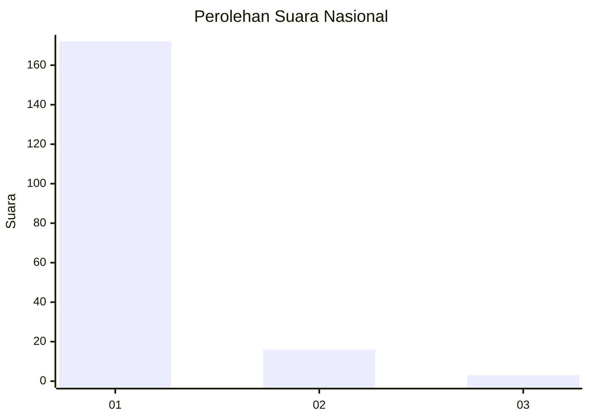
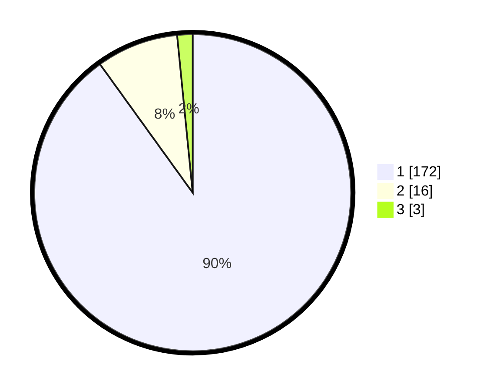

# Hasil

## Grafik

## Tabel

| No. | Nama Paslon    | Suara | Suara (raw) | Persentase |
|:--- |:-------------- | -----:| -----------:| ----------:|
| 1   | ANIES MUHAIMIN | 172   | [172][p-1]  | 90,05      |
| 2   | PRABOWO GIBRAN | 16    | [16][p-2]   | 8,38       |
| 3   | GANJAR MAHFUD  | 3     | [3][p-3]    | 1,57       |

[p-1]: https://github.com/gigit-pemilu/pemilu-2024/blob/main/pilpres/hitung-suara/sub/11-aceh/sub/06-aceh-besar/sub/07-darul-imarah/sub/2006-lam-blang-mayang/sub/001-tps/sub/paslon-1.txt
[p-2]: https://github.com/gigit-pemilu/pemilu-2024/blob/main/pilpres/hitung-suara/sub/11-aceh/sub/06-aceh-besar/sub/07-darul-imarah/sub/2006-lam-blang-mayang/sub/001-tps/sub/paslon-2.txt
[p-3]: https://github.com/gigit-pemilu/pemilu-2024/blob/main/pilpres/hitung-suara/sub/11-aceh/sub/06-aceh-besar/sub/07-darul-imarah/sub/2006-lam-blang-mayang/sub/001-tps/sub/paslon-3.txt

## Foto C Plano

https://sirekap-obj-formc.kpu.go.id/38db/pemilu/ppwp/11/06/07/20/06/1106072006001-20240215-060631--c1ba3229-1193-4f63-9aa7-41ad9499010d.jpg

https://sirekap-obj-formc.kpu.go.id/38db/pemilu/ppwp/11/06/07/20/06/1106072006001-20240215-060700--45394c57-ac16-43c7-9d90-1ac7536b3f90.jpg

https://sirekap-obj-formc.kpu.go.id/38db/pemilu/ppwp/11/06/07/20/06/1106072006001-20240215-060748--1d4a6a1e-7e58-4125-bb57-06662a32f02e.jpg

## Metadata

| Key        | Value               |
| ---------- | ------------------- |
| Time Stamp | 2024-02-15 21:30:27 |

