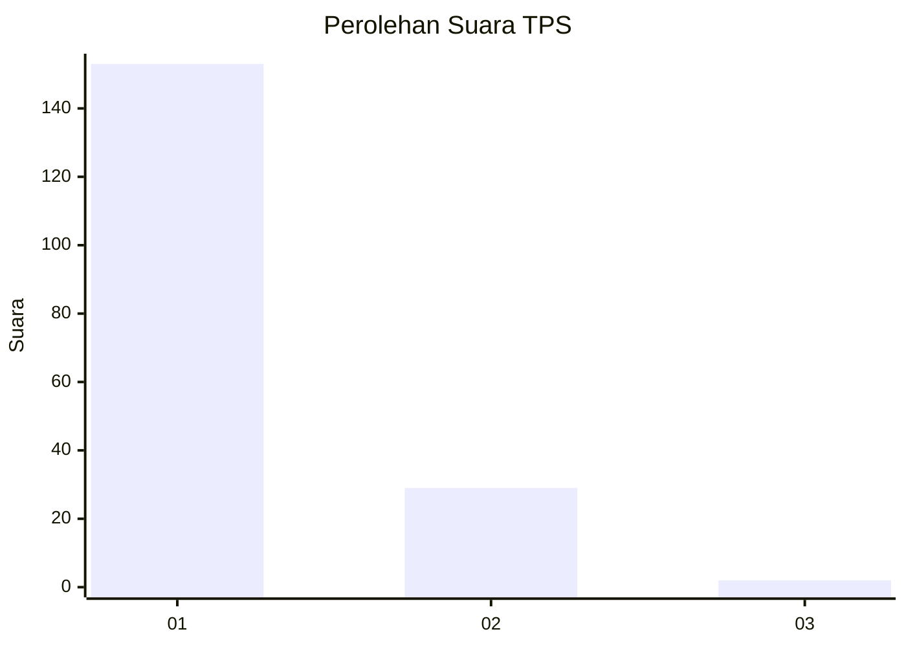
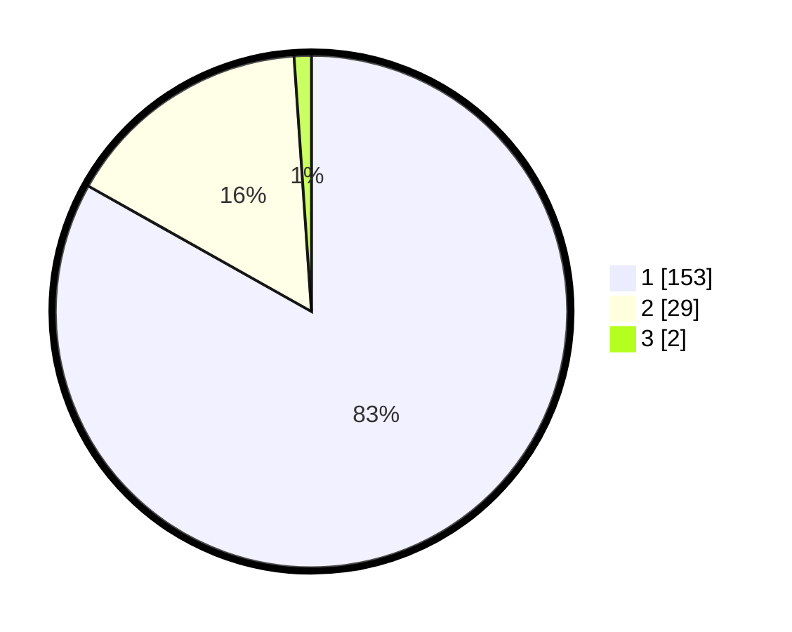

# Hasil

## Grafik

## Tabel

| No. | Nama Paslon    | Suara | Suara (raw) | Persentase |
|:--- |:-------------- | -----:| -----------:| ----------:|
| 1   | ANIES MUHAIMIN | 153   | [153][p-1]  | 83,15      |
| 2   | PRABOWO GIBRAN | 29    | [29][p-2]   | 15,76      |
| 3   | GANJAR MAHFUD  | 2     | [2][p-3]    | 1,09       |

[p-1]: https://github.com/gigit-pemilu/pemilu-2024-11-aceh/blob/main/pilpres/hitung-suara/sub/11-aceh/sub/06-aceh-besar/sub/07-darul-imarah/sub/2006-lam-blang-mayang/sub/003-tps/sub/paslon-1.txt
[p-2]: https://github.com/gigit-pemilu/pemilu-2024-11-aceh/blob/main/pilpres/hitung-suara/sub/11-aceh/sub/06-aceh-besar/sub/07-darul-imarah/sub/2006-lam-blang-mayang/sub/003-tps/sub/paslon-2.txt
[p-3]: https://github.com/gigit-pemilu/pemilu-2024-11-aceh/blob/main/pilpres/hitung-suara/sub/11-aceh/sub/06-aceh-besar/sub/07-darul-imarah/sub/2006-lam-blang-mayang/sub/003-tps/sub/paslon-3.txt

## Foto C Plano

https://sirekap-obj-formc.kpu.go.id/b1f8/pemilu/ppwp/11/06/07/20/06/1106072006003-20240215-035558--4938a68c-7515-4789-ac6e-51352271f8ae.jpg

https://sirekap-obj-formc.kpu.go.id/b1f8/pemilu/ppwp/11/06/07/20/06/1106072006003-20240215-032251--8ba674b3-7adc-4010-9f4c-990990570e3b.jpg

https://sirekap-obj-formc.kpu.go.id/b1f8/pemilu/ppwp/11/06/07/20/06/1106072006003-20240215-032402--0eeaff97-7423-4396-bc9b-9be951820939.jpg

## Metadata

| Key        | Value               |
| ---------- | ------------------- |
| Time Stamp | 2024-02-15 16:30:25 |

