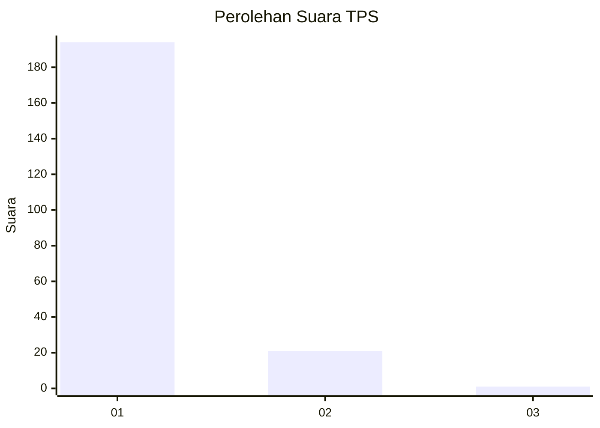
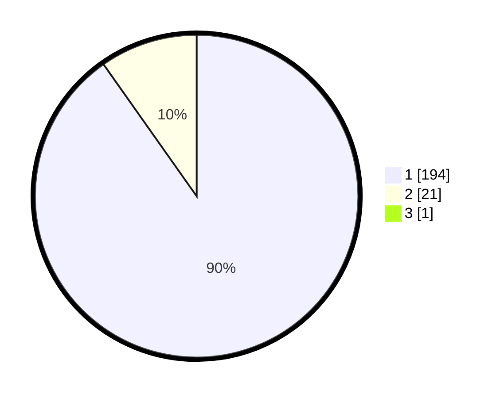

# Hasil

## Grafik

## Tabel

| No. | Nama Paslon    | Suara | Suara (raw) | Persentase |
|:--- |:-------------- | -----:| -----------:| ----------:|
| 1   | ANIES MUHAIMIN | 194   | [194][p-1]  | 89,81      |
| 2   | PRABOWO GIBRAN | 21    | [21][p-2]   | 9,72       |
| 3   | GANJAR MAHFUD  | 1     | [1][p-3]    | 0,46       |

[p-1]: https://github.com/gigit-pemilu/pemilu-2024-11-aceh/blob/main/pilpres/hitung-suara/sub/11-aceh/sub/06-aceh-besar/sub/07-darul-imarah/sub/2007-bayu/sub/004-tps/sub/paslon-1.txt
[p-2]: https://github.com/gigit-pemilu/pemilu-2024-11-aceh/blob/main/pilpres/hitung-suara/sub/11-aceh/sub/06-aceh-besar/sub/07-darul-imarah/sub/2007-bayu/sub/004-tps/sub/paslon-2.txt
[p-3]: https://github.com/gigit-pemilu/pemilu-2024-11-aceh/blob/main/pilpres/hitung-suara/sub/11-aceh/sub/06-aceh-besar/sub/07-darul-imarah/sub/2007-bayu/sub/004-tps/sub/paslon-3.txt

## Foto C Plano

https://sirekap-obj-formc.kpu.go.id/c2da/pemilu/ppwp/11/06/07/20/07/1106072007004-20240215-004404--0b95714f-5e01-4f51-8e96-67769f2dcd68.jpg

https://sirekap-obj-formc.kpu.go.id/c2da/pemilu/ppwp/11/06/07/20/07/1106072007004-20240215-004752--c2d15a51-f83f-42e9-8b98-64e3b4814f64.jpg

https://sirekap-obj-formc.kpu.go.id/c2da/pemilu/ppwp/11/06/07/20/07/1106072007004-20240215-005819--9ead25c7-fe88-4f29-8dc6-10d40cc3a06e.jpg

## Metadata

| Key        | Value               |
| ---------- | ------------------- |
| Time Stamp | 2024-02-15 18:30:25 |

