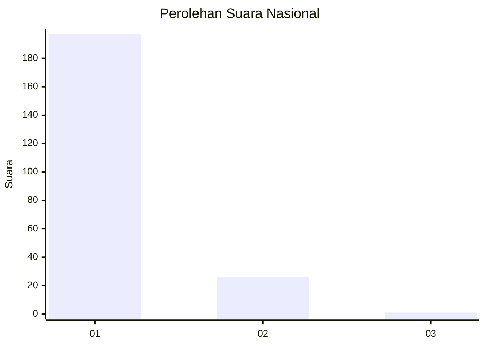
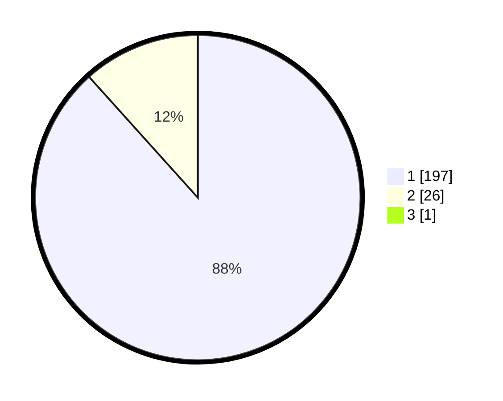

# Hasil

## Grafik

## Tabel

| No. | Nama Paslon    | Suara | Suara (raw) | Persentase |
|:--- |:-------------- | -----:| -----------:| ----------:|
| 1   | ANIES MUHAIMIN | 197   | [197][p-1]  | 87,95      |
| 2   | PRABOWO GIBRAN | 26    | [26][p-2]   | 11,61      |
| 3   | GANJAR MAHFUD  | 1     | [1][p-3]    | 0,45       |

[p-1]: https://github.com/gigit-pemilu/pemilu-2024/blob/main/pilpres/hitung-suara/sub/11-aceh/sub/06-aceh-besar/sub/07-darul-imarah/sub/2007-bayu/sub/005-tps/sub/paslon-1.txt
[p-2]: https://github.com/gigit-pemilu/pemilu-2024/blob/main/pilpres/hitung-suara/sub/11-aceh/sub/06-aceh-besar/sub/07-darul-imarah/sub/2007-bayu/sub/005-tps/sub/paslon-2.txt
[p-3]: https://github.com/gigit-pemilu/pemilu-2024/blob/main/pilpres/hitung-suara/sub/11-aceh/sub/06-aceh-besar/sub/07-darul-imarah/sub/2007-bayu/sub/005-tps/sub/paslon-3.txt

## Foto C Plano

https://sirekap-obj-formc.kpu.go.id/c9ba/pemilu/ppwp/11/06/07/20/07/1106072007005-20240214-231006--4a8774c0-770c-4949-a854-1b3c5c631ac8.jpg

https://sirekap-obj-formc.kpu.go.id/c9ba/pemilu/ppwp/11/06/07/20/07/1106072007005-20240214-231201--11495b72-2a5e-45aa-a6ee-4a2285a66853.jpg

https://sirekap-obj-formc.kpu.go.id/c9ba/pemilu/ppwp/11/06/07/20/07/1106072007005-20240216-233345--95d5532c-0fd4-442b-8d67-19dbfe7bb231.jpg

## Metadata

| Key        | Value               |
| ---------- | ------------------- |
| Time Stamp | 2024-02-16 23:45:47 |

