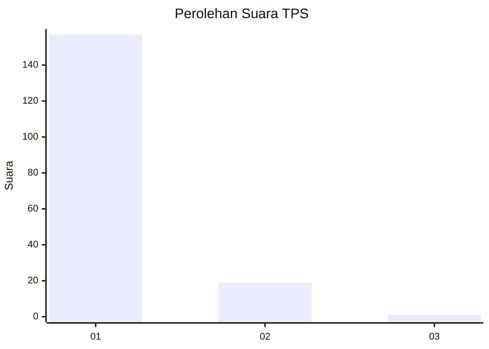
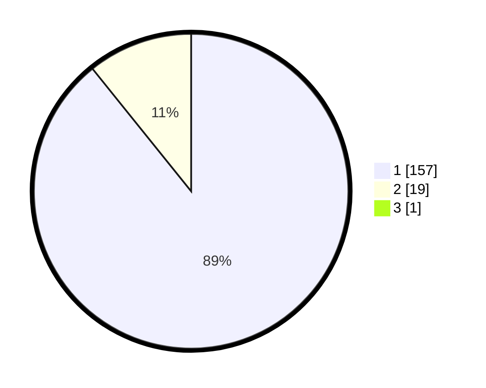

# Hasil

## Grafik

## Tabel

| No. | Nama Paslon    | Suara | Suara (raw) | Persentase |
|:--- |:-------------- | -----:| -----------:| ----------:|
| 1   | ANIES MUHAIMIN | 157   | [157][p-1]  | 88,70      |
| 2   | PRABOWO GIBRAN | 19    | [19][p-2]   | 10,73      |
| 3   | GANJAR MAHFUD  | 1     | [1][p-3]    | 0,56       |

[p-1]: https://github.com/gigit-pemilu/pemilu-2024-11-aceh/blob/main/pilpres/hitung-suara/sub/11-aceh/sub/06-aceh-besar/sub/07-darul-imarah/sub/2009-lamsiteh/sub/001-tps/sub/paslon-1.txt
[p-2]: https://github.com/gigit-pemilu/pemilu-2024-11-aceh/blob/main/pilpres/hitung-suara/sub/11-aceh/sub/06-aceh-besar/sub/07-darul-imarah/sub/2009-lamsiteh/sub/001-tps/sub/paslon-2.txt
[p-3]: https://github.com/gigit-pemilu/pemilu-2024-11-aceh/blob/main/pilpres/hitung-suara/sub/11-aceh/sub/06-aceh-besar/sub/07-darul-imarah/sub/2009-lamsiteh/sub/001-tps/sub/paslon-3.txt

## Foto C Plano

https://sirekap-obj-formc.kpu.go.id/6720/pemilu/ppwp/11/06/07/20/09/1106072009001-20240215-042234--a7697067-b2db-4c6f-83d8-cc152419036c.jpg

https://sirekap-obj-formc.kpu.go.id/6720/pemilu/ppwp/11/06/07/20/09/1106072009001-20240215-025346--04aa8a8a-bc88-46fa-bf1f-16bc839f0210.jpg

https://sirekap-obj-formc.kpu.go.id/6720/pemilu/ppwp/11/06/07/20/09/1106072009001-20240215-025430--68315bfe-e721-46b2-8f1c-e0c5d3e09da1.jpg

## Metadata

| Key        | Value               |
| ---------- | ------------------- |
| Time Stamp | 2024-02-15 16:30:25 |

