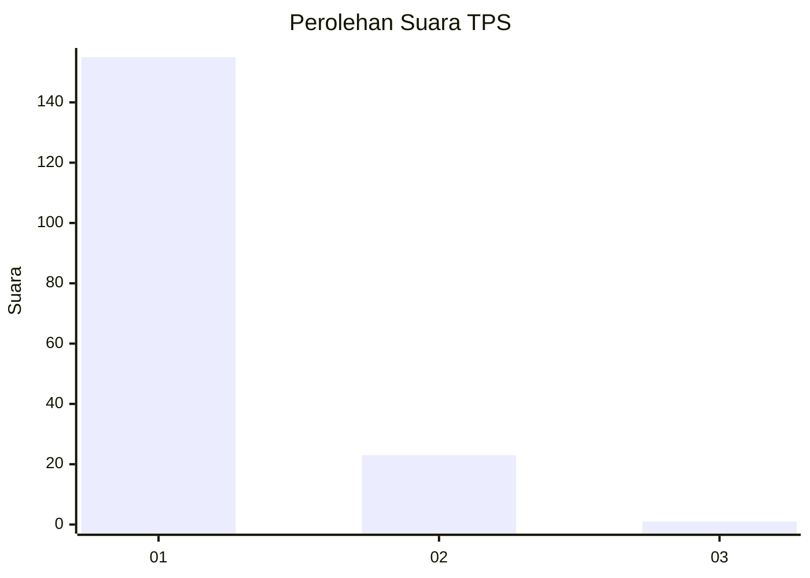
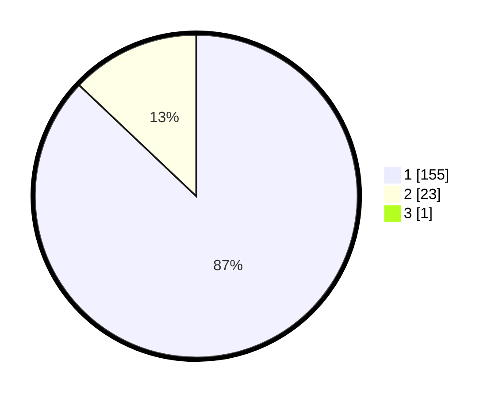

# Hasil

## Grafik

## Tabel

| No. | Nama Paslon    | Suara | Suara (raw) | Persentase |
|:--- |:-------------- | -----:| -----------:| ----------:|
| 1   | ANIES MUHAIMIN | 155   | [155][p-1]  | 86,59      |
| 2   | PRABOWO GIBRAN | 23    | [23][p-2]   | 12,85      |
| 3   | GANJAR MAHFUD  | 1     | [1][p-3]    | 0,56       |

[p-1]: https://github.com/gigit-pemilu/pemilu-2024-11-aceh/blob/main/pilpres/hitung-suara/sub/11-aceh/sub/06-aceh-besar/sub/07-darul-imarah/sub/2009-lamsiteh/sub/002-tps/sub/paslon-1.txt
[p-2]: https://github.com/gigit-pemilu/pemilu-2024-11-aceh/blob/main/pilpres/hitung-suara/sub/11-aceh/sub/06-aceh-besar/sub/07-darul-imarah/sub/2009-lamsiteh/sub/002-tps/sub/paslon-2.txt
[p-3]: https://github.com/gigit-pemilu/pemilu-2024-11-aceh/blob/main/pilpres/hitung-suara/sub/11-aceh/sub/06-aceh-besar/sub/07-darul-imarah/sub/2009-lamsiteh/sub/002-tps/sub/paslon-3.txt

## Foto C Plano

https://sirekap-obj-formc.kpu.go.id/630d/pemilu/ppwp/11/06/07/20/09/1106072009002-20240215-033209--d5480200-cfc2-4a41-813c-25995f2edcc2.jpg

https://sirekap-obj-formc.kpu.go.id/630d/pemilu/ppwp/11/06/07/20/09/1106072009002-20240215-033258--214a1c11-847f-4b5a-aeee-4c0943693790.jpg

https://sirekap-obj-formc.kpu.go.id/630d/pemilu/ppwp/11/06/07/20/09/1106072009002-20240215-033340--22ea69d6-cb35-45a0-9c88-798d2b4aed49.jpg

## Metadata

| Key        | Value               |
| ---------- | ------------------- |
| Time Stamp | 2024-02-15 16:30:25 |

