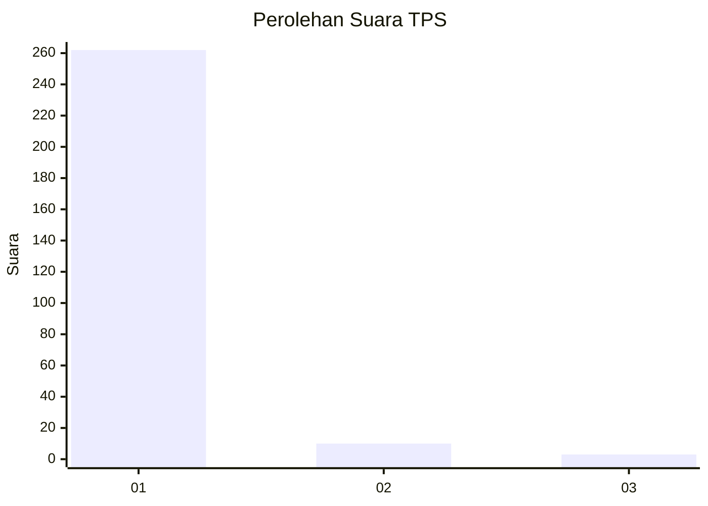
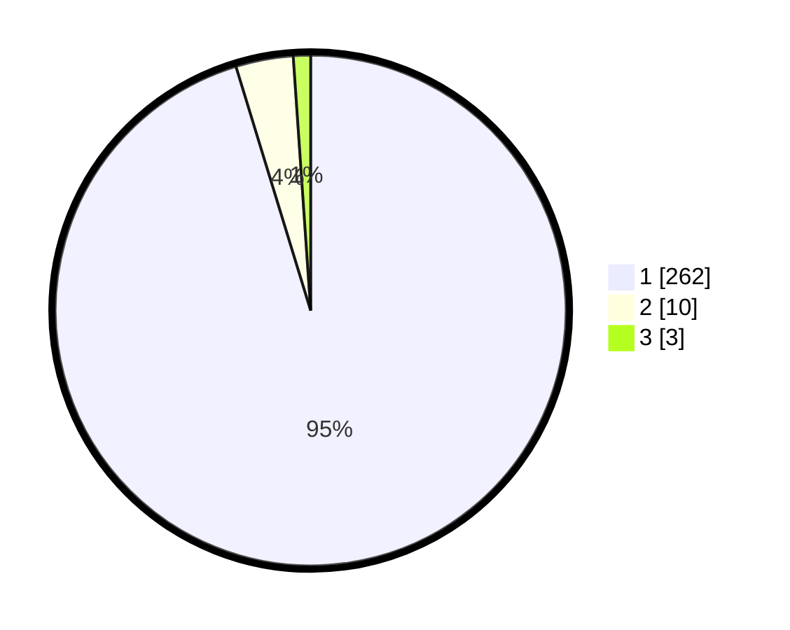

# Hasil

## Grafik

## Tabel

| No. | Nama Paslon    | Suara | Suara (raw) | Persentase |
|:--- |:-------------- | -----:| -----------:| ----------:|
| 1   | ANIES MUHAIMIN | 262   | [262][p-1]  | 95,27      |
| 2   | PRABOWO GIBRAN | 10    | [10][p-2]   | 3,64       |
| 3   | GANJAR MAHFUD  | 3     | [3][p-3]    | 1,09       |

[p-1]: https://github.com/gigit-pemilu/pemilu-2024-11-aceh/blob/main/pilpres/hitung-suara/sub/11-aceh/sub/06-aceh-besar/sub/07-darul-imarah/sub/2010-lamkawe/sub/001-tps/sub/paslon-1.txt
[p-2]: https://github.com/gigit-pemilu/pemilu-2024-11-aceh/blob/main/pilpres/hitung-suara/sub/11-aceh/sub/06-aceh-besar/sub/07-darul-imarah/sub/2010-lamkawe/sub/001-tps/sub/paslon-2.txt
[p-3]: https://github.com/gigit-pemilu/pemilu-2024-11-aceh/blob/main/pilpres/hitung-suara/sub/11-aceh/sub/06-aceh-besar/sub/07-darul-imarah/sub/2010-lamkawe/sub/001-tps/sub/paslon-3.txt

## Foto C Plano

https://sirekap-obj-formc.kpu.go.id/633e/pemilu/ppwp/11/06/07/20/10/1106072010001-20240215-035643--cc963a7a-07d3-4547-8f63-7ca804a9ab9b.jpg

https://sirekap-obj-formc.kpu.go.id/633e/pemilu/ppwp/11/06/07/20/10/1106072010001-20240215-035702--5b33f21e-eaae-4140-9148-c54fcffa1c6b.jpg

https://sirekap-obj-formc.kpu.go.id/633e/pemilu/ppwp/11/06/07/20/10/1106072010001-20240215-035724--98057978-e00f-4c45-8c33-eada0f7d01d9.jpg

## Metadata

| Key        | Value               |
| ---------- | ------------------- |
| Time Stamp | 2024-02-15 22:30:27 |

