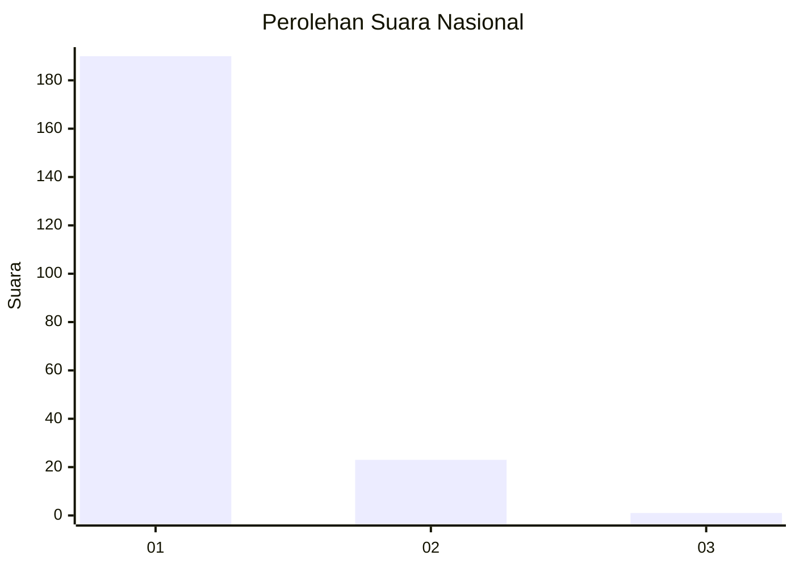
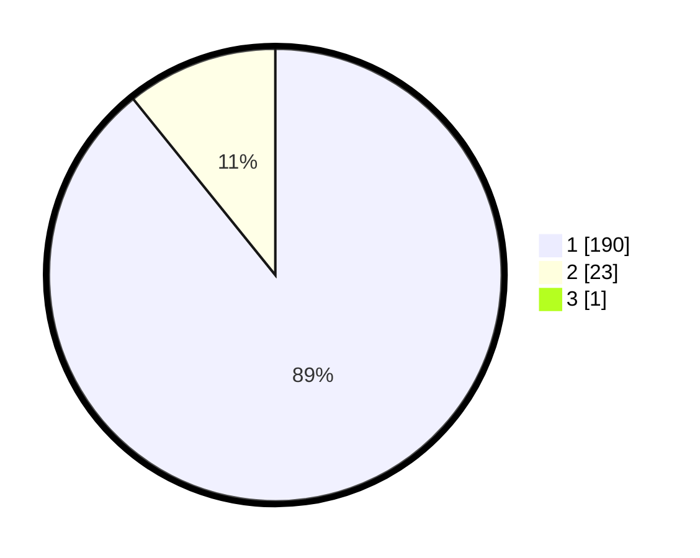

# Hasil

## Grafik

## Tabel

| No. | Nama Paslon    | Suara | Suara (raw) | Persentase |
|:--- |:-------------- | -----:| -----------:| ----------:|
| 1   | ANIES MUHAIMIN | 190   | [190][p-1]  | 88,79      |
| 2   | PRABOWO GIBRAN | 23    | [23][p-2]   | 10,75      |
| 3   | GANJAR MAHFUD  | 1     | [1][p-3]    | 0,47       |

[p-1]: https://github.com/gigit-pemilu/pemilu-2024/blob/main/pilpres/hitung-suara/sub/11-aceh/sub/06-aceh-besar/sub/07-darul-imarah/sub/2011-lheu-blang/sub/002-tps/sub/paslon-1.txt
[p-2]: https://github.com/gigit-pemilu/pemilu-2024/blob/main/pilpres/hitung-suara/sub/11-aceh/sub/06-aceh-besar/sub/07-darul-imarah/sub/2011-lheu-blang/sub/002-tps/sub/paslon-2.txt
[p-3]: https://github.com/gigit-pemilu/pemilu-2024/blob/main/pilpres/hitung-suara/sub/11-aceh/sub/06-aceh-besar/sub/07-darul-imarah/sub/2011-lheu-blang/sub/002-tps/sub/paslon-3.txt

## Foto C Plano

https://sirekap-obj-formc.kpu.go.id/2584/pemilu/ppwp/11/06/07/20/11/1106072011002-20240214-222505--46835ab1-ab61-4386-9ea6-336a04afe714.jpg

https://sirekap-obj-formc.kpu.go.id/2584/pemilu/ppwp/11/06/07/20/11/1106072011002-20240214-223308--82b2b9a9-e159-43ee-ad05-0d016494d687.jpg

https://sirekap-obj-formc.kpu.go.id/2584/pemilu/ppwp/11/06/07/20/11/1106072011002-20240214-223517--591d982c-a46f-405e-a582-866ce94b319b.jpg

## Metadata

| Key        | Value               |
| ---------- | ------------------- |
| Time Stamp | 2024-02-24 22:31:28 |

