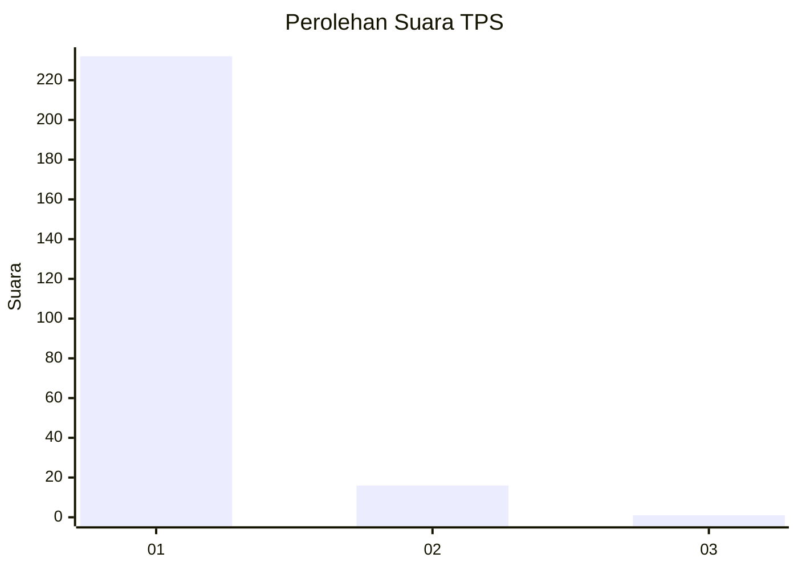
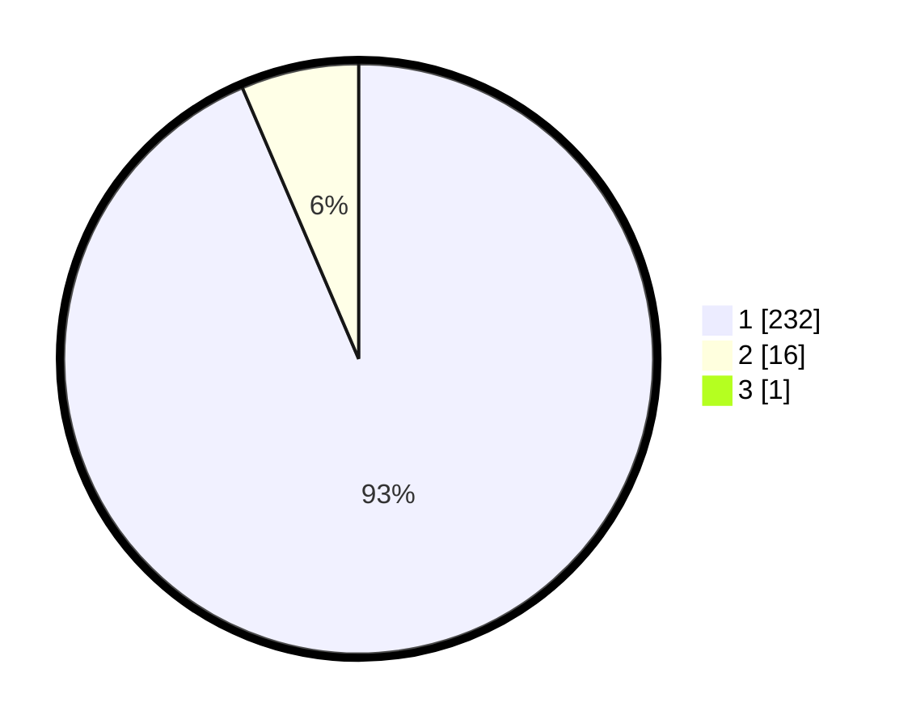

# Hasil

## Grafik

## Tabel

| No. | Nama Paslon    | Suara | Suara (raw) | Persentase |
|:--- |:-------------- | -----:| -----------:| ----------:|
| 1   | ANIES MUHAIMIN | 232   | [232][p-1]  | 93,17      |
| 2   | PRABOWO GIBRAN | 16    | [16][p-2]   | 6,43       |
| 3   | GANJAR MAHFUD  | 1     | [1][p-3]    | 0,40       |

[p-1]: https://github.com/gigit-pemilu/pemilu-2024-11-aceh/blob/main/pilpres/hitung-suara/sub/11-aceh/sub/06-aceh-besar/sub/07-darul-imarah/sub/2016-lampeuneun/sub/002-tps/sub/paslon-1.txt
[p-2]: https://github.com/gigit-pemilu/pemilu-2024-11-aceh/blob/main/pilpres/hitung-suara/sub/11-aceh/sub/06-aceh-besar/sub/07-darul-imarah/sub/2016-lampeuneun/sub/002-tps/sub/paslon-2.txt
[p-3]: https://github.com/gigit-pemilu/pemilu-2024-11-aceh/blob/main/pilpres/hitung-suara/sub/11-aceh/sub/06-aceh-besar/sub/07-darul-imarah/sub/2016-lampeuneun/sub/002-tps/sub/paslon-3.txt

## Foto C Plano

https://sirekap-obj-formc.kpu.go.id/5a0c/pemilu/ppwp/11/06/07/20/16/1106072016002-20240217-152629--1901e6a4-9dcd-45ce-984b-cc347633d87e.jpg

https://sirekap-obj-formc.kpu.go.id/5a0c/pemilu/ppwp/11/06/07/20/16/1106072016002-20240217-135111--3a621451-5817-458b-a96f-dcb90d890d45.jpg

https://sirekap-obj-formc.kpu.go.id/5a0c/pemilu/ppwp/11/06/07/20/16/1106072016002-20240217-184852--0f844fcd-09ca-453f-9c51-3ec28a2b6238.jpg

## Metadata

| Key        | Value               |
| ---------- | ------------------- |
| Time Stamp | 2024-02-17 19:00:04 |

