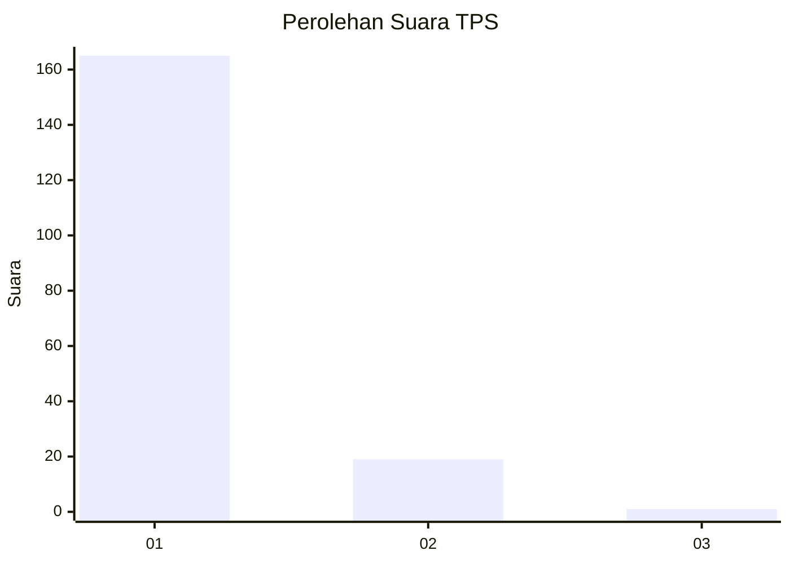
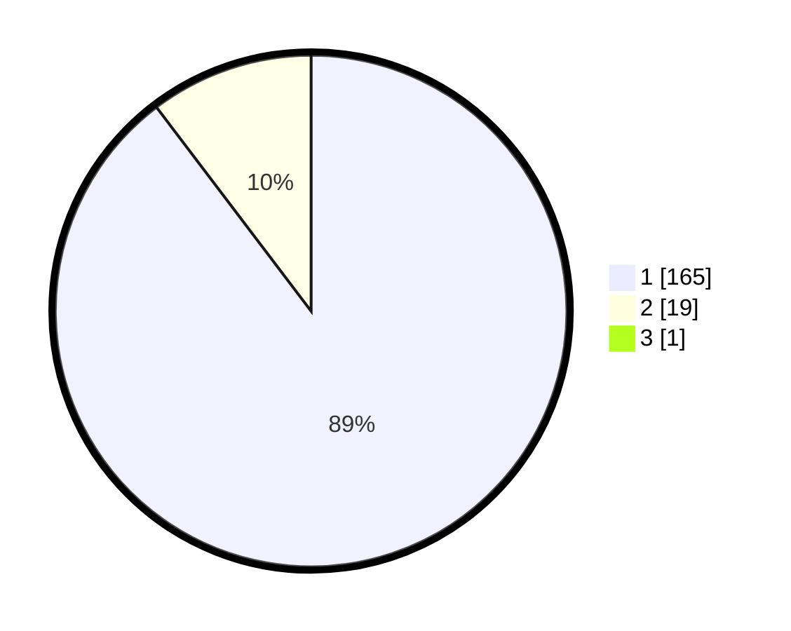

# Hasil

## Grafik

## Tabel

| No. | Nama Paslon    | Suara | Suara (raw) | Persentase |
|:--- |:-------------- | -----:| -----------:| ----------:|
| 1   | ANIES MUHAIMIN | 165   | [165][p-1]  | 89,19      |
| 2   | PRABOWO GIBRAN | 19    | [19][p-2]   | 10,27      |
| 3   | GANJAR MAHFUD  | 1     | [1][p-3]    | 0,54       |

[p-1]: https://github.com/gigit-pemilu/pemilu-2024-11-aceh/blob/main/pilpres/hitung-suara/sub/11-aceh/sub/06-aceh-besar/sub/07-darul-imarah/sub/2017-lamtheun/sub/001-tps/sub/paslon-1.txt
[p-2]: https://github.com/gigit-pemilu/pemilu-2024-11-aceh/blob/main/pilpres/hitung-suara/sub/11-aceh/sub/06-aceh-besar/sub/07-darul-imarah/sub/2017-lamtheun/sub/001-tps/sub/paslon-2.txt
[p-3]: https://github.com/gigit-pemilu/pemilu-2024-11-aceh/blob/main/pilpres/hitung-suara/sub/11-aceh/sub/06-aceh-besar/sub/07-darul-imarah/sub/2017-lamtheun/sub/001-tps/sub/paslon-3.txt

## Foto C Plano

https://sirekap-obj-formc.kpu.go.id/c2e7/pemilu/ppwp/11/06/07/20/17/1106072017001-20240215-000935--9a1391ab-5ac3-413d-9e40-7afd757fe467.jpg

https://sirekap-obj-formc.kpu.go.id/c2e7/pemilu/ppwp/11/06/07/20/17/1106072017001-20240215-064241--d871e631-6163-4106-b6c8-2affb47c195a.jpg

https://sirekap-obj-formc.kpu.go.id/c2e7/pemilu/ppwp/11/06/07/20/17/1106072017001-20240215-064345--6860c0a6-4cd6-4cba-afcf-e0b2df0ca969.jpg

## Metadata

| Key        | Value               |
| ---------- | ------------------- |
| Time Stamp | 2024-02-15 22:00:27 |

