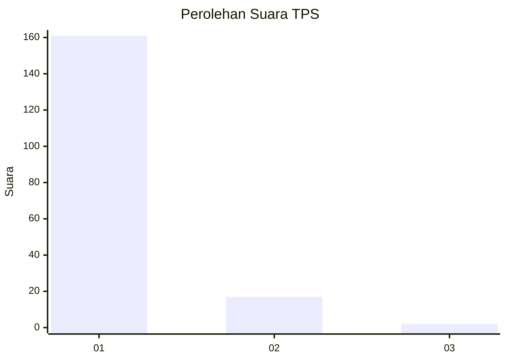
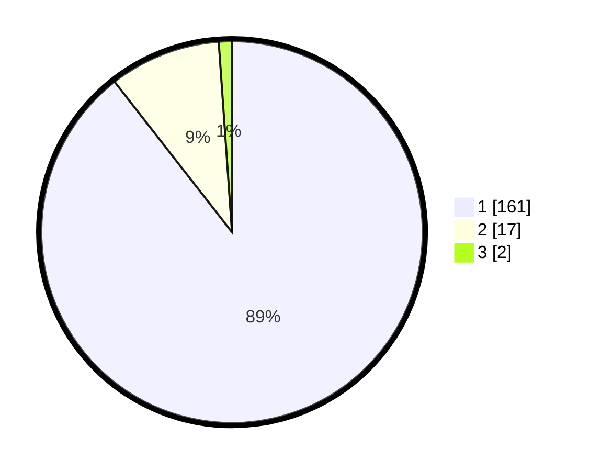

# Hasil

## Grafik

## Tabel

| No. | Nama Paslon    | Suara | Suara (raw) | Persentase |
|:--- |:-------------- | -----:| -----------:| ----------:|
| 1   | ANIES MUHAIMIN | 161   | [161][p-1]  | 89,44      |
| 2   | PRABOWO GIBRAN | 17    | [17][p-2]   | 9,44       |
| 3   | GANJAR MAHFUD  | 2     | [2][p-3]    | 1,11       |

[p-1]: https://github.com/gigit-pemilu/pemilu-2024-11-aceh/blob/main/pilpres/hitung-suara/sub/11-aceh/sub/06-aceh-besar/sub/07-darul-imarah/sub/2017-lamtheun/sub/002-tps/sub/paslon-1.txt
[p-2]: https://github.com/gigit-pemilu/pemilu-2024-11-aceh/blob/main/pilpres/hitung-suara/sub/11-aceh/sub/06-aceh-besar/sub/07-darul-imarah/sub/2017-lamtheun/sub/002-tps/sub/paslon-2.txt
[p-3]: https://github.com/gigit-pemilu/pemilu-2024-11-aceh/blob/main/pilpres/hitung-suara/sub/11-aceh/sub/06-aceh-besar/sub/07-darul-imarah/sub/2017-lamtheun/sub/002-tps/sub/paslon-3.txt

## Foto C Plano

https://sirekap-obj-formc.kpu.go.id/9e37/pemilu/ppwp/11/06/07/20/17/1106072017002-20240215-050335--7092995c-6eec-4e18-a0fa-ae184b9bdd01.jpg

https://sirekap-obj-formc.kpu.go.id/9e37/pemilu/ppwp/11/06/07/20/17/1106072017002-20240215-050413--7bde9fa0-85e3-404b-b680-59964285e247.jpg

https://sirekap-obj-formc.kpu.go.id/9e37/pemilu/ppwp/11/06/07/20/17/1106072017002-20240215-050450--042eaa3e-e1e9-42f6-9151-0873d761449a.jpg

## Metadata

| Key        | Value               |
| ---------- | ------------------- |
| Time Stamp | 2024-02-15 22:00:27 |

