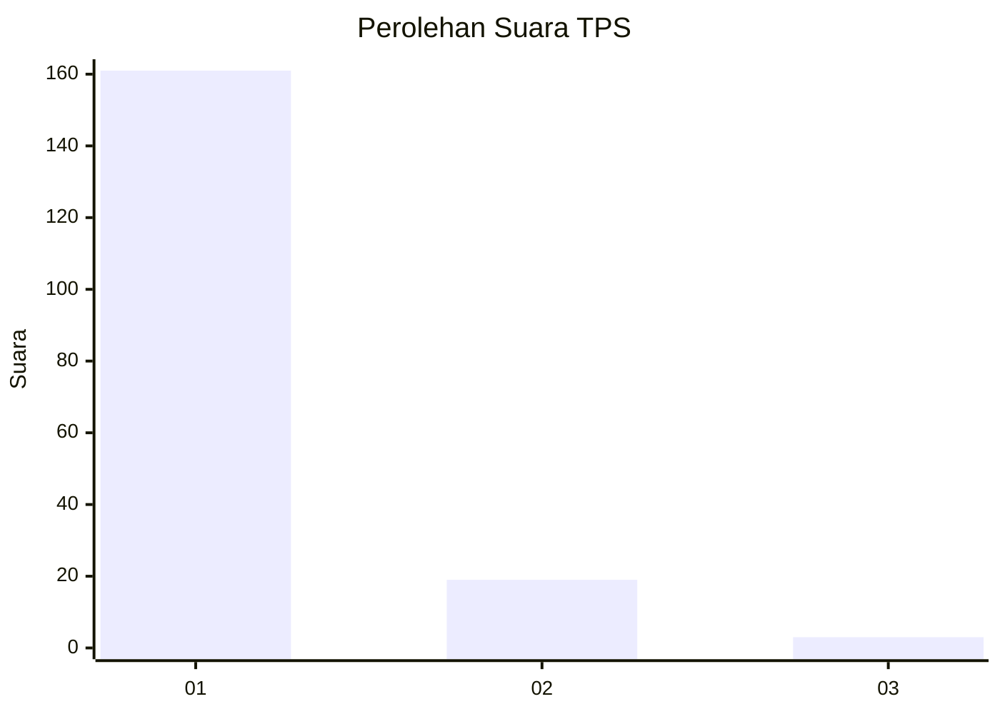
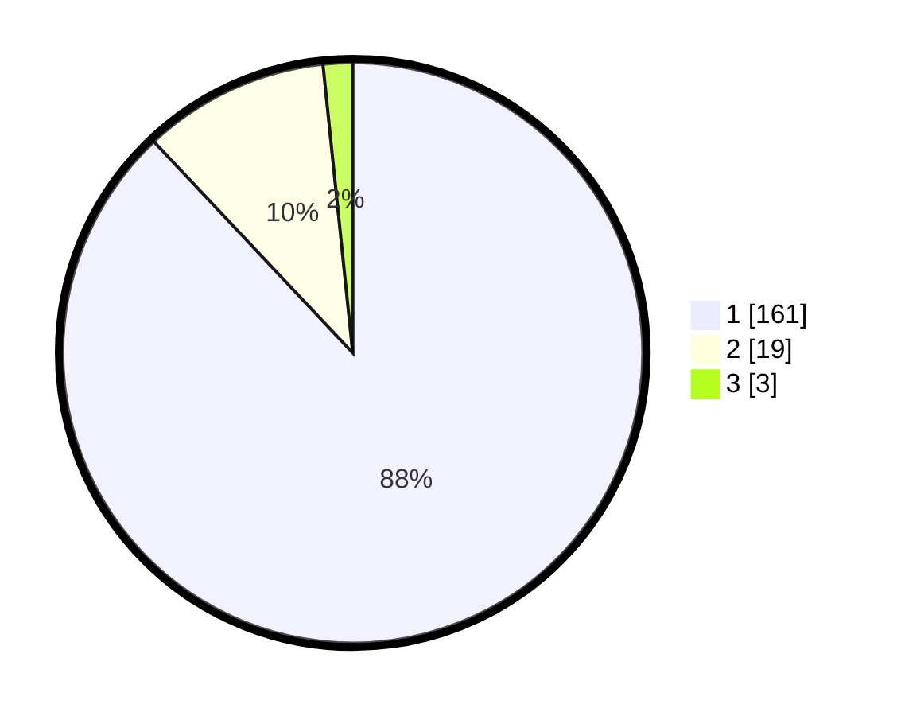

# Hasil

## Grafik

## Tabel

| No. | Nama Paslon    | Suara | Suara (raw) | Persentase |
|:--- |:-------------- | -----:| -----------:| ----------:|
| 1   | ANIES MUHAIMIN | 161   | [161][p-1]  | 87,98      |
| 2   | PRABOWO GIBRAN | 19    | [19][p-2]   | 10,38      |
| 3   | GANJAR MAHFUD  | 3     | [3][p-3]    | 1,64       |

[p-1]: https://github.com/gigit-pemilu/pemilu-2024-11-aceh/blob/main/pilpres/hitung-suara/sub/11-aceh/sub/06-aceh-besar/sub/07-darul-imarah/sub/2017-lamtheun/sub/003-tps/sub/paslon-1.txt
[p-2]: https://github.com/gigit-pemilu/pemilu-2024-11-aceh/blob/main/pilpres/hitung-suara/sub/11-aceh/sub/06-aceh-besar/sub/07-darul-imarah/sub/2017-lamtheun/sub/003-tps/sub/paslon-2.txt
[p-3]: https://github.com/gigit-pemilu/pemilu-2024-11-aceh/blob/main/pilpres/hitung-suara/sub/11-aceh/sub/06-aceh-besar/sub/07-darul-imarah/sub/2017-lamtheun/sub/003-tps/sub/paslon-3.txt

## Foto C Plano

https://sirekap-obj-formc.kpu.go.id/9166/pemilu/ppwp/11/06/07/20/17/1106072017003-20240215-023826--35dcdb12-df3e-4886-84d3-c1a21f3308b9.jpg

https://sirekap-obj-formc.kpu.go.id/9166/pemilu/ppwp/11/06/07/20/17/1106072017003-20240215-024031--f9e618e9-731b-4de2-abb7-645670428f58.jpg

https://sirekap-obj-formc.kpu.go.id/9166/pemilu/ppwp/11/06/07/20/17/1106072017003-20240215-024158--31cf30b8-3ea6-48a1-8aa6-d7c968444f49.jpg

## Metadata

| Key        | Value               |
| ---------- | ------------------- |
| Time Stamp | 2024-02-15 15:00:29 |

