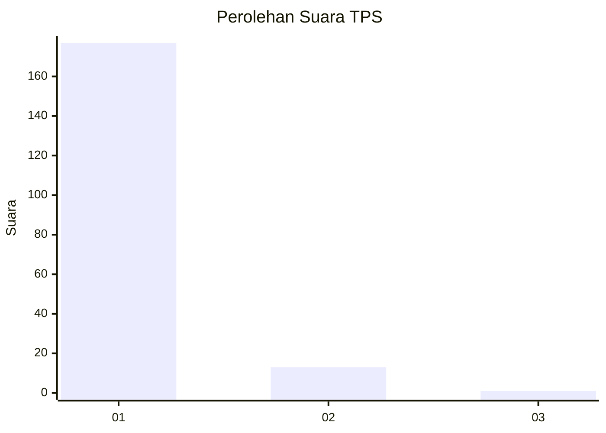
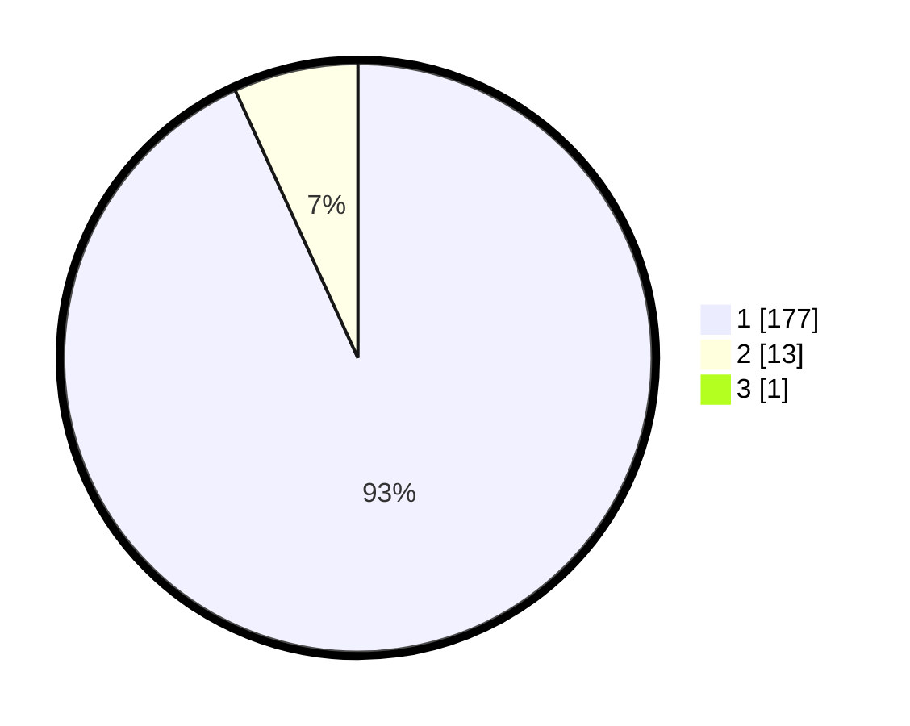

# Hasil

## Grafik

## Tabel

| No. | Nama Paslon    | Suara | Suara (raw) | Persentase |
|:--- |:-------------- | -----:| -----------:| ----------:|
| 1   | ANIES MUHAIMIN | 177   | [177][p-1]  | 92,67      |
| 2   | PRABOWO GIBRAN | 13    | [13][p-2]   | 6,81       |
| 3   | GANJAR MAHFUD  | 1     | [1][p-3]    | 0,52       |

[p-1]: https://github.com/gigit-pemilu/pemilu-2024-11-aceh/blob/main/pilpres/hitung-suara/sub/11-aceh/sub/06-aceh-besar/sub/07-darul-imarah/sub/2019-tingkuem/sub/004-tps/sub/paslon-1.txt
[p-2]: https://github.com/gigit-pemilu/pemilu-2024-11-aceh/blob/main/pilpres/hitung-suara/sub/11-aceh/sub/06-aceh-besar/sub/07-darul-imarah/sub/2019-tingkuem/sub/004-tps/sub/paslon-2.txt
[p-3]: https://github.com/gigit-pemilu/pemilu-2024-11-aceh/blob/main/pilpres/hitung-suara/sub/11-aceh/sub/06-aceh-besar/sub/07-darul-imarah/sub/2019-tingkuem/sub/004-tps/sub/paslon-3.txt

## Foto C Plano

https://sirekap-obj-formc.kpu.go.id/640e/pemilu/ppwp/11/06/07/20/19/1106072019004-20240214-160124--cd3ea73a-16d1-40c5-bce5-3f318834788d.jpg

https://sirekap-obj-formc.kpu.go.id/640e/pemilu/ppwp/11/06/07/20/19/1106072019004-20240214-155852--091ca565-a3c8-4e1d-8d59-470171bb8d5f.jpg

https://sirekap-obj-formc.kpu.go.id/640e/pemilu/ppwp/11/06/07/20/19/1106072019004-20240214-160142--f37f5641-7336-4edd-828e-4baf652809a9.jpg

## Metadata

| Key        | Value               |
| ---------- | ------------------- |
| Time Stamp | 2024-02-15 16:30:25 |

