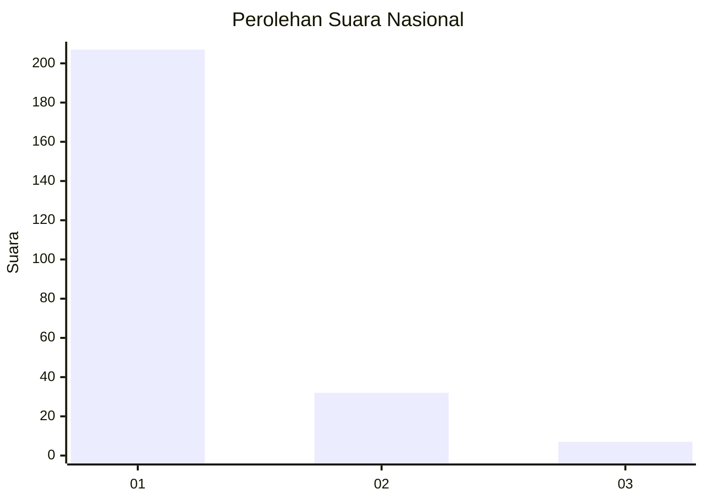
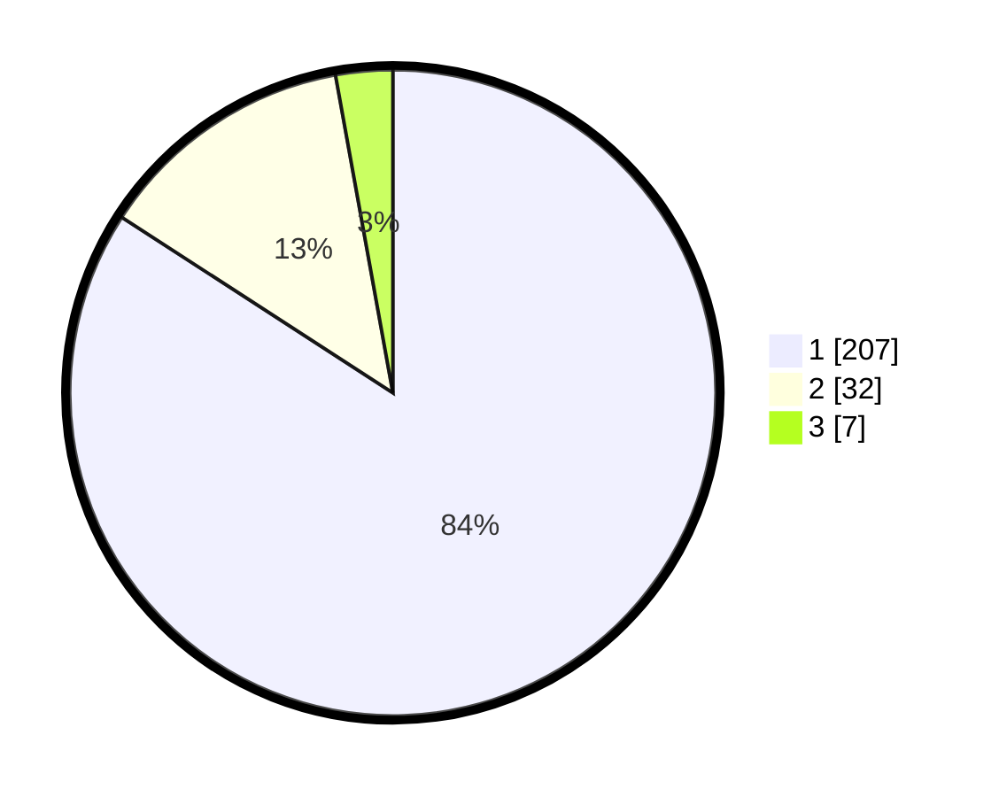

# Hasil

## Grafik

## Tabel

| No. | Nama Paslon    | Suara | Suara (raw) | Persentase |
|:--- |:-------------- | -----:| -----------:| ----------:|
| 1   | ANIES MUHAIMIN | 207   | [207][p-1]  | 84,15      |
| 2   | PRABOWO GIBRAN | 32    | [32][p-2]   | 13,01      |
| 3   | GANJAR MAHFUD  | 7     | [7][p-3]    | 2,85       |

[p-1]: https://github.com/gigit-pemilu/pemilu-2024/blob/main/pilpres/hitung-suara/sub/11-aceh/sub/06-aceh-besar/sub/07-darul-imarah/sub/2020-kandang/sub/001-tps/sub/paslon-1.txt
[p-2]: https://github.com/gigit-pemilu/pemilu-2024/blob/main/pilpres/hitung-suara/sub/11-aceh/sub/06-aceh-besar/sub/07-darul-imarah/sub/2020-kandang/sub/001-tps/sub/paslon-2.txt
[p-3]: https://github.com/gigit-pemilu/pemilu-2024/blob/main/pilpres/hitung-suara/sub/11-aceh/sub/06-aceh-besar/sub/07-darul-imarah/sub/2020-kandang/sub/001-tps/sub/paslon-3.txt

## Foto C Plano

https://sirekap-obj-formc.kpu.go.id/b50d/pemilu/ppwp/11/06/07/20/20/1106072020001-20240217-233353--77e8f747-b821-4a19-a838-96f87e1c36ac.jpg

https://sirekap-obj-formc.kpu.go.id/b50d/pemilu/ppwp/11/06/07/20/20/1106072020001-20240217-233417--25677979-a458-4609-8923-d6905dbd7a07.jpg

https://sirekap-obj-formc.kpu.go.id/b50d/pemilu/ppwp/11/06/07/20/20/1106072020001-20240217-233449--42747864-d4ef-47f5-a5c8-b16913f7982f.jpg

## Metadata

| Key        | Value               |
| ---------- | ------------------- |
| Time Stamp | 2024-02-19 21:00:00 |

