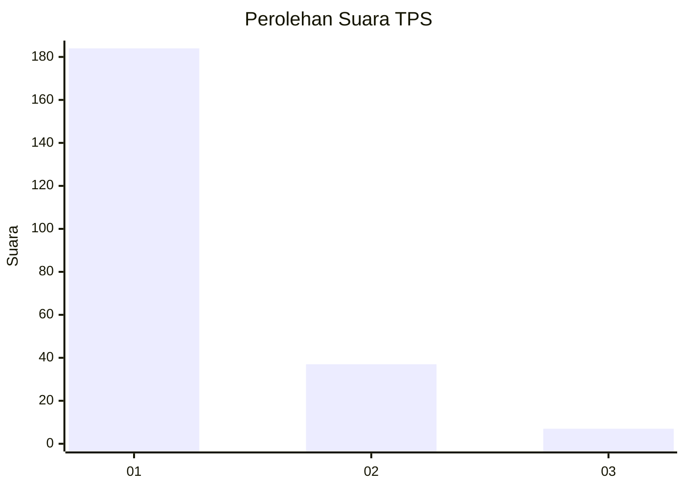
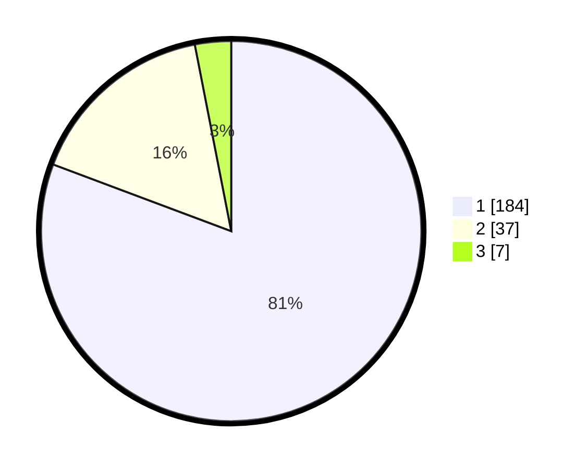

# Hasil

## Grafik

## Tabel

| No. | Nama Paslon    | Suara | Suara (raw) | Persentase |
|:--- |:-------------- | -----:| -----------:| ----------:|
| 1   | ANIES MUHAIMIN | 184   | [184][p-1]  | 80,70      |
| 2   | PRABOWO GIBRAN | 37    | [37][p-2]   | 16,23      |
| 3   | GANJAR MAHFUD  | 7     | [7][p-3]    | 3,07       |

[p-1]: https://github.com/gigit-pemilu/pemilu-2024-11-aceh/blob/main/pilpres/hitung-suara/sub/11-aceh/sub/06-aceh-besar/sub/07-darul-imarah/sub/2021-lam-bheu/sub/001-tps/sub/paslon-1.txt
[p-2]: https://github.com/gigit-pemilu/pemilu-2024-11-aceh/blob/main/pilpres/hitung-suara/sub/11-aceh/sub/06-aceh-besar/sub/07-darul-imarah/sub/2021-lam-bheu/sub/001-tps/sub/paslon-2.txt
[p-3]: https://github.com/gigit-pemilu/pemilu-2024-11-aceh/blob/main/pilpres/hitung-suara/sub/11-aceh/sub/06-aceh-besar/sub/07-darul-imarah/sub/2021-lam-bheu/sub/001-tps/sub/paslon-3.txt

## Foto C Plano

https://sirekap-obj-formc.kpu.go.id/3d99/pemilu/ppwp/11/06/07/20/21/1106072021001-20240214-222504--c181645e-b660-4906-a465-8ec5e458d960.jpg

https://sirekap-obj-formc.kpu.go.id/3d99/pemilu/ppwp/11/06/07/20/21/1106072021001-20240214-222658--c91bc49e-1338-482c-8056-a10257f7a8b3.jpg

https://sirekap-obj-formc.kpu.go.id/3d99/pemilu/ppwp/11/06/07/20/21/1106072021001-20240214-222807--9b6b176b-027b-47b6-bd5c-8071a27f3dba.jpg

## Metadata

| Key        | Value               |
| ---------- | ------------------- |
| Time Stamp | 2024-02-15 16:30:25 |

