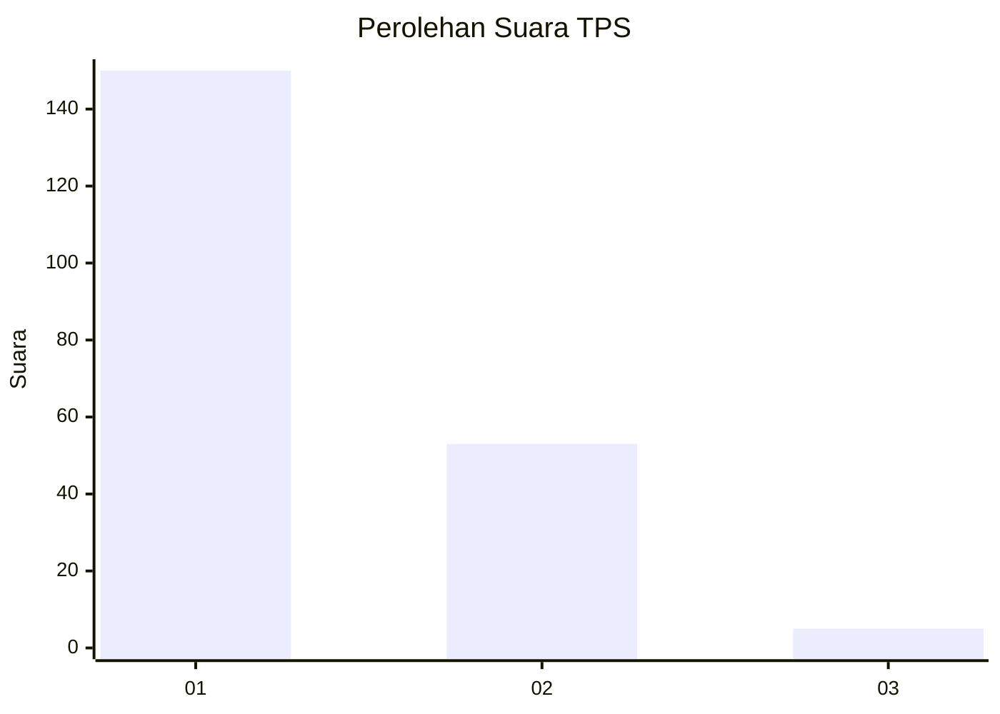
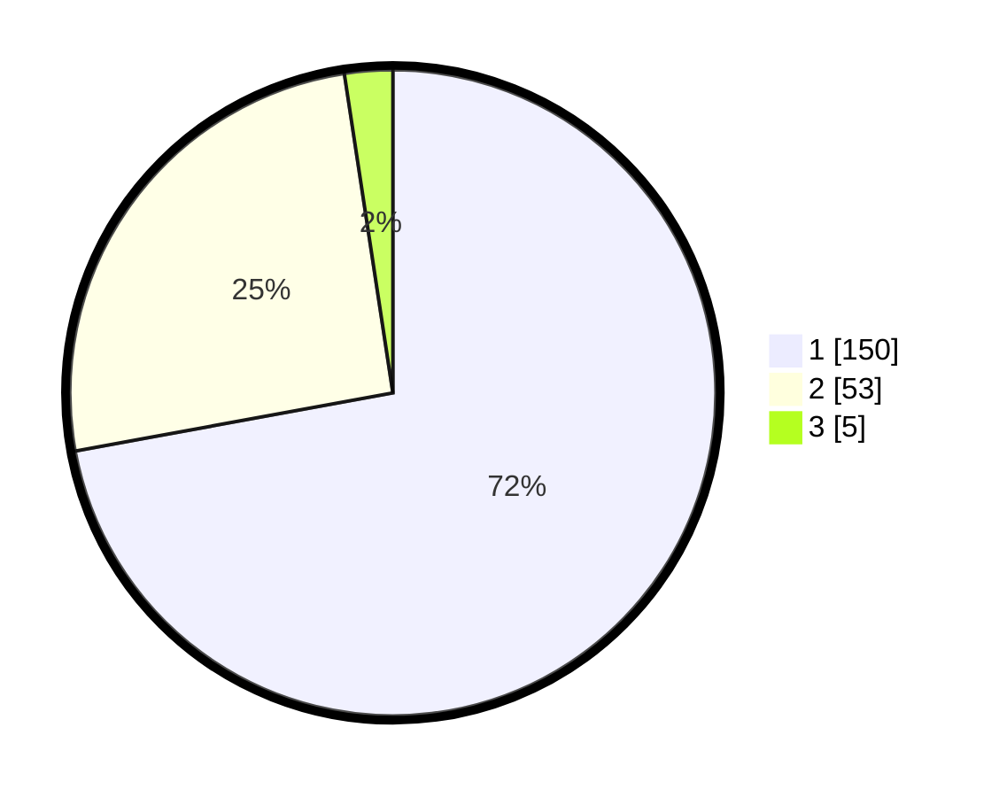

# Hasil

## Grafik

## Tabel

| No. | Nama Paslon    | Suara | Suara (raw) | Persentase |
|:--- |:-------------- | -----:| -----------:| ----------:|
| 1   | ANIES MUHAIMIN | 150   | [150][p-1]  | 72,12      |
| 2   | PRABOWO GIBRAN | 53    | [53][p-2]   | 25,48      |
| 3   | GANJAR MAHFUD  | 5     | [5][p-3]    | 2,40       |

[p-1]: https://github.com/gigit-pemilu/pemilu-2024-11-aceh/blob/main/pilpres/hitung-suara/sub/11-aceh/sub/06-aceh-besar/sub/07-darul-imarah/sub/2021-lam-bheu/sub/004-tps/sub/paslon-1.txt
[p-2]: https://github.com/gigit-pemilu/pemilu-2024-11-aceh/blob/main/pilpres/hitung-suara/sub/11-aceh/sub/06-aceh-besar/sub/07-darul-imarah/sub/2021-lam-bheu/sub/004-tps/sub/paslon-2.txt
[p-3]: https://github.com/gigit-pemilu/pemilu-2024-11-aceh/blob/main/pilpres/hitung-suara/sub/11-aceh/sub/06-aceh-besar/sub/07-darul-imarah/sub/2021-lam-bheu/sub/004-tps/sub/paslon-3.txt

## Foto C Plano

https://sirekap-obj-formc.kpu.go.id/a581/pemilu/ppwp/11/06/07/20/21/1106072021004-20240214-223931--d22843c3-7860-4947-bc17-ceeb83f65c02.jpg

https://sirekap-obj-formc.kpu.go.id/a581/pemilu/ppwp/11/06/07/20/21/1106072021004-20240214-224041--5ca69288-9ae0-46b2-a195-61d330677202.jpg

https://sirekap-obj-formc.kpu.go.id/a581/pemilu/ppwp/11/06/07/20/21/1106072021004-20240214-224151--83aa2d14-f93b-471f-8859-d74e9fef36fa.jpg

## Metadata

| Key        | Value               |
| ---------- | ------------------- |
| Time Stamp | 2024-02-15 22:00:27 |

