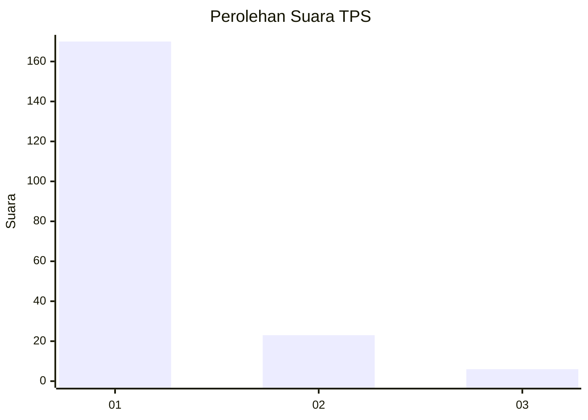
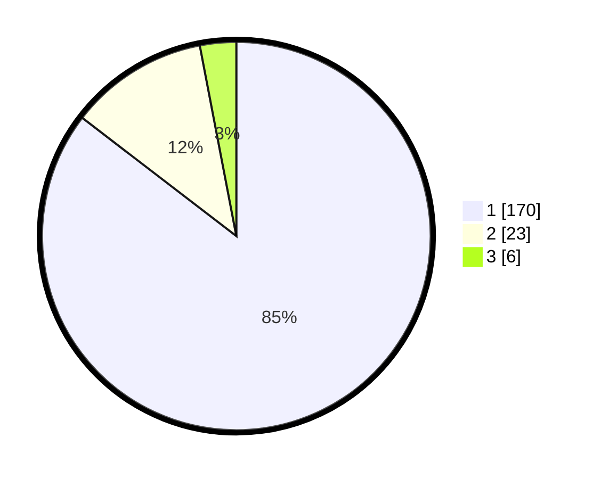

# Hasil

## Grafik

## Tabel

| No. | Nama Paslon    | Suara | Suara (raw) | Persentase |
|:--- |:-------------- | -----:| -----------:| ----------:|
| 1   | ANIES MUHAIMIN | 170   | [170][p-1]  | 85,43      |
| 2   | PRABOWO GIBRAN | 23    | [23][p-2]   | 11,56      |
| 3   | GANJAR MAHFUD  | 6     | [6][p-3]    | 3,02       |

[p-1]: https://github.com/gigit-pemilu/pemilu-2024-11-aceh/blob/main/pilpres/hitung-suara/sub/11-aceh/sub/06-aceh-besar/sub/07-darul-imarah/sub/2021-lam-bheu/sub/011-tps/sub/paslon-1.txt
[p-2]: https://github.com/gigit-pemilu/pemilu-2024-11-aceh/blob/main/pilpres/hitung-suara/sub/11-aceh/sub/06-aceh-besar/sub/07-darul-imarah/sub/2021-lam-bheu/sub/011-tps/sub/paslon-2.txt
[p-3]: https://github.com/gigit-pemilu/pemilu-2024-11-aceh/blob/main/pilpres/hitung-suara/sub/11-aceh/sub/06-aceh-besar/sub/07-darul-imarah/sub/2021-lam-bheu/sub/011-tps/sub/paslon-3.txt

## Foto C Plano

https://sirekap-obj-formc.kpu.go.id/f288/pemilu/ppwp/11/06/07/20/21/1106072021011-20240215-061650--d5bf62bc-f48e-410c-be03-7a75e05d0c12.jpg

https://sirekap-obj-formc.kpu.go.id/f288/pemilu/ppwp/11/06/07/20/21/1106072021011-20240215-061732--5494e623-9105-4d35-9aaf-de7cf9ed1de1.jpg

https://sirekap-obj-formc.kpu.go.id/f288/pemilu/ppwp/11/06/07/20/21/1106072021011-20240215-061751--47094478-c9db-40eb-ae1d-70bedb77d200.jpg

## Metadata

| Key        | Value               |
| ---------- | ------------------- |
| Time Stamp | 2024-02-15 16:30:25 |

