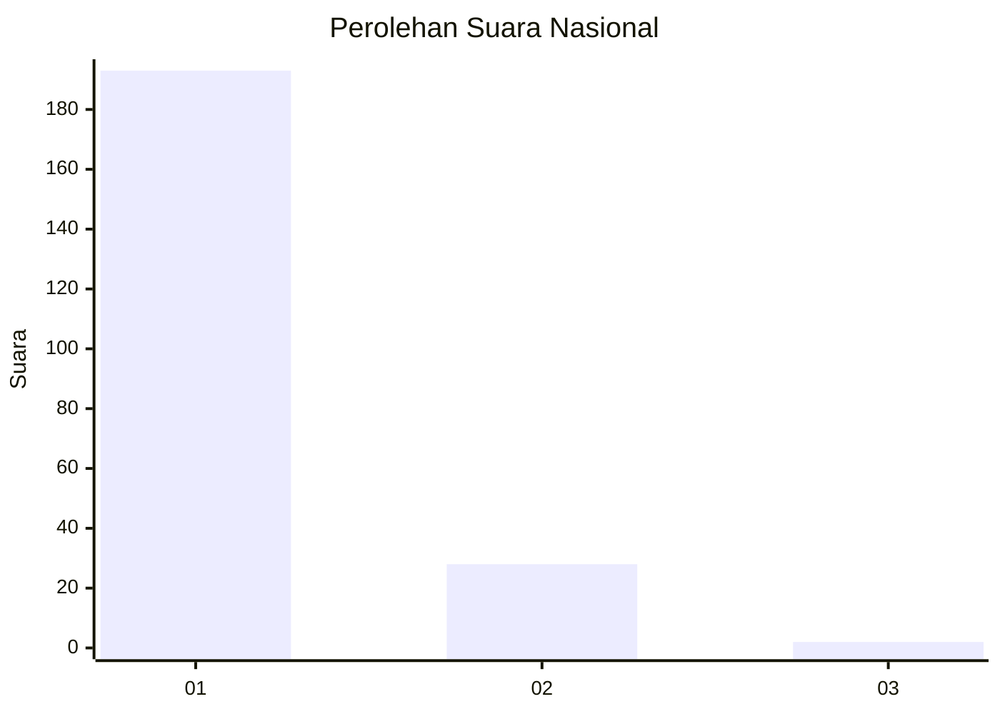
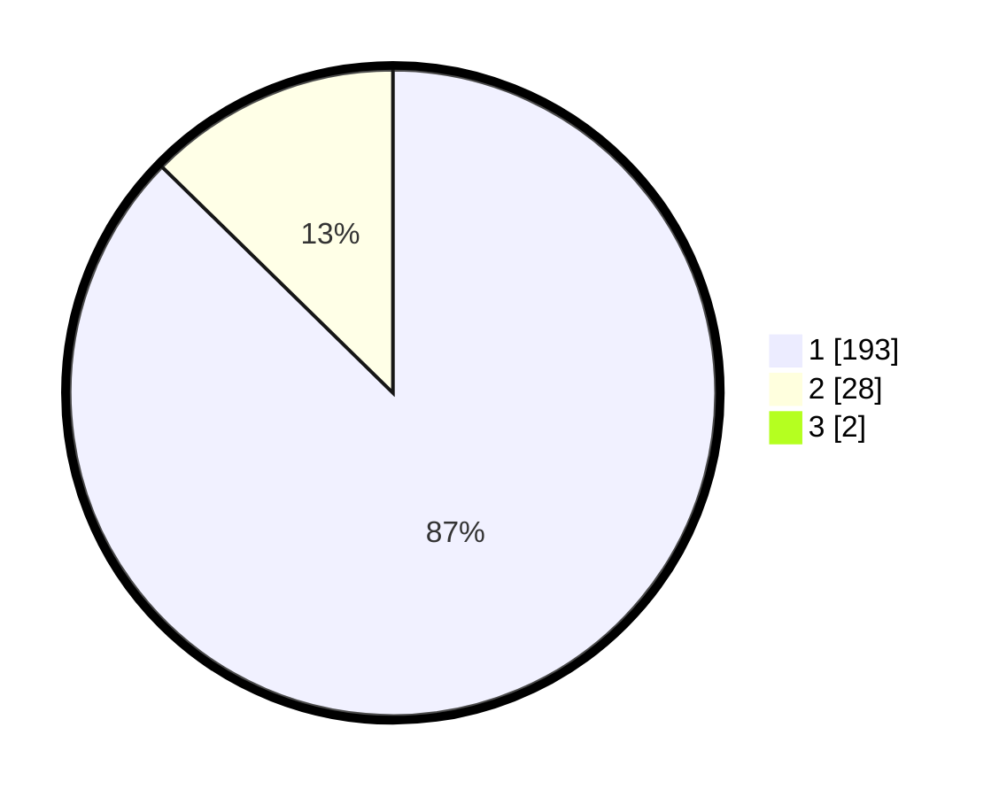

# Hasil

## Grafik

## Tabel

| No. | Nama Paslon    | Suara | Suara (raw) | Persentase |
|:--- |:-------------- | -----:| -----------:| ----------:|
| 1   | ANIES MUHAIMIN | 193   | [193][p-1]  | 86,55      |
| 2   | PRABOWO GIBRAN | 28    | [28][p-2]   | 12,56      |
| 3   | GANJAR MAHFUD  | 2     | [2][p-3]    | 0,90       |

[p-1]: https://github.com/gigit-pemilu/pemilu-2024/blob/main/pilpres/hitung-suara/sub/11-aceh/sub/06-aceh-besar/sub/07-darul-imarah/sub/2021-lam-bheu/sub/012-tps/sub/paslon-1.txt
[p-2]: https://github.com/gigit-pemilu/pemilu-2024/blob/main/pilpres/hitung-suara/sub/11-aceh/sub/06-aceh-besar/sub/07-darul-imarah/sub/2021-lam-bheu/sub/012-tps/sub/paslon-2.txt
[p-3]: https://github.com/gigit-pemilu/pemilu-2024/blob/main/pilpres/hitung-suara/sub/11-aceh/sub/06-aceh-besar/sub/07-darul-imarah/sub/2021-lam-bheu/sub/012-tps/sub/paslon-3.txt

## Foto C Plano

https://sirekap-obj-formc.kpu.go.id/b80b/pemilu/ppwp/11/06/07/20/21/1106072021012-20240215-031116--a547ade3-060c-4818-8227-7273ded503f7.jpg

https://sirekap-obj-formc.kpu.go.id/b80b/pemilu/ppwp/11/06/07/20/21/1106072021012-20240215-031342--1275406e-7295-46b9-9f35-1195f5dcd1ba.jpg

https://sirekap-obj-formc.kpu.go.id/b80b/pemilu/ppwp/11/06/07/20/21/1106072021012-20240215-031457--285d0ffd-65f4-427e-b1d5-f4824193e697.jpg

## Metadata

| Key        | Value               |
| ---------- | ------------------- |
| Time Stamp | 2024-02-15 22:00:27 |

