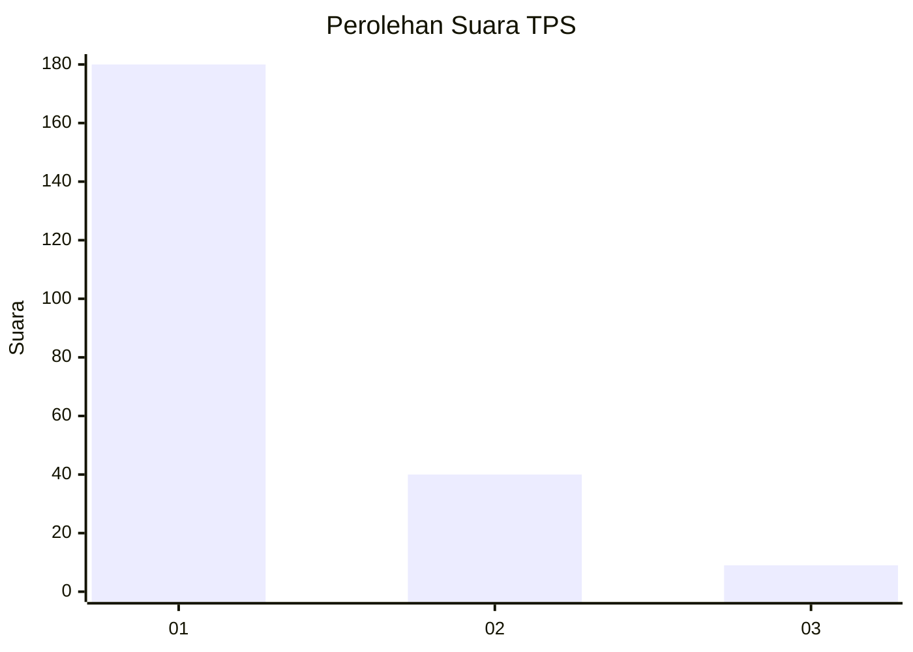
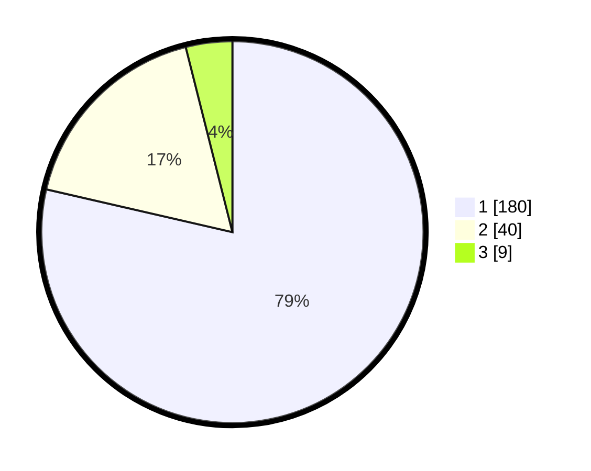

# Hasil

## Grafik

## Tabel

| No. | Nama Paslon    | Suara | Suara (raw) | Persentase |
|:--- |:-------------- | -----:| -----------:| ----------:|
| 1   | ANIES MUHAIMIN | 180   | [180][p-1]  | 78,60      |
| 2   | PRABOWO GIBRAN | 40    | [40][p-2]   | 17,47      |
| 3   | GANJAR MAHFUD  | 9     | [9][p-3]    | 3,93       |

[p-1]: https://github.com/gigit-pemilu/pemilu-2024-11-aceh/blob/main/pilpres/hitung-suara/sub/11-aceh/sub/06-aceh-besar/sub/07-darul-imarah/sub/2024-garot/sub/003-tps/sub/paslon-1.txt
[p-2]: https://github.com/gigit-pemilu/pemilu-2024-11-aceh/blob/main/pilpres/hitung-suara/sub/11-aceh/sub/06-aceh-besar/sub/07-darul-imarah/sub/2024-garot/sub/003-tps/sub/paslon-2.txt
[p-3]: https://github.com/gigit-pemilu/pemilu-2024-11-aceh/blob/main/pilpres/hitung-suara/sub/11-aceh/sub/06-aceh-besar/sub/07-darul-imarah/sub/2024-garot/sub/003-tps/sub/paslon-3.txt

## Foto C Plano

https://sirekap-obj-formc.kpu.go.id/6155/pemilu/ppwp/11/06/07/20/24/1106072024003-20240214-235357--8c1b1d4c-caa7-46cc-ae05-07a5c1fd5b64.jpg

https://sirekap-obj-formc.kpu.go.id/6155/pemilu/ppwp/11/06/07/20/24/1106072024003-20240214-235528--1f6a9651-c678-4728-87a9-ccd3d587f8d5.jpg

https://sirekap-obj-formc.kpu.go.id/6155/pemilu/ppwp/11/06/07/20/24/1106072024003-20240214-235752--0b3d259f-a043-4d90-b5ec-fb6d727d1f1b.jpg

## Metadata

| Key        | Value               |
| ---------- | ------------------- |
| Time Stamp | 2024-02-15 16:30:25 |

## DATA PEMILIH TETAP

Jumlah pemilih dalam DPT: **237**.
 * L: **133**.
 * P: **145**.

## DATA PENGGUNA HAK PILIH

Jumlah pengguna hak pilih dalam DPT: **260**.
 * L: **48**.
 * P: **113**.

Jumlah pengguna hak pilih dalam DPTb: **817**.
 * L: **886**.
 * P: **811**.

Jumlah pengguna hak pilih dalam DPK: **1**.
 * L: **838**.
 * P: **1**.

Jumlah pengguna hak pilih: **229**.
 * L: **104**.
 * P: **175**.

## JUMLAH SUARA SAH DAN TIDAK SAH

JUMLAH SELURUH SUARA SAH: **229**.

JUMLAH SUARA TIDAK SAH: **0**.

JUMLAH SELURUH SUARA SAH DAN SUARA TIDAK SAH: **229**.

