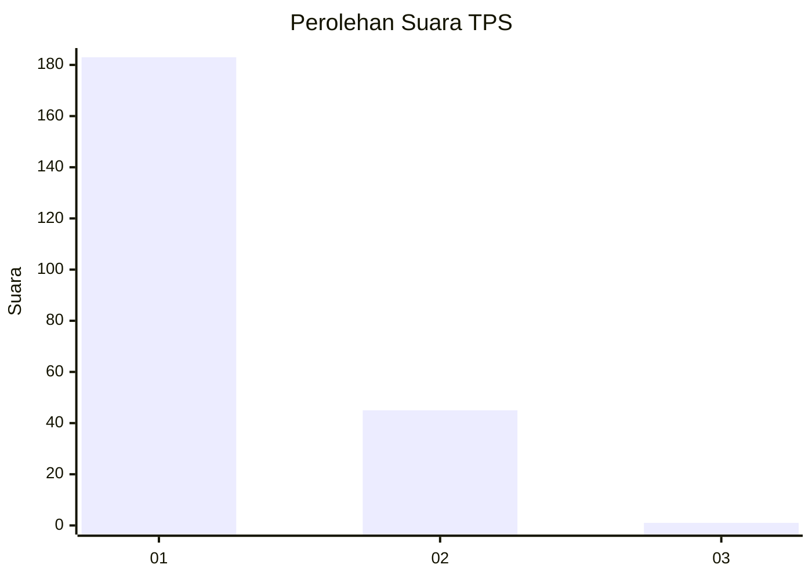
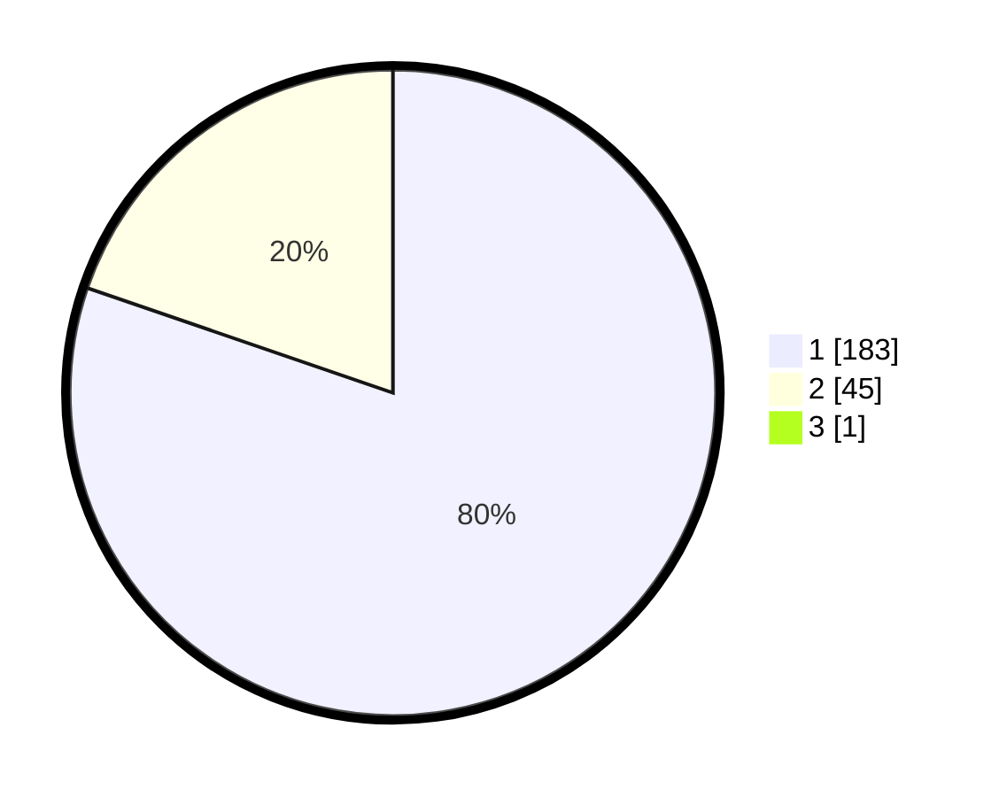

# Hasil

## Grafik

## Tabel

| No. | Nama Paslon    | Suara | Suara (raw) | Persentase |
|:--- |:-------------- | -----:| -----------:| ----------:|
| 1   | ANIES MUHAIMIN | 183   | [183][p-1]  | 79,91      |
| 2   | PRABOWO GIBRAN | 45    | [45][p-2]   | 19,65      |
| 3   | GANJAR MAHFUD  | 1     | [1][p-3]    | 0,44       |

[p-1]: https://github.com/gigit-pemilu/pemilu-2024-11-aceh/blob/main/pilpres/hitung-suara/sub/11-aceh/sub/06-aceh-besar/sub/07-darul-imarah/sub/2024-garot/sub/004-tps/sub/paslon-1.txt
[p-2]: https://github.com/gigit-pemilu/pemilu-2024-11-aceh/blob/main/pilpres/hitung-suara/sub/11-aceh/sub/06-aceh-besar/sub/07-darul-imarah/sub/2024-garot/sub/004-tps/sub/paslon-2.txt
[p-3]: https://github.com/gigit-pemilu/pemilu-2024-11-aceh/blob/main/pilpres/hitung-suara/sub/11-aceh/sub/06-aceh-besar/sub/07-darul-imarah/sub/2024-garot/sub/004-tps/sub/paslon-3.txt

## Foto C Plano

https://sirekap-obj-formc.kpu.go.id/6855/pemilu/ppwp/11/06/07/20/24/1106072024004-20240215-050359--45b69b2a-b438-484c-9b8c-ebfd79c27eba.jpg

https://sirekap-obj-formc.kpu.go.id/6855/pemilu/ppwp/11/06/07/20/24/1106072024004-20240215-050402--6f9bd8e3-9798-4367-8965-726667e16fd1.jpg

https://sirekap-obj-formc.kpu.go.id/6855/pemilu/ppwp/11/06/07/20/24/1106072024004-20240215-050404--deebc57c-d8aa-4395-9dc5-02d346ee760b.jpg

## Metadata

| Key        | Value               |
| ---------- | ------------------- |
| Time Stamp | 2024-02-15 22:00:27 |

