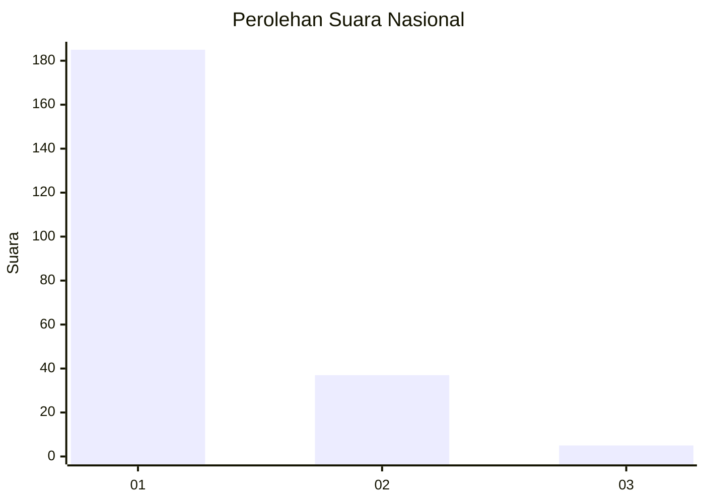
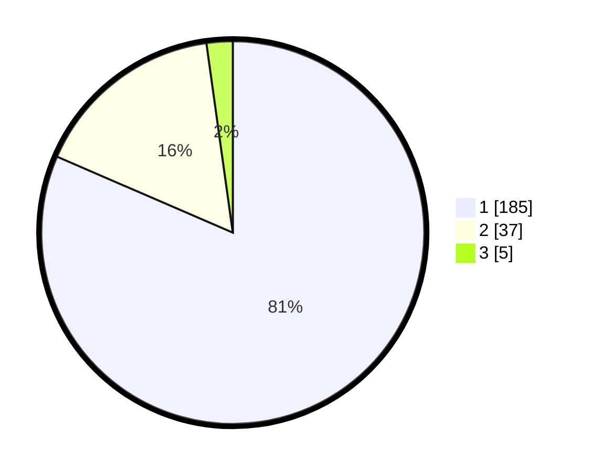

# Hasil

## Grafik

## Tabel

| No. | Nama Paslon    | Suara | Suara (raw) | Persentase |
|:--- |:-------------- | -----:| -----------:| ----------:|
| 1   | ANIES MUHAIMIN | 185   | [185][p-1]  | 81,50      |
| 2   | PRABOWO GIBRAN | 37    | [37][p-2]   | 16,30      |
| 3   | GANJAR MAHFUD  | 5     | [5][p-3]    | 2,20       |

[p-1]: https://github.com/gigit-pemilu/pemilu-2024/blob/main/pilpres/hitung-suara/sub/11-aceh/sub/06-aceh-besar/sub/07-darul-imarah/sub/2024-garot/sub/005-tps/sub/paslon-1.txt
[p-2]: https://github.com/gigit-pemilu/pemilu-2024/blob/main/pilpres/hitung-suara/sub/11-aceh/sub/06-aceh-besar/sub/07-darul-imarah/sub/2024-garot/sub/005-tps/sub/paslon-2.txt
[p-3]: https://github.com/gigit-pemilu/pemilu-2024/blob/main/pilpres/hitung-suara/sub/11-aceh/sub/06-aceh-besar/sub/07-darul-imarah/sub/2024-garot/sub/005-tps/sub/paslon-3.txt

## Foto C Plano

https://sirekap-obj-formc.kpu.go.id/ad8d/pemilu/ppwp/11/06/07/20/24/1106072024005-20240215-063847--fdaedbf4-2c32-45e6-a381-167defcd76ff.jpg

https://sirekap-obj-formc.kpu.go.id/ad8d/pemilu/ppwp/11/06/07/20/24/1106072024005-20240215-064038--9bf6f5db-9f12-4eeb-a78f-b0ff15f13832.jpg

https://sirekap-obj-formc.kpu.go.id/ad8d/pemilu/ppwp/11/06/07/20/24/1106072024005-20240215-064425--3a1828cf-f94e-47a3-bb1d-8da3974c7101.jpg

## Metadata

| Key        | Value               |
| ---------- | ------------------- |
| Time Stamp | 2024-02-15 16:30:25 |

