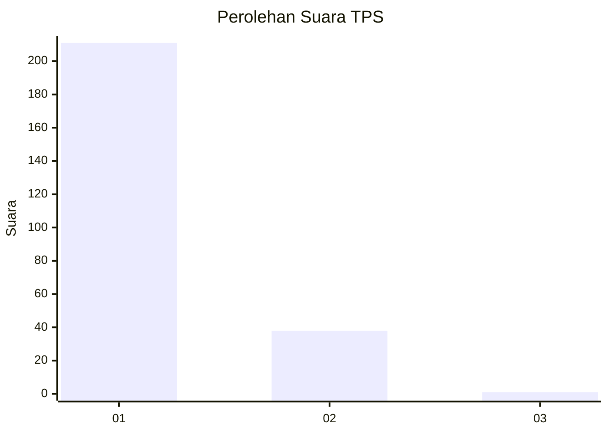
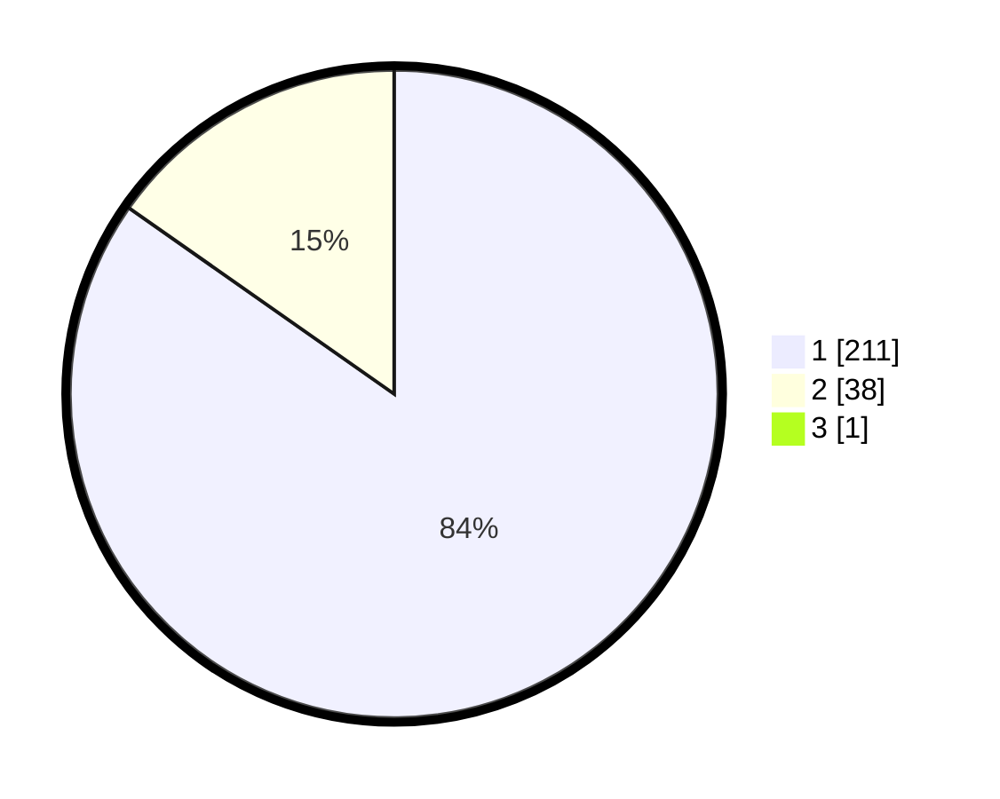

# Hasil

## Grafik

## Tabel

| No. | Nama Paslon    | Suara | Suara (raw) | Persentase |
|:--- |:-------------- | -----:| -----------:| ----------:|
| 1   | ANIES MUHAIMIN | 211   | [211][p-1]  | 84,40      |
| 2   | PRABOWO GIBRAN | 38    | [38][p-2]   | 15,20      |
| 3   | GANJAR MAHFUD  | 1     | [1][p-3]    | 0,40       |

[p-1]: https://github.com/gigit-pemilu/pemilu-2024-11-aceh/blob/main/pilpres/hitung-suara/sub/11-aceh/sub/06-aceh-besar/sub/07-darul-imarah/sub/2025-pasheu-beutong/sub/003-tps/sub/paslon-1.txt
[p-2]: https://github.com/gigit-pemilu/pemilu-2024-11-aceh/blob/main/pilpres/hitung-suara/sub/11-aceh/sub/06-aceh-besar/sub/07-darul-imarah/sub/2025-pasheu-beutong/sub/003-tps/sub/paslon-2.txt
[p-3]: https://github.com/gigit-pemilu/pemilu-2024-11-aceh/blob/main/pilpres/hitung-suara/sub/11-aceh/sub/06-aceh-besar/sub/07-darul-imarah/sub/2025-pasheu-beutong/sub/003-tps/sub/paslon-3.txt

## Foto C Plano

https://sirekap-obj-formc.kpu.go.id/9540/pemilu/ppwp/11/06/07/20/25/1106072025003-20240215-010917--226c1ae3-4b0a-469b-978c-5bfddc8fb724.jpg

https://sirekap-obj-formc.kpu.go.id/9540/pemilu/ppwp/11/06/07/20/25/1106072025003-20240215-011018--f145449c-0728-4d88-be8c-240169622adf.jpg

https://sirekap-obj-formc.kpu.go.id/9540/pemilu/ppwp/11/06/07/20/25/1106072025003-20240215-011103--c2f8db18-836d-4409-bb4a-0c68b47f9894.jpg

## Metadata

| Key        | Value               |
| ---------- | ------------------- |
| Time Stamp | 2024-02-15 15:00:29 |

