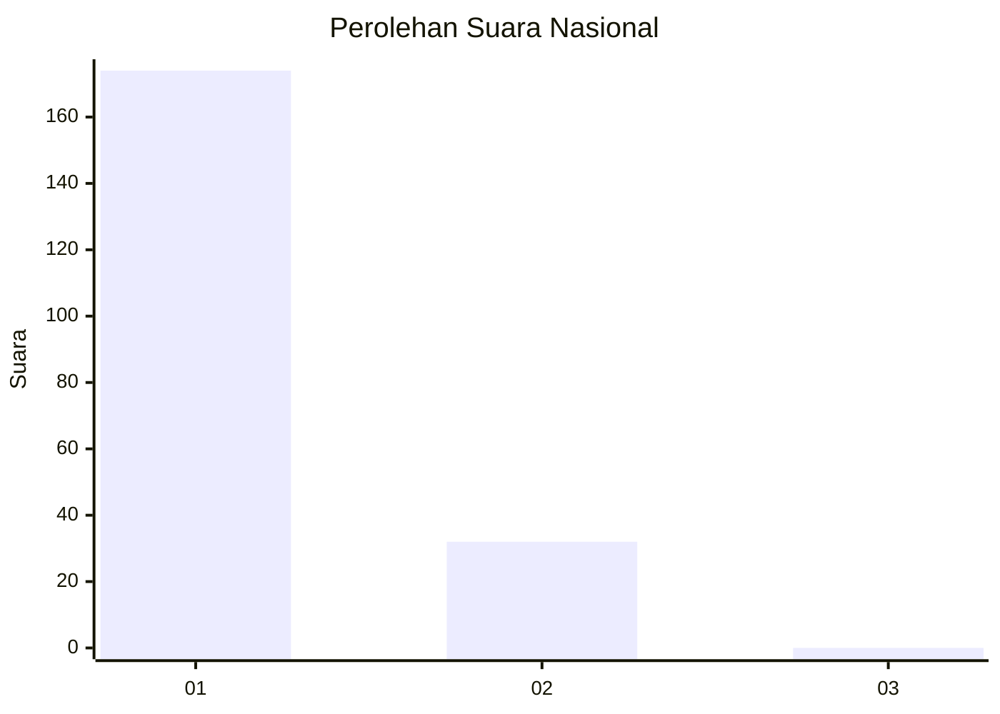
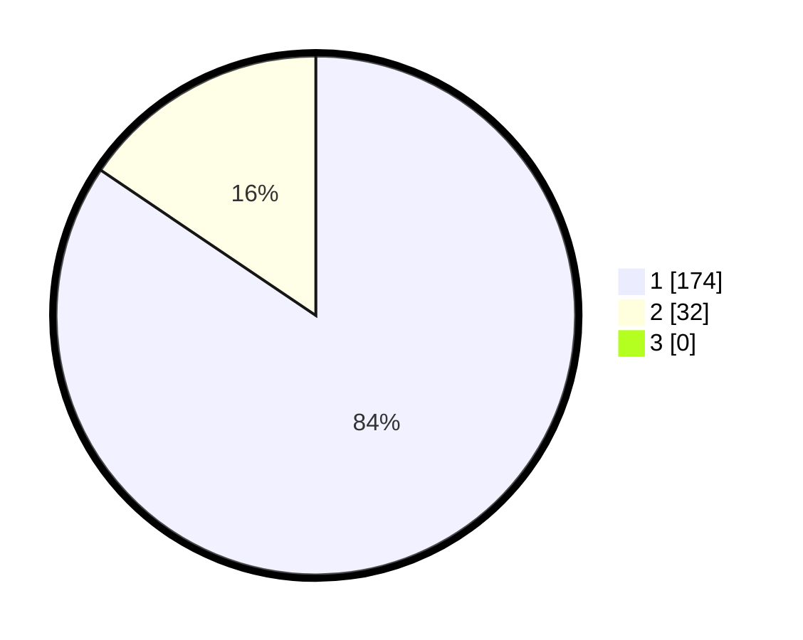

# Hasil

## Grafik

## Tabel

| No. | Nama Paslon    | Suara | Suara (raw) | Persentase |
|:--- |:-------------- | -----:| -----------:| ----------:|
| 1   | ANIES MUHAIMIN | 174   | [174][p-1]  | 84,47      |
| 2   | PRABOWO GIBRAN | 32    | [32][p-2]   | 15,53      |
| 3   | GANJAR MAHFUD  | 0     | [0][p-3]    | 0,00       |

[p-1]: https://github.com/gigit-pemilu/pemilu-2024/blob/main/pilpres/hitung-suara/sub/11-aceh/sub/06-aceh-besar/sub/07-darul-imarah/sub/2025-pasheu-beutong/sub/004-tps/sub/paslon-1.txt
[p-2]: https://github.com/gigit-pemilu/pemilu-2024/blob/main/pilpres/hitung-suara/sub/11-aceh/sub/06-aceh-besar/sub/07-darul-imarah/sub/2025-pasheu-beutong/sub/004-tps/sub/paslon-2.txt
[p-3]: https://github.com/gigit-pemilu/pemilu-2024/blob/main/pilpres/hitung-suara/sub/11-aceh/sub/06-aceh-besar/sub/07-darul-imarah/sub/2025-pasheu-beutong/sub/004-tps/sub/paslon-3.txt

## Foto C Plano

https://sirekap-obj-formc.kpu.go.id/5361/pemilu/ppwp/11/06/07/20/25/1106072025004-20240214-232052--45f5b529-6506-4c9c-87cb-8ea89716282e.jpg

https://sirekap-obj-formc.kpu.go.id/5361/pemilu/ppwp/11/06/07/20/25/1106072025004-20240214-232356--686ecbd1-d16a-4df7-b87d-1f06b9cb03dc.jpg

https://sirekap-obj-formc.kpu.go.id/5361/pemilu/ppwp/11/06/07/20/25/1106072025004-20240214-230432--289916e5-b0fd-4fec-8b91-3ac27847ee94.jpg

## Metadata

| Key        | Value               |
| ---------- | ------------------- |
| Time Stamp | 2024-02-15 16:30:25 |

