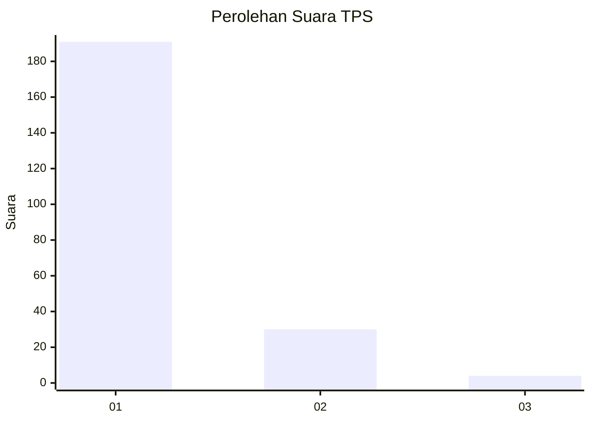
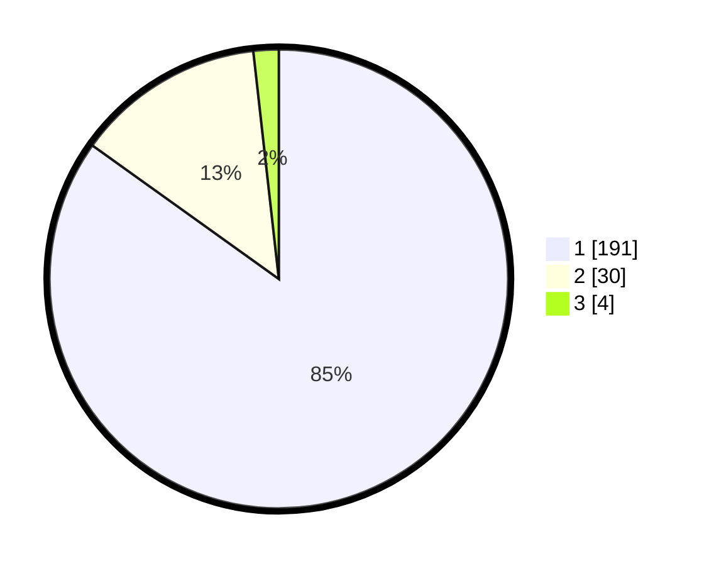

# Hasil

## Grafik

## Tabel

| No. | Nama Paslon    | Suara | Suara (raw) | Persentase |
|:--- |:-------------- | -----:| -----------:| ----------:|
| 1   | ANIES MUHAIMIN | 191   | [191][p-1]  | 84,89      |
| 2   | PRABOWO GIBRAN | 30    | [30][p-2]   | 13,33      |
| 3   | GANJAR MAHFUD  | 4     | [4][p-3]    | 1,78       |

[p-1]: https://github.com/gigit-pemilu/pemilu-2024-11-aceh/blob/main/pilpres/hitung-suara/sub/11-aceh/sub/06-aceh-besar/sub/07-darul-imarah/sub/2026-lampasi-engking/sub/001-tps/sub/paslon-1.txt
[p-2]: https://github.com/gigit-pemilu/pemilu-2024-11-aceh/blob/main/pilpres/hitung-suara/sub/11-aceh/sub/06-aceh-besar/sub/07-darul-imarah/sub/2026-lampasi-engking/sub/001-tps/sub/paslon-2.txt
[p-3]: https://github.com/gigit-pemilu/pemilu-2024-11-aceh/blob/main/pilpres/hitung-suara/sub/11-aceh/sub/06-aceh-besar/sub/07-darul-imarah/sub/2026-lampasi-engking/sub/001-tps/sub/paslon-3.txt

## Foto C Plano

https://sirekap-obj-formc.kpu.go.id/eb81/pemilu/ppwp/11/06/07/20/26/1106072026001-20240215-035332--37a39e55-89fa-47df-8c97-a0d6fe0c2da1.jpg

https://sirekap-obj-formc.kpu.go.id/eb81/pemilu/ppwp/11/06/07/20/26/1106072026001-20240215-035706--13ba19f9-fba1-4a8f-9512-c6c667f4fb5b.jpg

https://sirekap-obj-formc.kpu.go.id/eb81/pemilu/ppwp/11/06/07/20/26/1106072026001-20240215-035609--31ca2e9d-1925-4343-8e32-c4dc822d1f8f.jpg

## Metadata

| Key        | Value               |
| ---------- | ------------------- |
| Time Stamp | 2024-02-15 16:30:25 |

