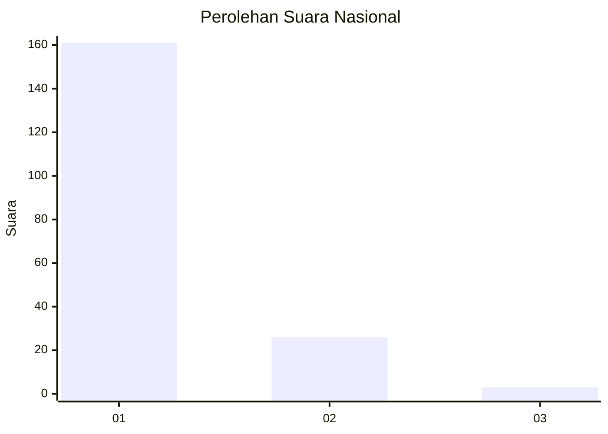
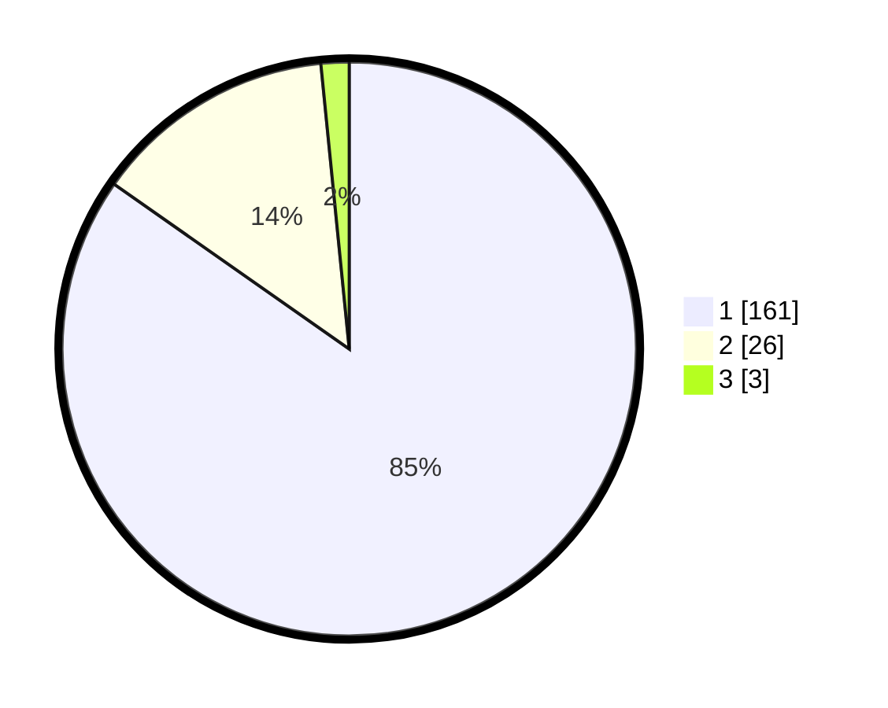

# Hasil

## Grafik

## Tabel

| No. | Nama Paslon    | Suara | Suara (raw) | Persentase |
|:--- |:-------------- | -----:| -----------:| ----------:|
| 1   | ANIES MUHAIMIN | 161   | [161][p-1]  | 84,74      |
| 2   | PRABOWO GIBRAN | 26    | [26][p-2]   | 13,68      |
| 3   | GANJAR MAHFUD  | 3     | [3][p-3]    | 1,58       |

[p-1]: https://github.com/gigit-pemilu/pemilu-2024/blob/main/pilpres/hitung-suara/sub/11-aceh/sub/06-aceh-besar/sub/07-darul-imarah/sub/2026-lampasi-engking/sub/006-tps/sub/paslon-1.txt
[p-2]: https://github.com/gigit-pemilu/pemilu-2024/blob/main/pilpres/hitung-suara/sub/11-aceh/sub/06-aceh-besar/sub/07-darul-imarah/sub/2026-lampasi-engking/sub/006-tps/sub/paslon-2.txt
[p-3]: https://github.com/gigit-pemilu/pemilu-2024/blob/main/pilpres/hitung-suara/sub/11-aceh/sub/06-aceh-besar/sub/07-darul-imarah/sub/2026-lampasi-engking/sub/006-tps/sub/paslon-3.txt

## Foto C Plano

https://sirekap-obj-formc.kpu.go.id/e96a/pemilu/ppwp/11/06/07/20/26/1106072026006-20240214-194941--cbf1459a-15dc-467b-9b78-56c20d260ab4.jpg

https://sirekap-obj-formc.kpu.go.id/e96a/pemilu/ppwp/11/06/07/20/26/1106072026006-20240214-195109--247bda72-e70e-4064-9a54-7377c43bace5.jpg

https://sirekap-obj-formc.kpu.go.id/e96a/pemilu/ppwp/11/06/07/20/26/1106072026006-20240214-195730--9fcb0353-74ae-4a33-a3af-2d239c8ffa88.jpg

## Metadata

| Key        | Value               |
| ---------- | ------------------- |
| Time Stamp | 2024-02-15 12:00:28 |

