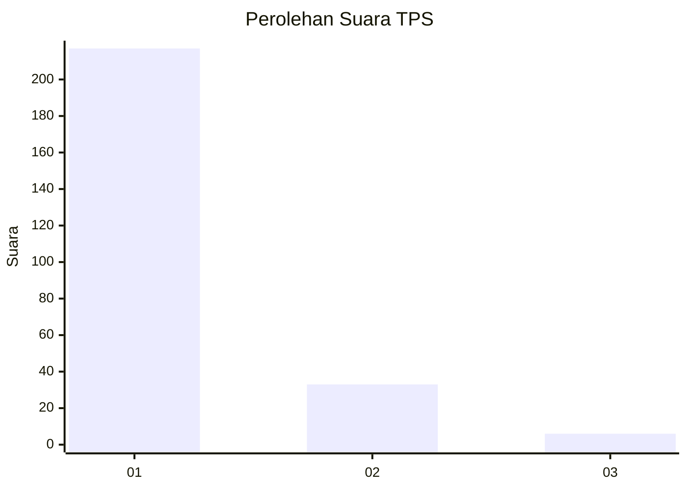
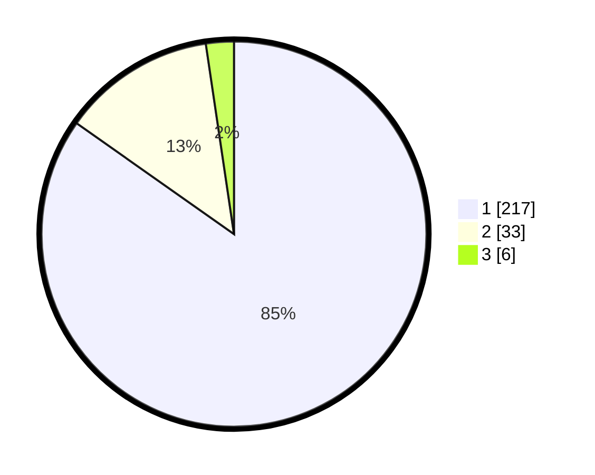

# Hasil

## Grafik

## Tabel

| No. | Nama Paslon    | Suara | Suara (raw) | Persentase |
|:--- |:-------------- | -----:| -----------:| ----------:|
| 1   | ANIES MUHAIMIN | 217   | [217][p-1]  | 84,77      |
| 2   | PRABOWO GIBRAN | 33    | [33][p-2]   | 12,89      |
| 3   | GANJAR MAHFUD  | 6     | [6][p-3]    | 2,34       |

[p-1]: https://github.com/gigit-pemilu/pemilu-2024-11-aceh/blob/main/pilpres/hitung-suara/sub/11-aceh/sub/06-aceh-besar/sub/07-darul-imarah/sub/2027-jeumpet-ajun/sub/002-tps/sub/paslon-1.txt
[p-2]: https://github.com/gigit-pemilu/pemilu-2024-11-aceh/blob/main/pilpres/hitung-suara/sub/11-aceh/sub/06-aceh-besar/sub/07-darul-imarah/sub/2027-jeumpet-ajun/sub/002-tps/sub/paslon-2.txt
[p-3]: https://github.com/gigit-pemilu/pemilu-2024-11-aceh/blob/main/pilpres/hitung-suara/sub/11-aceh/sub/06-aceh-besar/sub/07-darul-imarah/sub/2027-jeumpet-ajun/sub/002-tps/sub/paslon-3.txt

## Foto C Plano

https://sirekap-obj-formc.kpu.go.id/6a1d/pemilu/ppwp/11/06/07/20/27/1106072027002-20240216-024436--9a0047ae-7b86-42a0-b08c-45bd5ed9efc9.jpg

https://sirekap-obj-formc.kpu.go.id/6a1d/pemilu/ppwp/11/06/07/20/27/1106072027002-20240216-024438--3c512931-e074-4fe5-8790-ac57e6eea5d6.jpg

https://sirekap-obj-formc.kpu.go.id/6a1d/pemilu/ppwp/11/06/07/20/27/1106072027002-20240216-024437--11423827-f8f8-47fa-9b0b-f0934c6743b5.jpg

## Metadata

| Key        | Value               |
| ---------- | ------------------- |
| Time Stamp | 2024-02-16 12:51:22 |

## DATA PEMILIH TETAP

Jumlah pemilih dalam DPT: **299**.
 * L: **132**.
 * P: **167**.

## DATA PENGGUNA HAK PILIH

Jumlah pengguna hak pilih dalam DPT: **248**.
 * L: **107**.
 * P: **141**.

Jumlah pengguna hak pilih dalam DPTb: **0**.
 * L: **0**.
 * P: **0**.

Jumlah pengguna hak pilih dalam DPK: **9**.
 * L: **4**.
 * P: **5**.

Jumlah pengguna hak pilih: **257**.
 * L: **111**.
 * P: **146**.

## JUMLAH SUARA SAH DAN TIDAK SAH

JUMLAH SELURUH SUARA SAH: **256**.

JUMLAH SUARA TIDAK SAH: **1**.

JUMLAH SELURUH SUARA SAH DAN SUARA TIDAK SAH: **257**.

