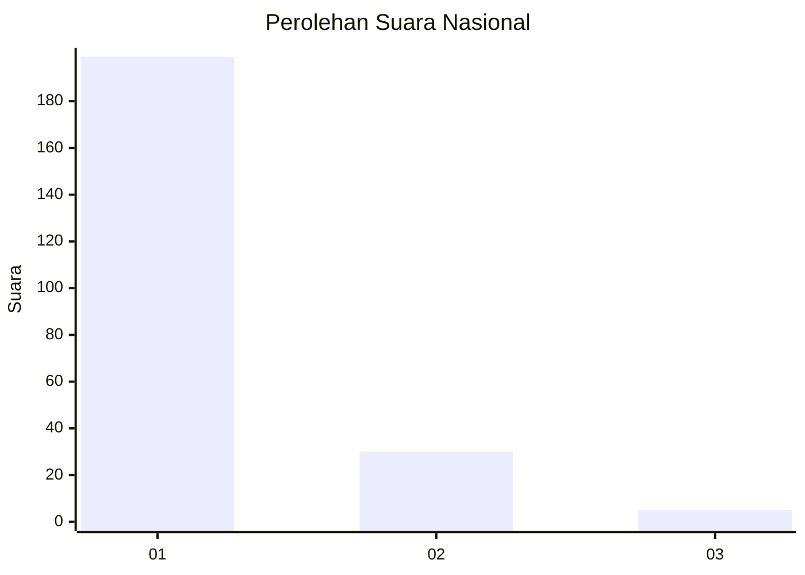
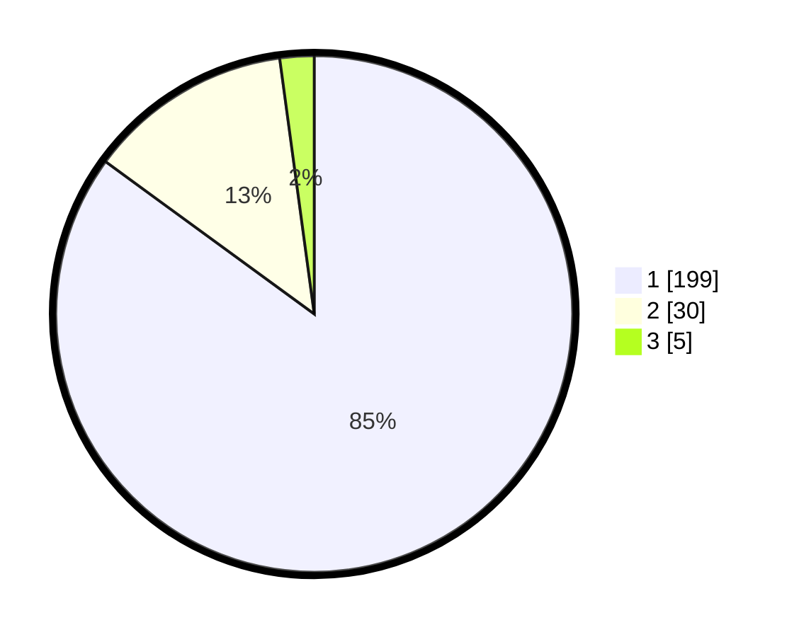

# Hasil

## Grafik

## Tabel

| No. | Nama Paslon    | Suara | Suara (raw) | Persentase |
|:--- |:-------------- | -----:| -----------:| ----------:|
| 1   | ANIES MUHAIMIN | 199   | [199][p-1]  | 85,04      |
| 2   | PRABOWO GIBRAN | 30    | [30][p-2]   | 12,82      |
| 3   | GANJAR MAHFUD  | 5     | [5][p-3]    | 2,14       |

[p-1]: https://github.com/gigit-pemilu/pemilu-2024/blob/main/pilpres/hitung-suara/sub/11-aceh/sub/06-aceh-besar/sub/07-darul-imarah/sub/2027-jeumpet-ajun/sub/006-tps/sub/paslon-1.txt
[p-2]: https://github.com/gigit-pemilu/pemilu-2024/blob/main/pilpres/hitung-suara/sub/11-aceh/sub/06-aceh-besar/sub/07-darul-imarah/sub/2027-jeumpet-ajun/sub/006-tps/sub/paslon-2.txt
[p-3]: https://github.com/gigit-pemilu/pemilu-2024/blob/main/pilpres/hitung-suara/sub/11-aceh/sub/06-aceh-besar/sub/07-darul-imarah/sub/2027-jeumpet-ajun/sub/006-tps/sub/paslon-3.txt

## Foto C Plano

https://sirekap-obj-formc.kpu.go.id/ce40/pemilu/ppwp/11/06/07/20/27/1106072027006-20240214-201029--ec3c967c-b238-485b-bd76-5d59bb501923.jpg

https://sirekap-obj-formc.kpu.go.id/ce40/pemilu/ppwp/11/06/07/20/27/1106072027006-20240214-201333--f5381736-5c38-4a94-be0b-bb5d11aae85e.jpg

https://sirekap-obj-formc.kpu.go.id/ce40/pemilu/ppwp/11/06/07/20/27/1106072027006-20240214-201457--06d81851-1553-4569-a116-7d68ea8b3fb9.jpg

## Metadata

| Key        | Value               |
| ---------- | ------------------- |
| Time Stamp | 2024-02-15 12:00:28 |

