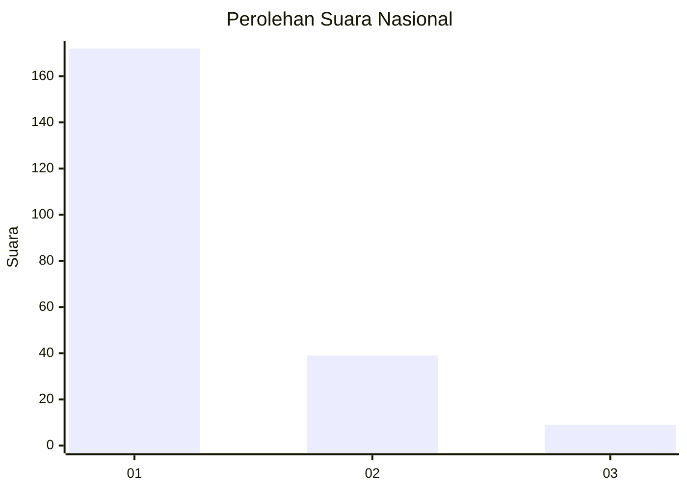
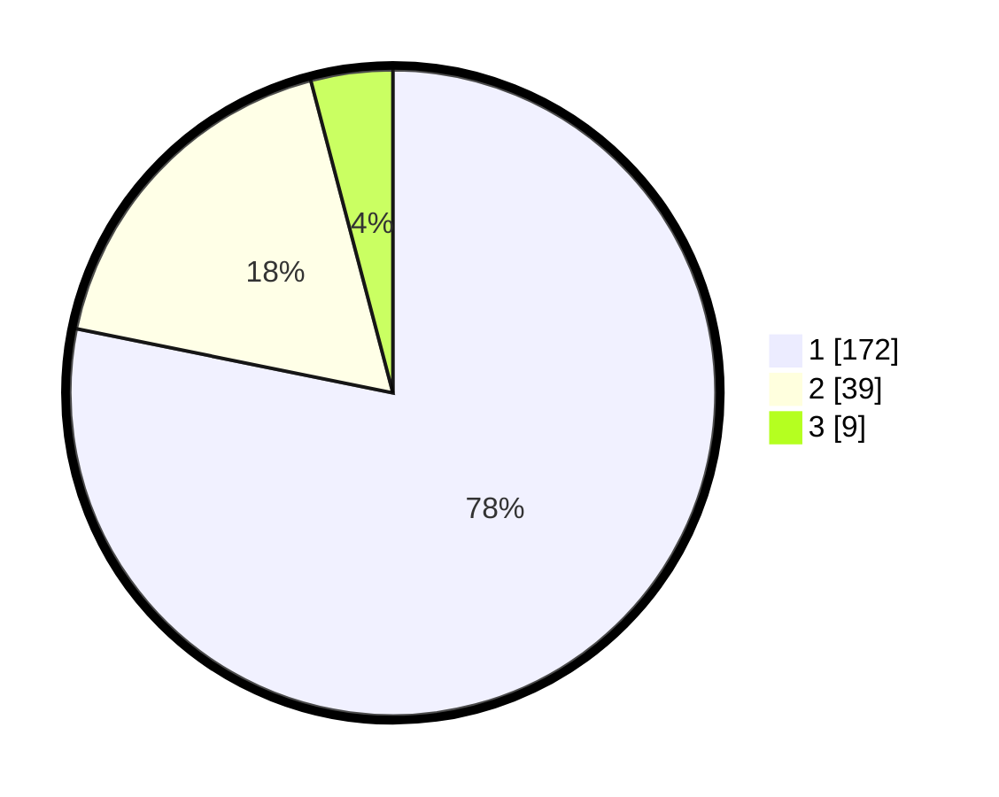

# Hasil

## Grafik

## Tabel

| No. | Nama Paslon    | Suara | Suara (raw) | Persentase |
|:--- |:-------------- | -----:| -----------:| ----------:|
| 1   | ANIES MUHAIMIN | 172   | [172][p-1]  | 78,18      |
| 2   | PRABOWO GIBRAN | 39    | [39][p-2]   | 17,73      |
| 3   | GANJAR MAHFUD  | 9     | [9][p-3]    | 4,09       |

[p-1]: https://github.com/gigit-pemilu/pemilu-2024/blob/main/pilpres/hitung-suara/sub/11-aceh/sub/06-aceh-besar/sub/07-darul-imarah/sub/2028-gue-gajah/sub/003-tps/sub/paslon-1.txt
[p-2]: https://github.com/gigit-pemilu/pemilu-2024/blob/main/pilpres/hitung-suara/sub/11-aceh/sub/06-aceh-besar/sub/07-darul-imarah/sub/2028-gue-gajah/sub/003-tps/sub/paslon-2.txt
[p-3]: https://github.com/gigit-pemilu/pemilu-2024/blob/main/pilpres/hitung-suara/sub/11-aceh/sub/06-aceh-besar/sub/07-darul-imarah/sub/2028-gue-gajah/sub/003-tps/sub/paslon-3.txt

## Foto C Plano

https://sirekap-obj-formc.kpu.go.id/c003/pemilu/ppwp/11/06/07/20/28/1106072028003-20240215-071108--9f02749c-8d08-4750-93e2-7addf6d4e4ec.jpg

https://sirekap-obj-formc.kpu.go.id/c003/pemilu/ppwp/11/06/07/20/28/1106072028003-20240215-071603--7006437b-c91a-48be-a9c8-ed5c9e6dc071.jpg

https://sirekap-obj-formc.kpu.go.id/c003/pemilu/ppwp/11/06/07/20/28/1106072028003-20240215-071757--831a5ec9-b899-48d0-88bf-74a27ac22d3b.jpg

## Metadata

| Key        | Value               |
| ---------- | ------------------- |
| Time Stamp | 2024-02-15 22:00:27 |

