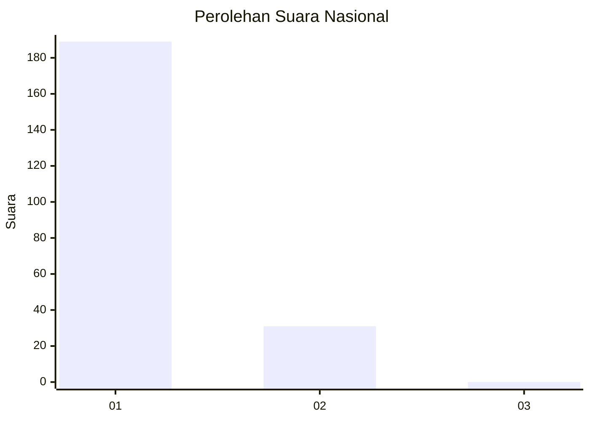
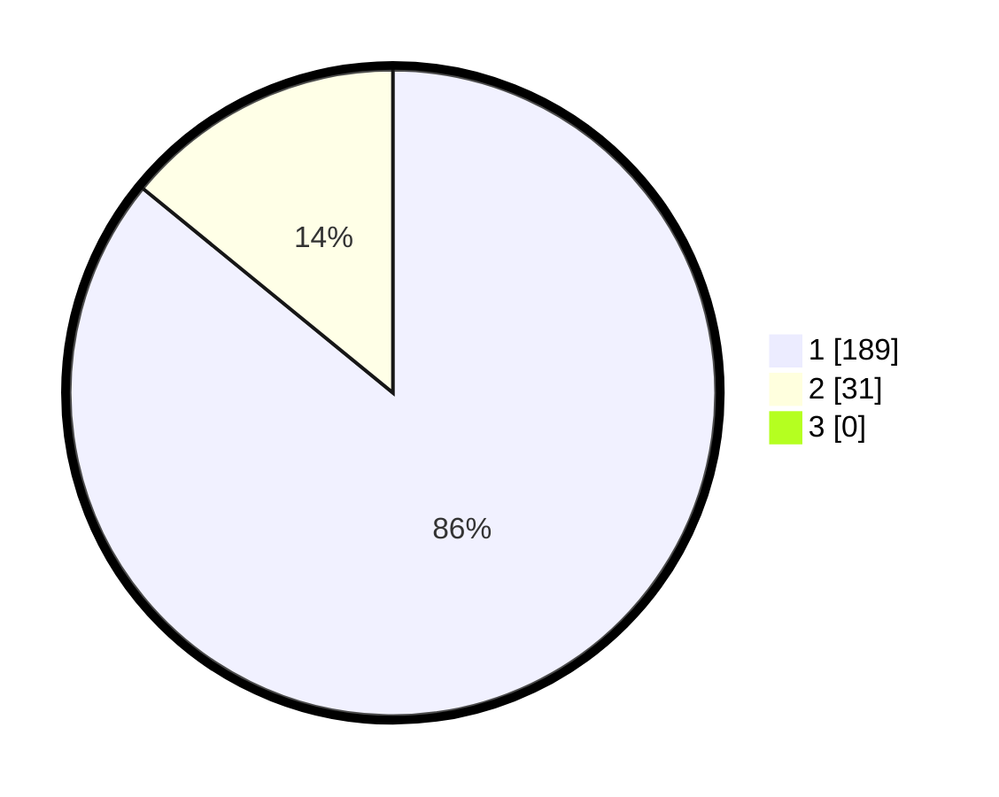

# Hasil

## Grafik

## Tabel

| No. | Nama Paslon    | Suara | Suara (raw) | Persentase |
|:--- |:-------------- | -----:| -----------:| ----------:|
| 1   | ANIES MUHAIMIN | 189   | [189][p-1]  | 85,91      |
| 2   | PRABOWO GIBRAN | 31    | [31][p-2]   | 14,09      |
| 3   | GANJAR MAHFUD  | 0     | [0][p-3]    | 0,00       |

[p-1]: https://github.com/gigit-pemilu/pemilu-2024/blob/main/pilpres/hitung-suara/sub/11-aceh/sub/06-aceh-besar/sub/07-darul-imarah/sub/2028-gue-gajah/sub/004-tps/sub/paslon-1.txt
[p-2]: https://github.com/gigit-pemilu/pemilu-2024/blob/main/pilpres/hitung-suara/sub/11-aceh/sub/06-aceh-besar/sub/07-darul-imarah/sub/2028-gue-gajah/sub/004-tps/sub/paslon-2.txt
[p-3]: https://github.com/gigit-pemilu/pemilu-2024/blob/main/pilpres/hitung-suara/sub/11-aceh/sub/06-aceh-besar/sub/07-darul-imarah/sub/2028-gue-gajah/sub/004-tps/sub/paslon-3.txt

## Foto C Plano

https://sirekap-obj-formc.kpu.go.id/1117/pemilu/ppwp/11/06/07/20/28/1106072028004-20240214-234147--dd35b40a-05ac-4b64-9500-3b3e424cb08d.jpg

https://sirekap-obj-formc.kpu.go.id/1117/pemilu/ppwp/11/06/07/20/28/1106072028004-20240214-234337--5ac0b90f-8191-44a5-9332-448ba0ba1ab1.jpg

https://sirekap-obj-formc.kpu.go.id/1117/pemilu/ppwp/11/06/07/20/28/1106072028004-20240214-234541--3d279443-3034-4ccf-aaef-38a6f3bbe45d.jpg

## Metadata

| Key        | Value               |
| ---------- | ------------------- |
| Time Stamp | 2024-02-15 16:30:25 |

