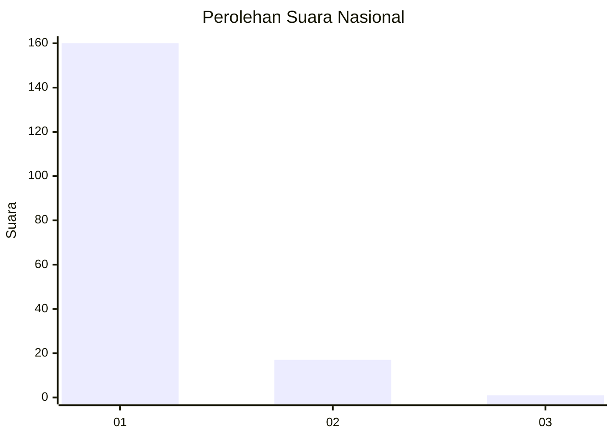
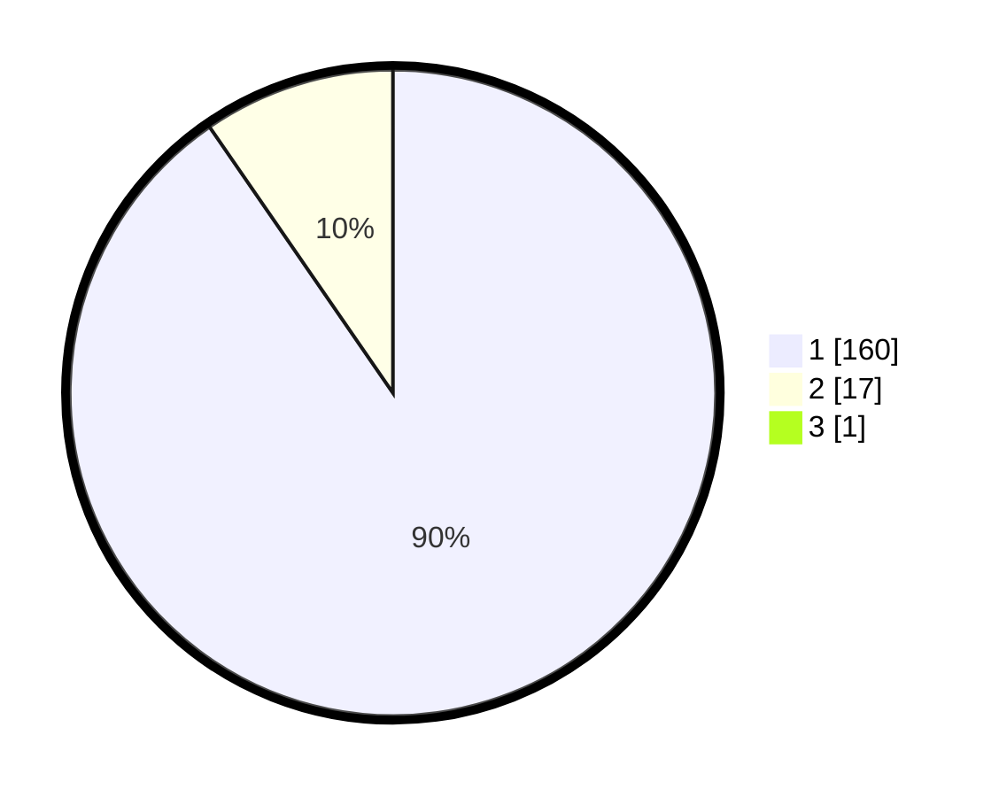

# Hasil

## Grafik

## Tabel

| No. | Nama Paslon    | Suara | Suara (raw) | Persentase |
|:--- |:-------------- | -----:| -----------:| ----------:|
| 1   | ANIES MUHAIMIN | 160   | [160][p-1]  | 89,89      |
| 2   | PRABOWO GIBRAN | 17    | [17][p-2]   | 9,55       |
| 3   | GANJAR MAHFUD  | 1     | [1][p-3]    | 0,56       |

[p-1]: https://github.com/gigit-pemilu/pemilu-2024/blob/main/pilpres/hitung-suara/sub/11-aceh/sub/06-aceh-besar/sub/07-darul-imarah/sub/2030-ulee-lueng/sub/001-tps/sub/paslon-1.txt
[p-2]: https://github.com/gigit-pemilu/pemilu-2024/blob/main/pilpres/hitung-suara/sub/11-aceh/sub/06-aceh-besar/sub/07-darul-imarah/sub/2030-ulee-lueng/sub/001-tps/sub/paslon-2.txt
[p-3]: https://github.com/gigit-pemilu/pemilu-2024/blob/main/pilpres/hitung-suara/sub/11-aceh/sub/06-aceh-besar/sub/07-darul-imarah/sub/2030-ulee-lueng/sub/001-tps/sub/paslon-3.txt

## Foto C Plano

https://sirekap-obj-formc.kpu.go.id/3f59/pemilu/ppwp/11/06/07/20/30/1106072030001-20240215-012810--44260e18-94ab-4200-af5e-c12fdf912afa.jpg

https://sirekap-obj-formc.kpu.go.id/3f59/pemilu/ppwp/11/06/07/20/30/1106072030001-20240215-014557--8b98a6ff-ae70-4002-8411-ad3d21c8277a.jpg

https://sirekap-obj-formc.kpu.go.id/3f59/pemilu/ppwp/11/06/07/20/30/1106072030001-20240215-014735--eb86680c-4d63-43ca-86f1-072d6b5a8ced.jpg

## Metadata

| Key        | Value               |
| ---------- | ------------------- |
| Time Stamp | 2024-02-15 16:30:25 |

