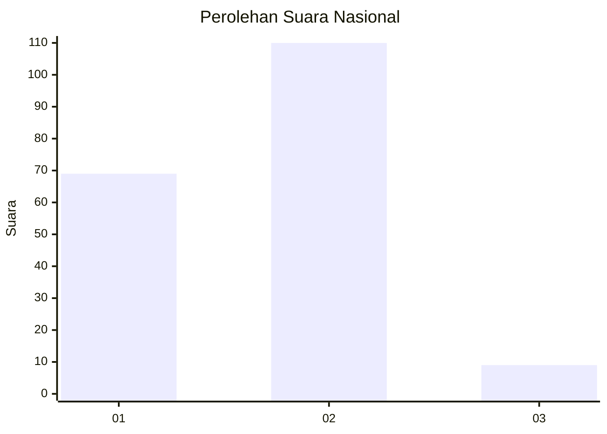
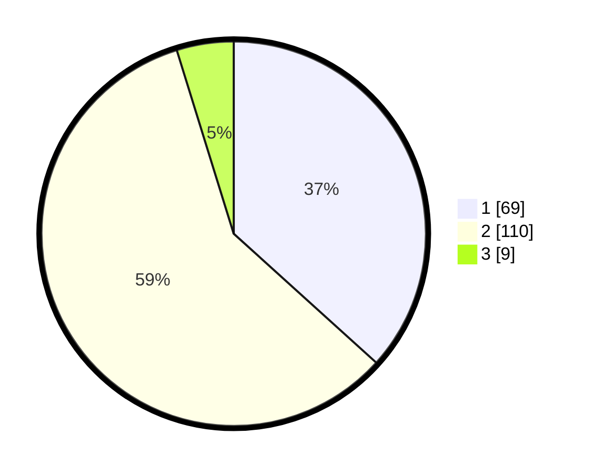

# Hasil

## Grafik

## Tabel

| No. | Nama Paslon    | Suara | Suara (raw) | Persentase |
|:--- |:-------------- | -----:| -----------:| ----------:|
| 1   | ANIES MUHAIMIN | 69    | [69][p-1]   | 36,70      |
| 2   | PRABOWO GIBRAN | 110   | [110][p-2]  | 58,51      |
| 3   | GANJAR MAHFUD  | 9     | [9][p-3]    | 4,79       |

[p-1]: https://github.com/gigit-pemilu/pemilu-2024/blob/main/pilpres/hitung-suara/sub/11-aceh/sub/06-aceh-besar/sub/07-darul-imarah/sub/2031-punie/sub/001-tps/sub/paslon-1.txt
[p-2]: https://github.com/gigit-pemilu/pemilu-2024/blob/main/pilpres/hitung-suara/sub/11-aceh/sub/06-aceh-besar/sub/07-darul-imarah/sub/2031-punie/sub/001-tps/sub/paslon-2.txt
[p-3]: https://github.com/gigit-pemilu/pemilu-2024/blob/main/pilpres/hitung-suara/sub/11-aceh/sub/06-aceh-besar/sub/07-darul-imarah/sub/2031-punie/sub/001-tps/sub/paslon-3.txt

## Foto C Plano

https://sirekap-obj-formc.kpu.go.id/18aa/pemilu/ppwp/11/06/07/20/31/1106072031001-20240217-165617--3c255d0f-510f-4ebf-8f95-004f1f613416.jpg

https://sirekap-obj-formc.kpu.go.id/18aa/pemilu/ppwp/11/06/07/20/31/1106072031001-20240217-165618--ad7755b9-aedb-4ba4-b218-d66b849ff04a.jpg

https://sirekap-obj-formc.kpu.go.id/18aa/pemilu/ppwp/11/06/07/20/31/1106072031001-20240217-165617--84a4f8b0-6338-40b7-b8b2-e565b97ddc82.jpg

## Metadata

| Key        | Value               |
| ---------- | ------------------- |
| Time Stamp | 2024-02-24 22:31:28 |

## DATA PEMILIH TETAP

Jumlah pemilih dalam DPT: **260**.
 * L: **79**.
 * P: **181**.

## DATA PENGGUNA HAK PILIH

Jumlah pengguna hak pilih dalam DPT: **142**.
 * L: **36**.
 * P: **106**.

Jumlah pengguna hak pilih dalam DPTb: **8**.
 * L: **6**.
 * P: **2**.

Jumlah pengguna hak pilih dalam DPK: **39**.
 * L: **11**.
 * P: **28**.

Jumlah pengguna hak pilih: **189**.
 * L: **53**.
 * P: **136**.

## JUMLAH SUARA SAH DAN TIDAK SAH

JUMLAH SELURUH SUARA SAH: **188**.

JUMLAH SUARA TIDAK SAH: **1**.

JUMLAH SELURUH SUARA SAH DAN SUARA TIDAK SAH: **189**.

