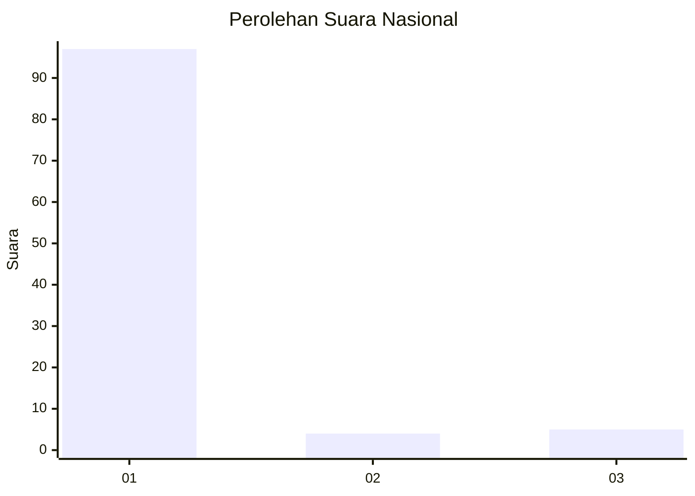
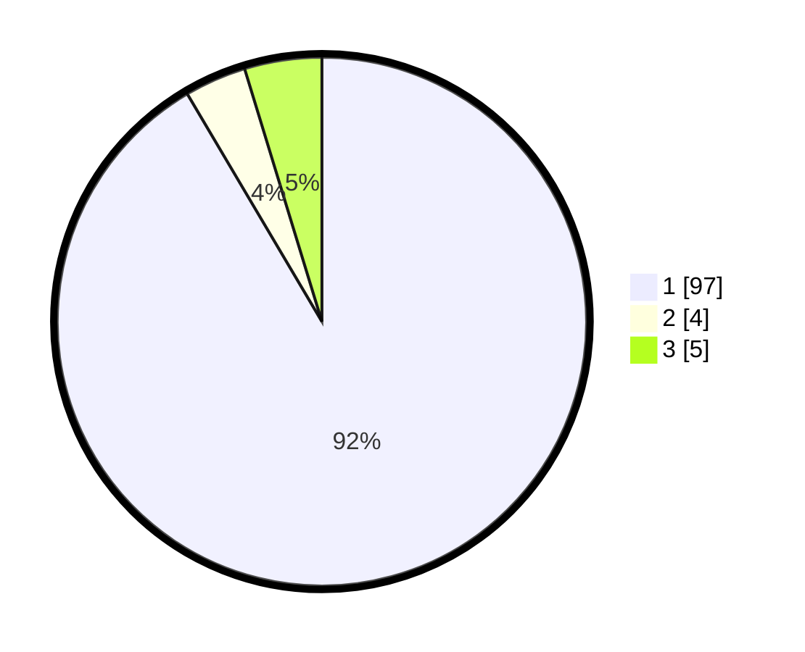

# Hasil

## Grafik

## Tabel

| No. | Nama Paslon    | Suara | Suara (raw) | Persentase |
|:--- |:-------------- | -----:| -----------:| ----------:|
| 1   | ANIES MUHAIMIN | 97    | [97][p-1]   | 91,51      |
| 2   | PRABOWO GIBRAN | 4     | [4][p-2]    | 3,77       |
| 3   | GANJAR MAHFUD  | 5     | [5][p-3]    | 4,72       |

[p-1]: https://github.com/gigit-pemilu/pemilu-2024/blob/main/pilpres/hitung-suara/sub/11-aceh/sub/06-aceh-besar/sub/08-peukan-bada/sub/2002-lamguron/sub/001-tps/sub/paslon-1.txt
[p-2]: https://github.com/gigit-pemilu/pemilu-2024/blob/main/pilpres/hitung-suara/sub/11-aceh/sub/06-aceh-besar/sub/08-peukan-bada/sub/2002-lamguron/sub/001-tps/sub/paslon-2.txt
[p-3]: https://github.com/gigit-pemilu/pemilu-2024/blob/main/pilpres/hitung-suara/sub/11-aceh/sub/06-aceh-besar/sub/08-peukan-bada/sub/2002-lamguron/sub/001-tps/sub/paslon-3.txt

## Foto C Plano

https://sirekap-obj-formc.kpu.go.id/9b53/pemilu/ppwp/11/06/08/20/02/1106082002001-20240215-022720--00893f71-3772-4fec-9020-aeb48b828312.jpg

https://sirekap-obj-formc.kpu.go.id/9b53/pemilu/ppwp/11/06/08/20/02/1106082002001-20240215-022927--33eb5a9e-20fd-47f8-a57b-7bce3af464c7.jpg

https://sirekap-obj-formc.kpu.go.id/9b53/pemilu/ppwp/11/06/08/20/02/1106082002001-20240215-024830--4e9a2573-d42c-4768-9092-948c089d0890.jpg

## Metadata

| Key        | Value               |
| ---------- | ------------------- |
| Time Stamp | 2024-02-15 22:30:27 |

