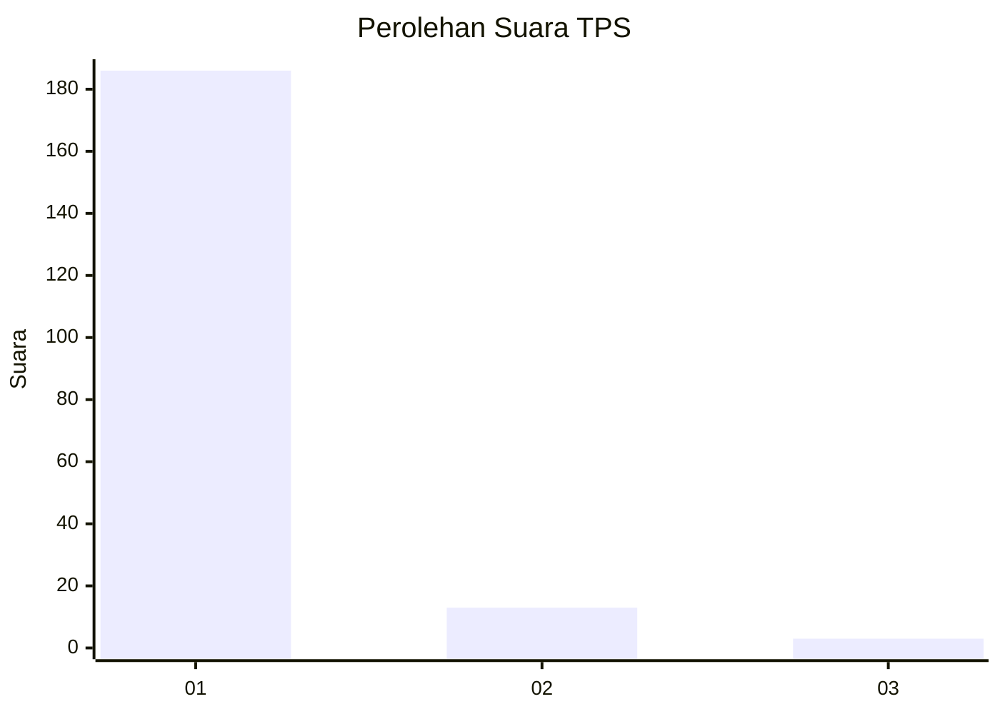
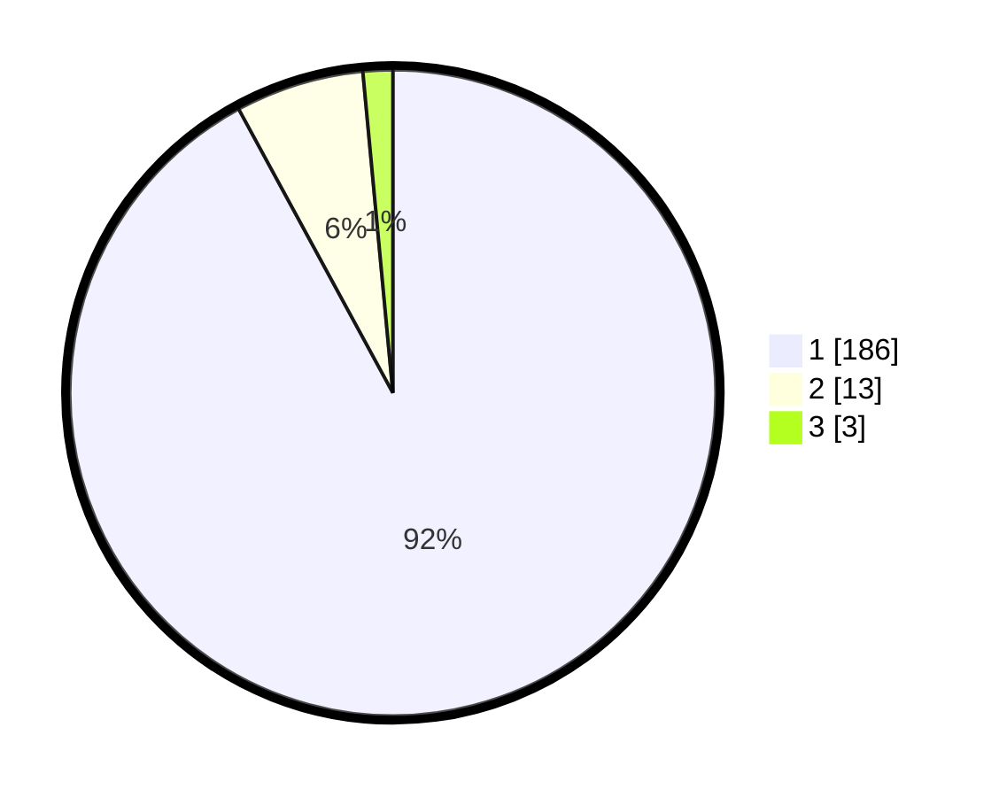

# Hasil

## Grafik

## Tabel

| No. | Nama Paslon    | Suara | Suara (raw) | Persentase |
|:--- |:-------------- | -----:| -----------:| ----------:|
| 1   | ANIES MUHAIMIN | 186   | [186][p-1]  | 92,08      |
| 2   | PRABOWO GIBRAN | 13    | [13][p-2]   | 6,44       |
| 3   | GANJAR MAHFUD  | 3     | [3][p-3]    | 1,49       |

[p-1]: https://github.com/gigit-pemilu/pemilu-2024-11-aceh/blob/main/pilpres/hitung-suara/sub/11-aceh/sub/06-aceh-besar/sub/08-peukan-bada/sub/2003-lambaro-nejid/sub/003-tps/sub/paslon-1.txt
[p-2]: https://github.com/gigit-pemilu/pemilu-2024-11-aceh/blob/main/pilpres/hitung-suara/sub/11-aceh/sub/06-aceh-besar/sub/08-peukan-bada/sub/2003-lambaro-nejid/sub/003-tps/sub/paslon-2.txt
[p-3]: https://github.com/gigit-pemilu/pemilu-2024-11-aceh/blob/main/pilpres/hitung-suara/sub/11-aceh/sub/06-aceh-besar/sub/08-peukan-bada/sub/2003-lambaro-nejid/sub/003-tps/sub/paslon-3.txt

## Foto C Plano

https://sirekap-obj-formc.kpu.go.id/c123/pemilu/ppwp/11/06/08/20/03/1106082003003-20240214-230338--d34481f2-c7ed-4706-ab2e-1d3d3e726533.jpg

https://sirekap-obj-formc.kpu.go.id/c123/pemilu/ppwp/11/06/08/20/03/1106082003003-20240214-205552--11dd0d8b-6195-4b16-8291-cca7266a56a9.jpg

https://sirekap-obj-formc.kpu.go.id/c123/pemilu/ppwp/11/06/08/20/03/1106082003003-20240214-210137--ddd6ad55-59be-4b0b-bd60-40ecf479a471.jpg

## Metadata

| Key        | Value               |
| ---------- | ------------------- |
| Time Stamp | 2024-02-15 03:06:03 |

