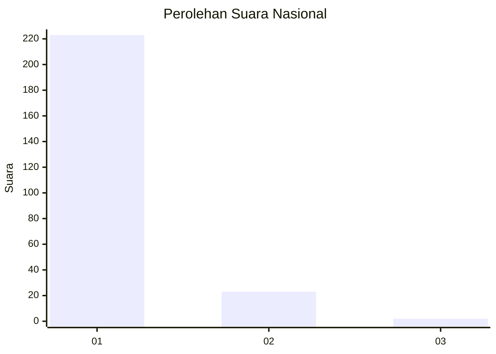
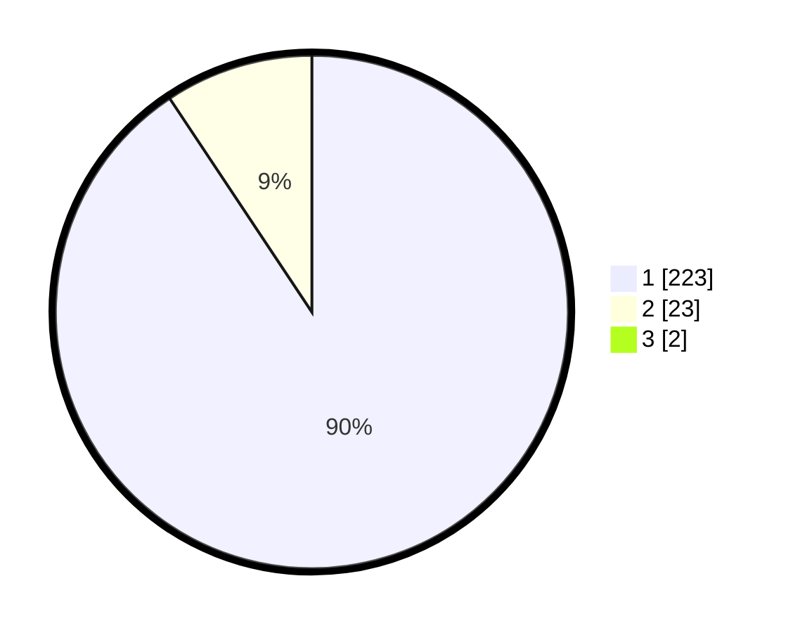

# Hasil

## Grafik

## Tabel

| No. | Nama Paslon    | Suara | Suara (raw) | Persentase |
|:--- |:-------------- | -----:| -----------:| ----------:|
| 1   | ANIES MUHAIMIN | 223   | [223][p-1]  | 89,92      |
| 2   | PRABOWO GIBRAN | 23    | [23][p-2]   | 9,27       |
| 3   | GANJAR MAHFUD  | 2     | [2][p-3]    | 0,81       |

[p-1]: https://github.com/gigit-pemilu/pemilu-2024/blob/main/pilpres/hitung-suara/sub/11-aceh/sub/06-aceh-besar/sub/08-peukan-bada/sub/2004-lampageu/sub/001-tps/sub/paslon-1.txt
[p-2]: https://github.com/gigit-pemilu/pemilu-2024/blob/main/pilpres/hitung-suara/sub/11-aceh/sub/06-aceh-besar/sub/08-peukan-bada/sub/2004-lampageu/sub/001-tps/sub/paslon-2.txt
[p-3]: https://github.com/gigit-pemilu/pemilu-2024/blob/main/pilpres/hitung-suara/sub/11-aceh/sub/06-aceh-besar/sub/08-peukan-bada/sub/2004-lampageu/sub/001-tps/sub/paslon-3.txt

## Foto C Plano

https://sirekap-obj-formc.kpu.go.id/377d/pemilu/ppwp/11/06/08/20/04/1106082004001-20240215-035941--8c089c84-cb68-4a62-ae35-d51a0903a69f.jpg

https://sirekap-obj-formc.kpu.go.id/377d/pemilu/ppwp/11/06/08/20/04/1106082004001-20240215-143229--311f241c-b517-48b8-9867-0c8b3902bbd7.jpg

https://sirekap-obj-formc.kpu.go.id/377d/pemilu/ppwp/11/06/08/20/04/1106082004001-20240215-143350--7d5024b7-1bf8-4a0f-879c-48481663ac18.jpg

## Metadata

| Key        | Value               |
| ---------- | ------------------- |
| Time Stamp | 2024-02-15 16:30:25 |

