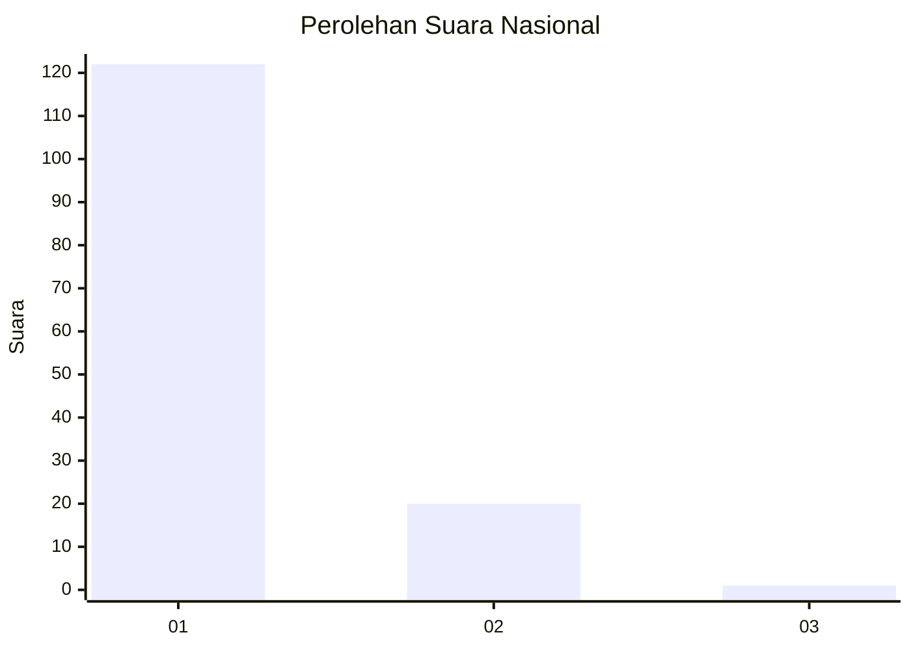
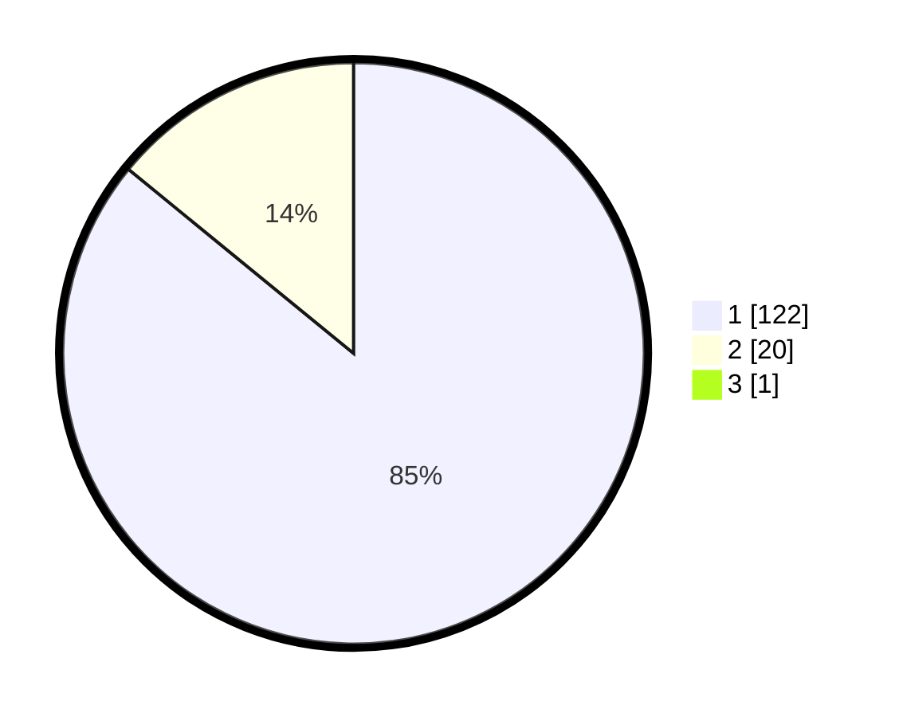

# Hasil

## Grafik

## Tabel

| No. | Nama Paslon    | Suara | Suara (raw) | Persentase |
|:--- |:-------------- | -----:| -----------:| ----------:|
| 1   | ANIES MUHAIMIN | 122   | [122][p-1]  | 85,31      |
| 2   | PRABOWO GIBRAN | 20    | [20][p-2]   | 13,99      |
| 3   | GANJAR MAHFUD  | 1     | [1][p-3]    | 0,70       |

[p-1]: https://github.com/gigit-pemilu/pemilu-2024/blob/main/pilpres/hitung-suara/sub/11-aceh/sub/06-aceh-besar/sub/08-peukan-bada/sub/2005-gampong-baro/sub/001-tps/sub/paslon-1.txt
[p-2]: https://github.com/gigit-pemilu/pemilu-2024/blob/main/pilpres/hitung-suara/sub/11-aceh/sub/06-aceh-besar/sub/08-peukan-bada/sub/2005-gampong-baro/sub/001-tps/sub/paslon-2.txt
[p-3]: https://github.com/gigit-pemilu/pemilu-2024/blob/main/pilpres/hitung-suara/sub/11-aceh/sub/06-aceh-besar/sub/08-peukan-bada/sub/2005-gampong-baro/sub/001-tps/sub/paslon-3.txt

## Foto C Plano

https://sirekap-obj-formc.kpu.go.id/70e8/pemilu/ppwp/11/06/08/20/05/1106082005001-20240215-023650--308a0c30-83ae-4763-8c17-5b52d3702c81.jpg

https://sirekap-obj-formc.kpu.go.id/70e8/pemilu/ppwp/11/06/08/20/05/1106082005001-20240215-021704--edb1e65c-e701-44f7-a8ea-0ebc5df0abdc.jpg

https://sirekap-obj-formc.kpu.go.id/70e8/pemilu/ppwp/11/06/08/20/05/1106082005001-20240215-021820--ffda5f2b-0728-413c-9e56-b0c4f06e6a79.jpg

## Metadata

| Key        | Value               |
| ---------- | ------------------- |
| Time Stamp | 2024-02-15 21:30:27 |

