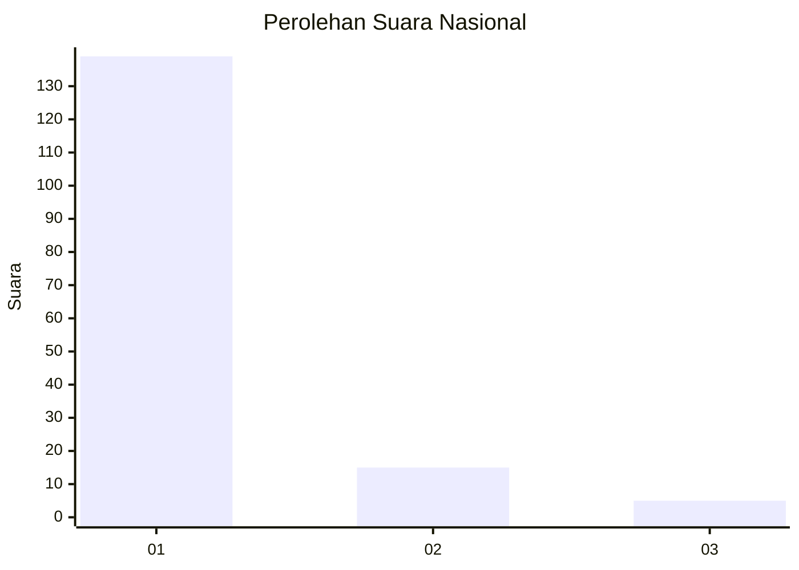
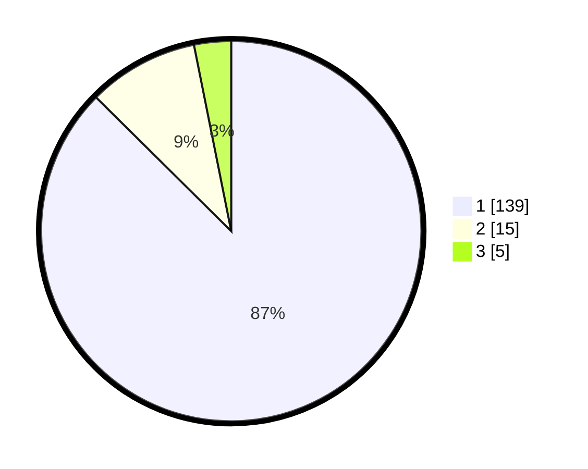

# Hasil

## Grafik

## Tabel

| No. | Nama Paslon    | Suara | Suara (raw) | Persentase |
|:--- |:-------------- | -----:| -----------:| ----------:|
| 1   | ANIES MUHAIMIN | 139   | [139][p-1]  | 87,42      |
| 2   | PRABOWO GIBRAN | 15    | [15][p-2]   | 9,43       |
| 3   | GANJAR MAHFUD  | 5     | [5][p-3]    | 3,14       |

[p-1]: https://github.com/gigit-pemilu/pemilu-2024/blob/main/pilpres/hitung-suara/sub/11-aceh/sub/06-aceh-besar/sub/08-peukan-bada/sub/2005-gampong-baro/sub/002-tps/sub/paslon-1.txt
[p-2]: https://github.com/gigit-pemilu/pemilu-2024/blob/main/pilpres/hitung-suara/sub/11-aceh/sub/06-aceh-besar/sub/08-peukan-bada/sub/2005-gampong-baro/sub/002-tps/sub/paslon-2.txt
[p-3]: https://github.com/gigit-pemilu/pemilu-2024/blob/main/pilpres/hitung-suara/sub/11-aceh/sub/06-aceh-besar/sub/08-peukan-bada/sub/2005-gampong-baro/sub/002-tps/sub/paslon-3.txt

## Foto C Plano

https://sirekap-obj-formc.kpu.go.id/2b0f/pemilu/ppwp/11/06/08/20/05/1106082005002-20240215-023613--b8f7abf1-a4d6-4e68-b866-819bdf24bb7f.jpg

https://sirekap-obj-formc.kpu.go.id/2b0f/pemilu/ppwp/11/06/08/20/05/1106082005002-20240215-023707--10a7e867-2b3d-4c8a-be38-c1ecc0edb023.jpg

https://sirekap-obj-formc.kpu.go.id/2b0f/pemilu/ppwp/11/06/08/20/05/1106082005002-20240215-023931--d7d17f35-57b8-4971-bd47-626f8fe8a7f1.jpg

## Metadata

| Key        | Value               |
| ---------- | ------------------- |
| Time Stamp | 2024-02-15 22:30:27 |

