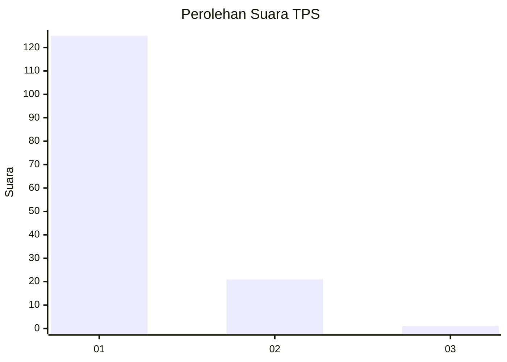
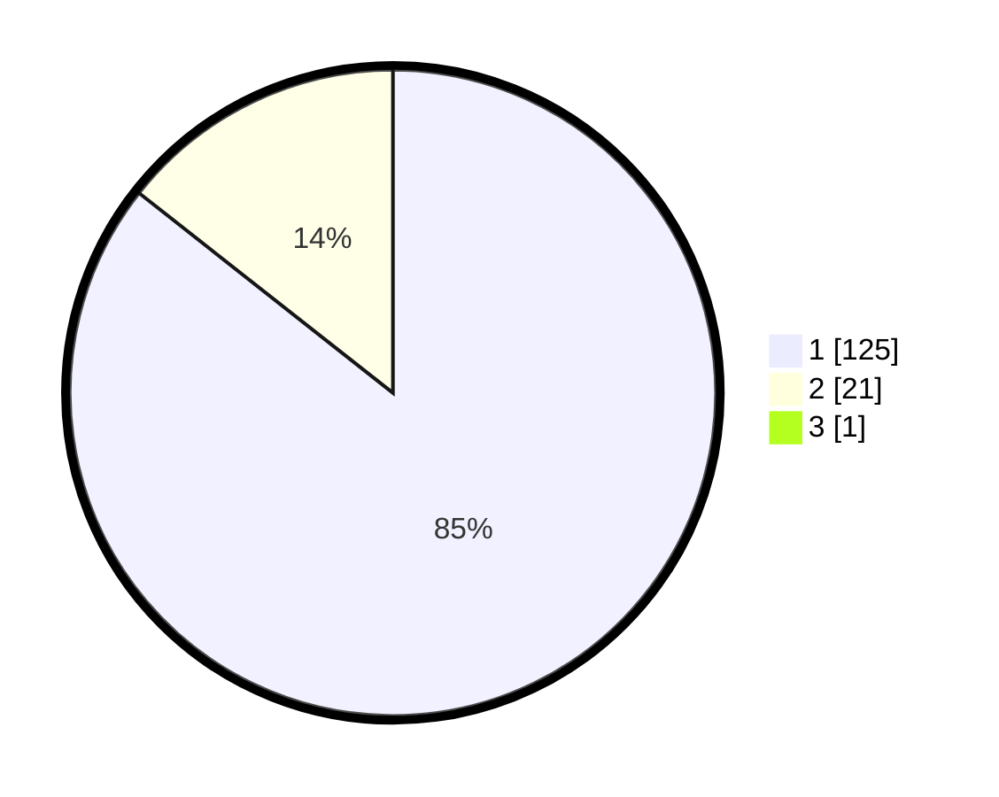

# Hasil

## Grafik

## Tabel

| No. | Nama Paslon    | Suara | Suara (raw) | Persentase |
|:--- |:-------------- | -----:| -----------:| ----------:|
| 1   | ANIES MUHAIMIN | 125   | [125][p-1]  | 85,03      |
| 2   | PRABOWO GIBRAN | 21    | [21][p-2]   | 14,29      |
| 3   | GANJAR MAHFUD  | 1     | [1][p-3]    | 0,68       |

[p-1]: https://github.com/gigit-pemilu/pemilu-2024-11-aceh/blob/main/pilpres/hitung-suara/sub/11-aceh/sub/06-aceh-besar/sub/08-peukan-bada/sub/2006-lam-manyang/sub/002-tps/sub/paslon-1.txt
[p-2]: https://github.com/gigit-pemilu/pemilu-2024-11-aceh/blob/main/pilpres/hitung-suara/sub/11-aceh/sub/06-aceh-besar/sub/08-peukan-bada/sub/2006-lam-manyang/sub/002-tps/sub/paslon-2.txt
[p-3]: https://github.com/gigit-pemilu/pemilu-2024-11-aceh/blob/main/pilpres/hitung-suara/sub/11-aceh/sub/06-aceh-besar/sub/08-peukan-bada/sub/2006-lam-manyang/sub/002-tps/sub/paslon-3.txt

## Foto C Plano

https://sirekap-obj-formc.kpu.go.id/ec03/pemilu/ppwp/11/06/08/20/06/1106082006002-20240215-044606--5758cfab-bb3e-4886-b431-5f911c18def1.jpg

https://sirekap-obj-formc.kpu.go.id/ec03/pemilu/ppwp/11/06/08/20/06/1106082006002-20240215-044933--3e3d7ffd-931d-42ed-88d0-c76780ca6632.jpg

https://sirekap-obj-formc.kpu.go.id/ec03/pemilu/ppwp/11/06/08/20/06/1106082006002-20240215-045200--98fb7cb9-af24-48cf-bfeb-9d119b6ce131.jpg

## Metadata

| Key        | Value               |
| ---------- | ------------------- |
| Time Stamp | 2024-02-15 22:30:27 |

