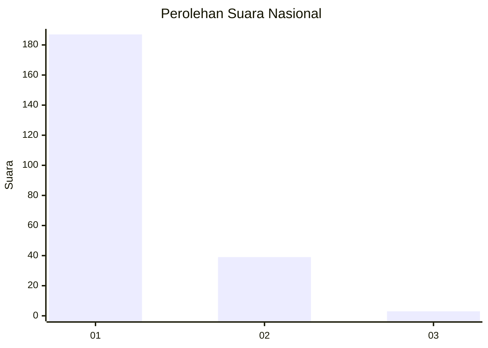
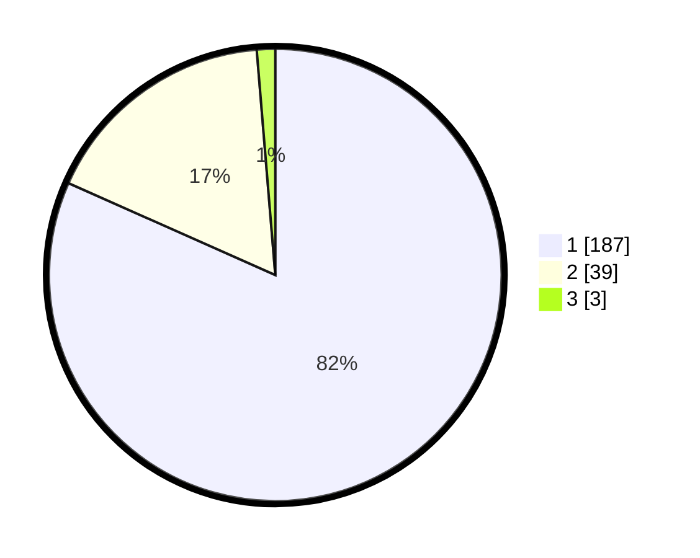

# Hasil

## Grafik

## Tabel

| No. | Nama Paslon    | Suara | Suara (raw) | Persentase |
|:--- |:-------------- | -----:| -----------:| ----------:|
| 1   | ANIES MUHAIMIN | 187   | [187][p-1]  | 81,66      |
| 2   | PRABOWO GIBRAN | 39    | [39][p-2]   | 17,03      |
| 3   | GANJAR MAHFUD  | 3     | [3][p-3]    | 1,31       |

[p-1]: https://github.com/gigit-pemilu/pemilu-2024/blob/main/pilpres/hitung-suara/sub/11-aceh/sub/06-aceh-besar/sub/08-peukan-bada/sub/2007-lamteh/sub/001-tps/sub/paslon-1.txt
[p-2]: https://github.com/gigit-pemilu/pemilu-2024/blob/main/pilpres/hitung-suara/sub/11-aceh/sub/06-aceh-besar/sub/08-peukan-bada/sub/2007-lamteh/sub/001-tps/sub/paslon-2.txt
[p-3]: https://github.com/gigit-pemilu/pemilu-2024/blob/main/pilpres/hitung-suara/sub/11-aceh/sub/06-aceh-besar/sub/08-peukan-bada/sub/2007-lamteh/sub/001-tps/sub/paslon-3.txt

## Foto C Plano

https://sirekap-obj-formc.kpu.go.id/fee2/pemilu/ppwp/11/06/08/20/07/1106082007001-20240217-182725--66cbeffb-de80-43ca-b7a5-37d4f28a8554.jpg

https://sirekap-obj-formc.kpu.go.id/fee2/pemilu/ppwp/11/06/08/20/07/1106082007001-20240218-123954--9783fc4e-1140-4e02-a349-be097a6f96e8.jpg

https://sirekap-obj-formc.kpu.go.id/fee2/pemilu/ppwp/11/06/08/20/07/1106082007001-20240217-190713--40c17758-5f3b-4b20-bc92-fe78d1cc9e2e.jpg

## Metadata

| Key        | Value               |
| ---------- | ------------------- |
| Time Stamp | 2024-02-24 22:31:28 |

## DATA PEMILIH TETAP

Jumlah pemilih dalam DPT: **295**.
 * L: **138**.
 * P: **157**.

## DATA PENGGUNA HAK PILIH

Jumlah pengguna hak pilih dalam DPT: **229**.
 * L: **109**.
 * P: **120**.

Jumlah pengguna hak pilih dalam DPTb: **11**.
 * L: **4**.
 * P: **7**.

Jumlah pengguna hak pilih dalam DPK: **14**.
 * L: **3**.
 * P: **11**.

Jumlah pengguna hak pilih: **254**.
 * L: **116**.
 * P: **138**.

## JUMLAH SUARA SAH DAN TIDAK SAH

JUMLAH SELURUH SUARA SAH: **251**.

JUMLAH SUARA TIDAK SAH: **3**.

JUMLAH SELURUH SUARA SAH DAN SUARA TIDAK SAH: **254**.

