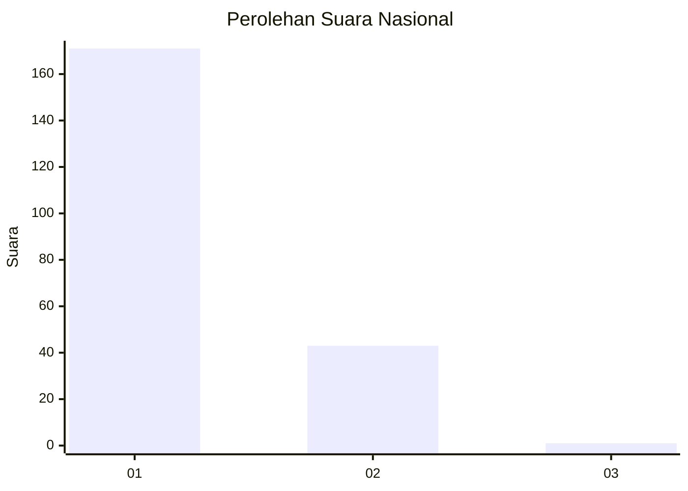
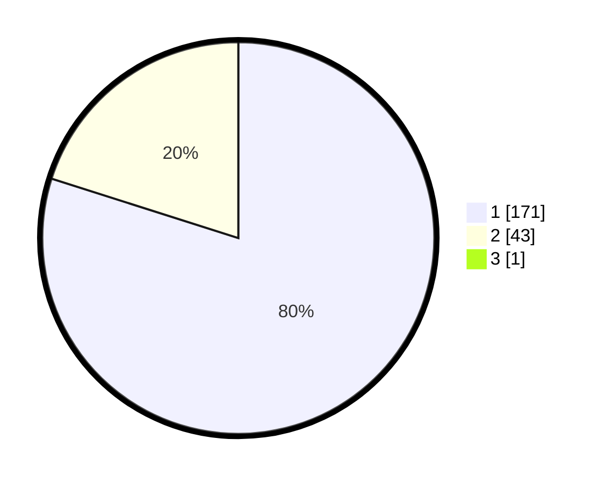

# Hasil

## Grafik

## Tabel

| No. | Nama Paslon    | Suara | Suara (raw) | Persentase |
|:--- |:-------------- | -----:| -----------:| ----------:|
| 1   | ANIES MUHAIMIN | 171   | [171][p-1]  | 79,53      |
| 2   | PRABOWO GIBRAN | 43    | [43][p-2]   | 20,00      |
| 3   | GANJAR MAHFUD  | 1     | [1][p-3]    | 0,47       |

[p-1]: https://github.com/gigit-pemilu/pemilu-2024/blob/main/pilpres/hitung-suara/sub/11-aceh/sub/06-aceh-besar/sub/08-peukan-bada/sub/2008-lam-lumpu/sub/004-tps/sub/paslon-1.txt
[p-2]: https://github.com/gigit-pemilu/pemilu-2024/blob/main/pilpres/hitung-suara/sub/11-aceh/sub/06-aceh-besar/sub/08-peukan-bada/sub/2008-lam-lumpu/sub/004-tps/sub/paslon-2.txt
[p-3]: https://github.com/gigit-pemilu/pemilu-2024/blob/main/pilpres/hitung-suara/sub/11-aceh/sub/06-aceh-besar/sub/08-peukan-bada/sub/2008-lam-lumpu/sub/004-tps/sub/paslon-3.txt

## Foto C Plano

https://sirekap-obj-formc.kpu.go.id/0f49/pemilu/ppwp/11/06/08/20/08/1106082008004-20240215-052928--5c6626d4-bdc7-41a7-8759-7d207efa6b5e.jpg

https://sirekap-obj-formc.kpu.go.id/0f49/pemilu/ppwp/11/06/08/20/08/1106082008004-20240215-053033--9cf3c7af-92a0-4fd0-85a4-223bc3b2ebdb.jpg

https://sirekap-obj-formc.kpu.go.id/0f49/pemilu/ppwp/11/06/08/20/08/1106082008004-20240215-053133--2037bea6-c950-4465-beab-cbccc68056f0.jpg

## Metadata

| Key        | Value               |
| ---------- | ------------------- |
| Time Stamp | 2024-02-15 16:30:25 |

