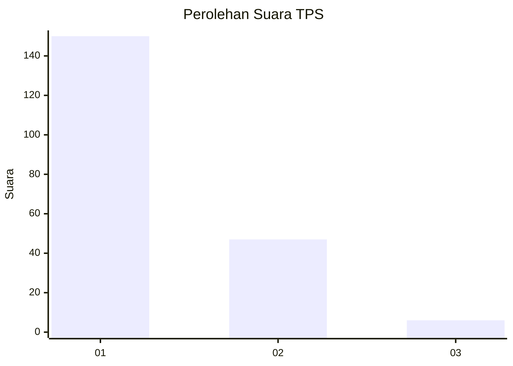
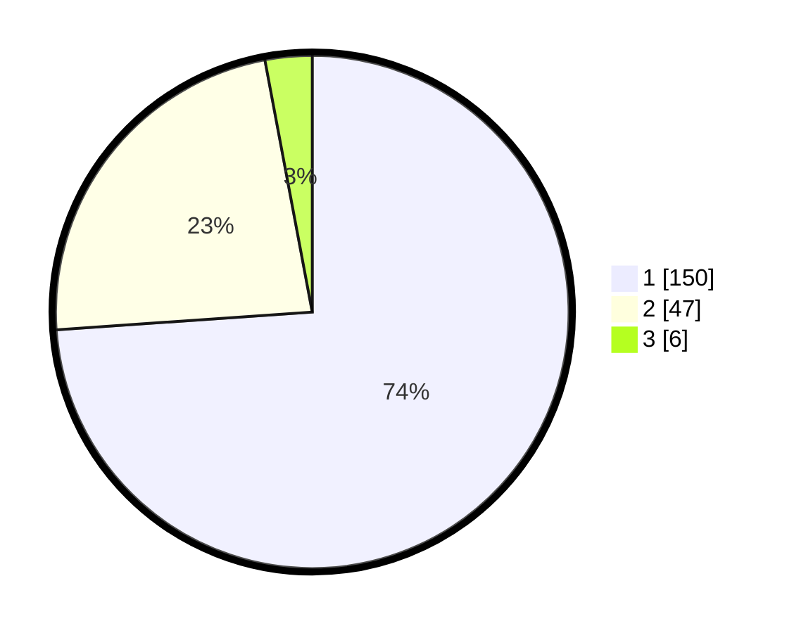

# Hasil

## Grafik

## Tabel

| No. | Nama Paslon    | Suara | Suara (raw) | Persentase |
|:--- |:-------------- | -----:| -----------:| ----------:|
| 1   | ANIES MUHAIMIN | 150   | [150][p-1]  | 73,89      |
| 2   | PRABOWO GIBRAN | 47    | [47][p-2]   | 23,15      |
| 3   | GANJAR MAHFUD  | 6     | [6][p-3]    | 2,96       |

[p-1]: https://github.com/gigit-pemilu/pemilu-2024-11-aceh/blob/main/pilpres/hitung-suara/sub/11-aceh/sub/06-aceh-besar/sub/08-peukan-bada/sub/2008-lam-lumpu/sub/005-tps/sub/paslon-1.txt
[p-2]: https://github.com/gigit-pemilu/pemilu-2024-11-aceh/blob/main/pilpres/hitung-suara/sub/11-aceh/sub/06-aceh-besar/sub/08-peukan-bada/sub/2008-lam-lumpu/sub/005-tps/sub/paslon-2.txt
[p-3]: https://github.com/gigit-pemilu/pemilu-2024-11-aceh/blob/main/pilpres/hitung-suara/sub/11-aceh/sub/06-aceh-besar/sub/08-peukan-bada/sub/2008-lam-lumpu/sub/005-tps/sub/paslon-3.txt

## Foto C Plano

https://sirekap-obj-formc.kpu.go.id/8d9e/pemilu/ppwp/11/06/08/20/08/1106082008005-20240215-044728--2ad59e11-f743-436a-b41b-1a463428873c.jpg

https://sirekap-obj-formc.kpu.go.id/8d9e/pemilu/ppwp/11/06/08/20/08/1106082008005-20240215-044925--83db0d94-4403-4dd8-a89e-b178966a370c.jpg

https://sirekap-obj-formc.kpu.go.id/8d9e/pemilu/ppwp/11/06/08/20/08/1106082008005-20240215-045052--af7785eb-e52c-4747-af4c-5a4ef69839a1.jpg

## Metadata

| Key        | Value               |
| ---------- | ------------------- |
| Time Stamp | 2024-02-15 16:00:26 |

