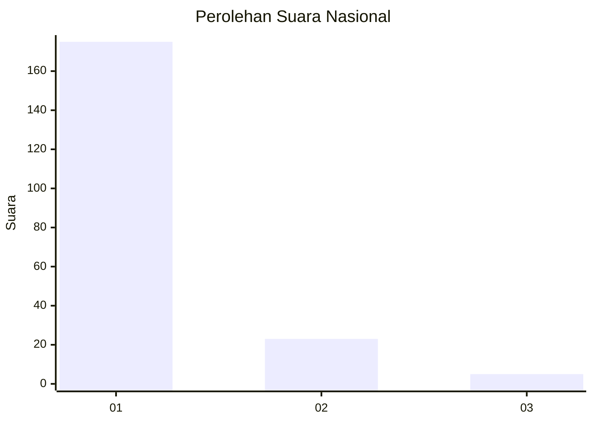
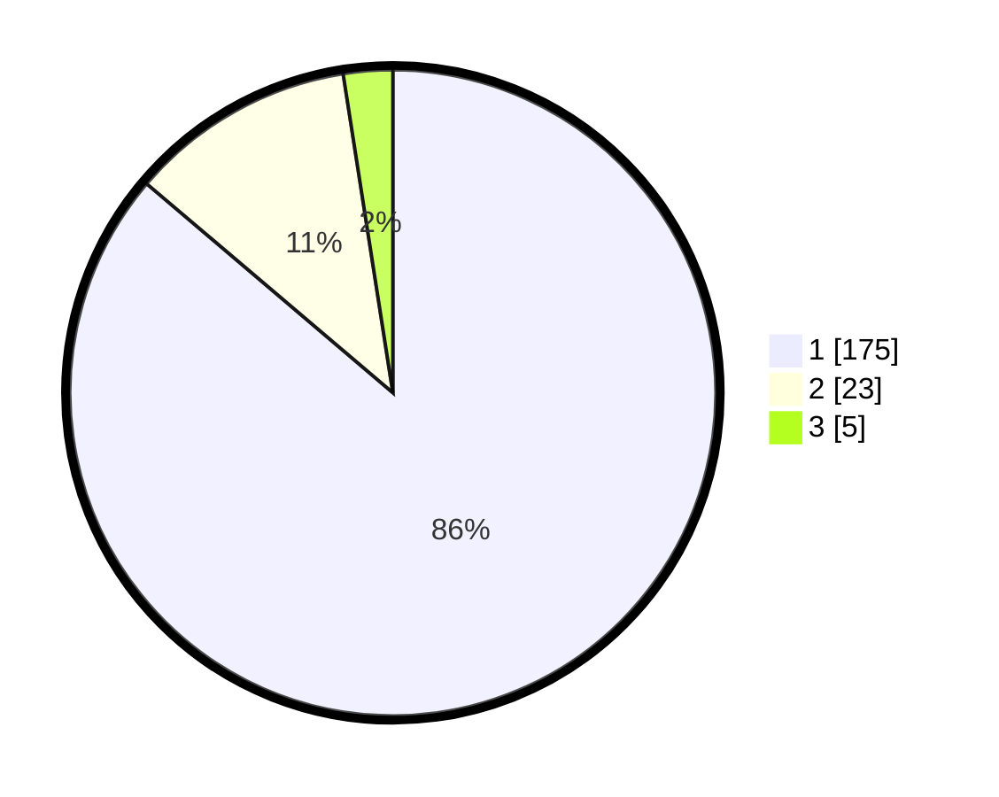

# Hasil

## Grafik

## Tabel

| No. | Nama Paslon    | Suara | Suara (raw) | Persentase |
|:--- |:-------------- | -----:| -----------:| ----------:|
| 1   | ANIES MUHAIMIN | 175   | [175][p-1]  | 86,21      |
| 2   | PRABOWO GIBRAN | 23    | [23][p-2]   | 11,33      |
| 3   | GANJAR MAHFUD  | 5     | [5][p-3]    | 2,46       |

[p-1]: https://github.com/gigit-pemilu/pemilu-2024/blob/main/pilpres/hitung-suara/sub/11-aceh/sub/06-aceh-besar/sub/08-peukan-bada/sub/2011-meunasah-tuha/sub/002-tps/sub/paslon-1.txt
[p-2]: https://github.com/gigit-pemilu/pemilu-2024/blob/main/pilpres/hitung-suara/sub/11-aceh/sub/06-aceh-besar/sub/08-peukan-bada/sub/2011-meunasah-tuha/sub/002-tps/sub/paslon-2.txt
[p-3]: https://github.com/gigit-pemilu/pemilu-2024/blob/main/pilpres/hitung-suara/sub/11-aceh/sub/06-aceh-besar/sub/08-peukan-bada/sub/2011-meunasah-tuha/sub/002-tps/sub/paslon-3.txt

## Foto C Plano

https://sirekap-obj-formc.kpu.go.id/c64a/pemilu/ppwp/11/06/08/20/11/1106082011002-20240214-233057--6c283af4-13c2-4a9c-9acf-f5ffa1f7f05b.jpg

https://sirekap-obj-formc.kpu.go.id/c64a/pemilu/ppwp/11/06/08/20/11/1106082011002-20240214-233406--48e3a84a-69f8-4d8a-82fb-903bdafe08ad.jpg

https://sirekap-obj-formc.kpu.go.id/c64a/pemilu/ppwp/11/06/08/20/11/1106082011002-20240214-232404--6dbd1c2d-2f73-4e5b-b6a8-29a4f2ddeff2.jpg

## Metadata

| Key        | Value               |
| ---------- | ------------------- |
| Time Stamp | 2024-02-15 16:30:25 |

