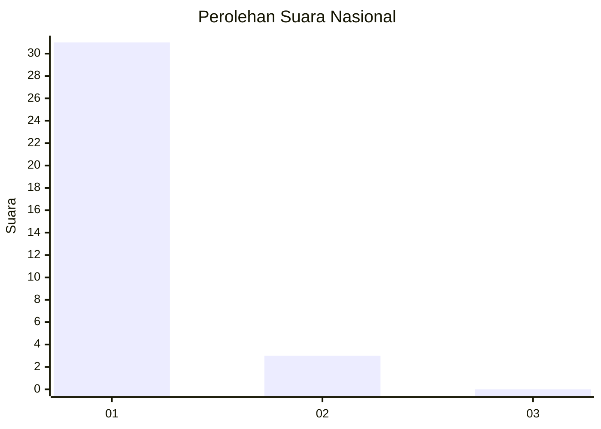
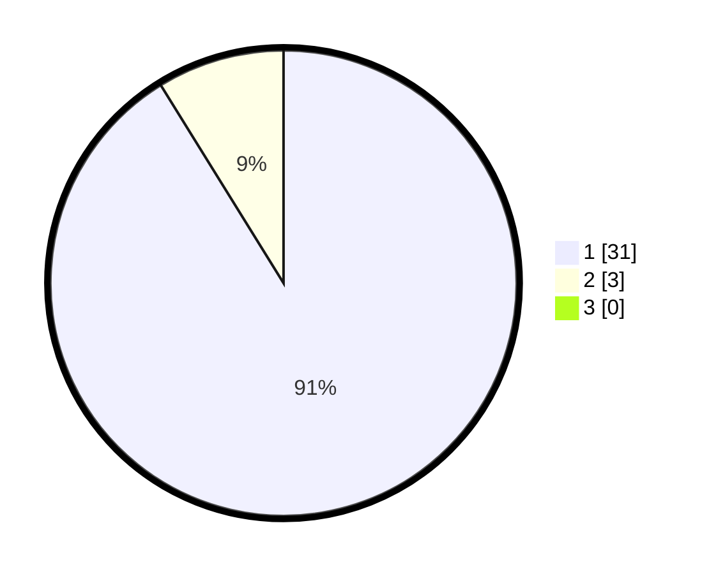

# Hasil

## Grafik

## Tabel

| No. | Nama Paslon    | Suara | Suara (raw) | Persentase |
|:--- |:-------------- | -----:| -----------:| ----------:|
| 1   | ANIES MUHAIMIN | 31    | [31][p-1]   | 91,18      |
| 2   | PRABOWO GIBRAN | 3     | [3][p-2]    | 8,82       |
| 3   | GANJAR MAHFUD  | 0     | [0][p-3]    | 0,00       |

[p-1]: https://github.com/gigit-pemilu/pemilu-2024/blob/main/pilpres/hitung-suara/sub/11-aceh/sub/06-aceh-besar/sub/08-peukan-bada/sub/2013-pulo-bunta/sub/001-tps/sub/paslon-1.txt
[p-2]: https://github.com/gigit-pemilu/pemilu-2024/blob/main/pilpres/hitung-suara/sub/11-aceh/sub/06-aceh-besar/sub/08-peukan-bada/sub/2013-pulo-bunta/sub/001-tps/sub/paslon-2.txt
[p-3]: https://github.com/gigit-pemilu/pemilu-2024/blob/main/pilpres/hitung-suara/sub/11-aceh/sub/06-aceh-besar/sub/08-peukan-bada/sub/2013-pulo-bunta/sub/001-tps/sub/paslon-3.txt

## Foto C Plano

https://sirekap-obj-formc.kpu.go.id/c105/pemilu/ppwp/11/06/08/20/13/1106082013001-20240214-195001--5eac82b2-4442-45ec-ac73-fb9c4fdf8998.jpg

https://sirekap-obj-formc.kpu.go.id/c105/pemilu/ppwp/11/06/08/20/13/1106082013001-20240214-195020--ebdd5692-1331-4995-b02b-a6ef6829e6b6.jpg

https://sirekap-obj-formc.kpu.go.id/c105/pemilu/ppwp/11/06/08/20/13/1106082013001-20240214-195035--25d69fd3-11d7-48c9-a404-eac8090536d8.jpg

## Metadata

| Key        | Value               |
| ---------- | ------------------- |
| Time Stamp | 2024-02-14 21:46:01 |

## DATA PEMILIH TETAP

Jumlah pemilih dalam DPT: **44**.
 * L: **18**.
 * P: **26**.

## DATA PENGGUNA HAK PILIH

Jumlah pengguna hak pilih dalam DPT: **37**.
 * L: **16**.
 * P: **21**.

Jumlah pengguna hak pilih dalam DPTb: **0**.
 * L: **0**.
 * P: **0**.

Jumlah pengguna hak pilih dalam DPK: **0**.
 * L: **0**.
 * P: **0**.

Jumlah pengguna hak pilih: **37**.
 * L: **16**.
 * P: **21**.

## JUMLAH SUARA SAH DAN TIDAK SAH

JUMLAH SELURUH SUARA SAH: **34**.

JUMLAH SUARA TIDAK SAH: **3**.

JUMLAH SELURUH SUARA SAH DAN SUARA TIDAK SAH: **37**.

