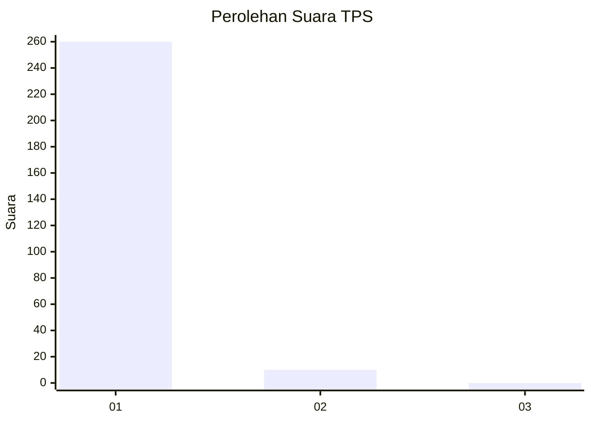
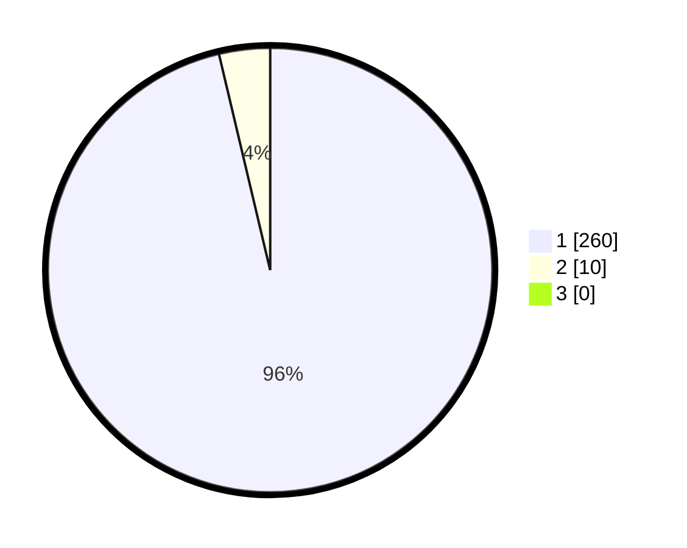

# Hasil

## Grafik

## Tabel

| No. | Nama Paslon    | Suara | Suara (raw) | Persentase |
|:--- |:-------------- | -----:| -----------:| ----------:|
| 1   | ANIES MUHAIMIN | 260   | [260][p-1]  | 96,30      |
| 2   | PRABOWO GIBRAN | 10    | [10][p-2]   | 3,70       |
| 3   | GANJAR MAHFUD  | 0     | [0][p-3]    | 0,00       |

[p-1]: https://github.com/gigit-pemilu/pemilu-2024-11-aceh/blob/main/pilpres/hitung-suara/sub/11-aceh/sub/06-aceh-besar/sub/08-peukan-bada/sub/2014-beuradeun/sub/001-tps/sub/paslon-1.txt
[p-2]: https://github.com/gigit-pemilu/pemilu-2024-11-aceh/blob/main/pilpres/hitung-suara/sub/11-aceh/sub/06-aceh-besar/sub/08-peukan-bada/sub/2014-beuradeun/sub/001-tps/sub/paslon-2.txt
[p-3]: https://github.com/gigit-pemilu/pemilu-2024-11-aceh/blob/main/pilpres/hitung-suara/sub/11-aceh/sub/06-aceh-besar/sub/08-peukan-bada/sub/2014-beuradeun/sub/001-tps/sub/paslon-3.txt

## Foto C Plano

https://sirekap-obj-formc.kpu.go.id/0bc7/pemilu/ppwp/11/06/08/20/14/1106082014001-20240218-115111--c45652b2-ab03-4e06-992c-41dc0ef641c5.jpg

https://sirekap-obj-formc.kpu.go.id/0bc7/pemilu/ppwp/11/06/08/20/14/1106082014001-20240218-114054--6910099c-9e71-417a-9149-145249f25645.jpg

https://sirekap-obj-formc.kpu.go.id/0bc7/pemilu/ppwp/11/06/08/20/14/1106082014001-20240218-114155--78a3350e-703b-4506-ad2e-3a7489665c2f.jpg

## Metadata

| Key        | Value               |
| ---------- | ------------------- |
| Time Stamp | 2024-02-19 21:00:00 |

