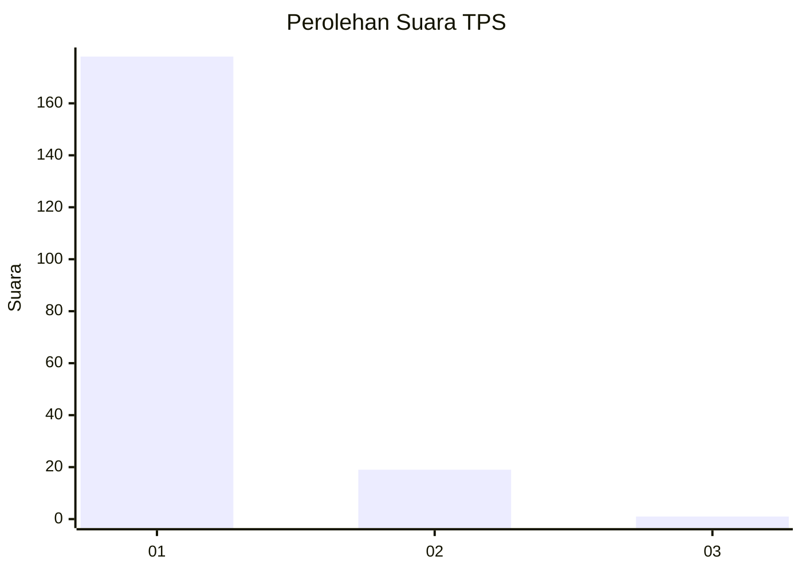
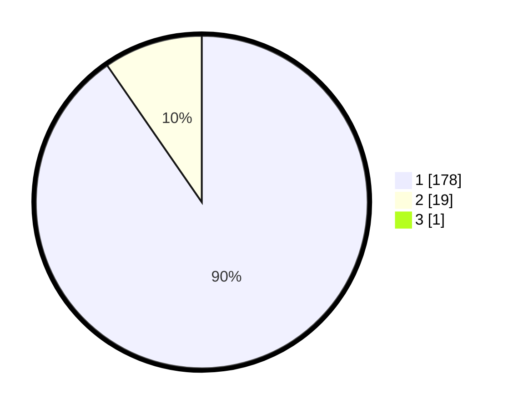

# Hasil

## Grafik

## Tabel

| No. | Nama Paslon    | Suara | Suara (raw) | Persentase |
|:--- |:-------------- | -----:| -----------:| ----------:|
| 1   | ANIES MUHAIMIN | 178   | [178][p-1]  | 89,90      |
| 2   | PRABOWO GIBRAN | 19    | [19][p-2]   | 9,60       |
| 3   | GANJAR MAHFUD  | 1     | [1][p-3]    | 0,51       |

[p-1]: https://github.com/gigit-pemilu/pemilu-2024-11-aceh/blob/main/pilpres/hitung-suara/sub/11-aceh/sub/06-aceh-besar/sub/08-peukan-bada/sub/2015-lampisang/sub/001-tps/sub/paslon-1.txt
[p-2]: https://github.com/gigit-pemilu/pemilu-2024-11-aceh/blob/main/pilpres/hitung-suara/sub/11-aceh/sub/06-aceh-besar/sub/08-peukan-bada/sub/2015-lampisang/sub/001-tps/sub/paslon-2.txt
[p-3]: https://github.com/gigit-pemilu/pemilu-2024-11-aceh/blob/main/pilpres/hitung-suara/sub/11-aceh/sub/06-aceh-besar/sub/08-peukan-bada/sub/2015-lampisang/sub/001-tps/sub/paslon-3.txt

## Foto C Plano

https://sirekap-obj-formc.kpu.go.id/c0be/pemilu/ppwp/11/06/08/20/15/1106082015001-20240215-025917--491415b7-08a8-4078-9640-948d4fb6c16f.jpg

https://sirekap-obj-formc.kpu.go.id/c0be/pemilu/ppwp/11/06/08/20/15/1106082015001-20240215-030145--f7d14f86-3a26-4c72-801c-926a4670a301.jpg

https://sirekap-obj-formc.kpu.go.id/c0be/pemilu/ppwp/11/06/08/20/15/1106082015001-20240215-030332--c7e609a3-73c4-460b-b168-5143bac55ea9.jpg

## Metadata

| Key        | Value               |
| ---------- | ------------------- |
| Time Stamp | 2024-02-15 16:30:25 |

